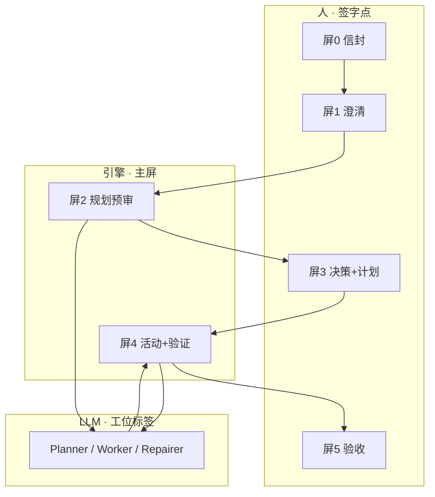
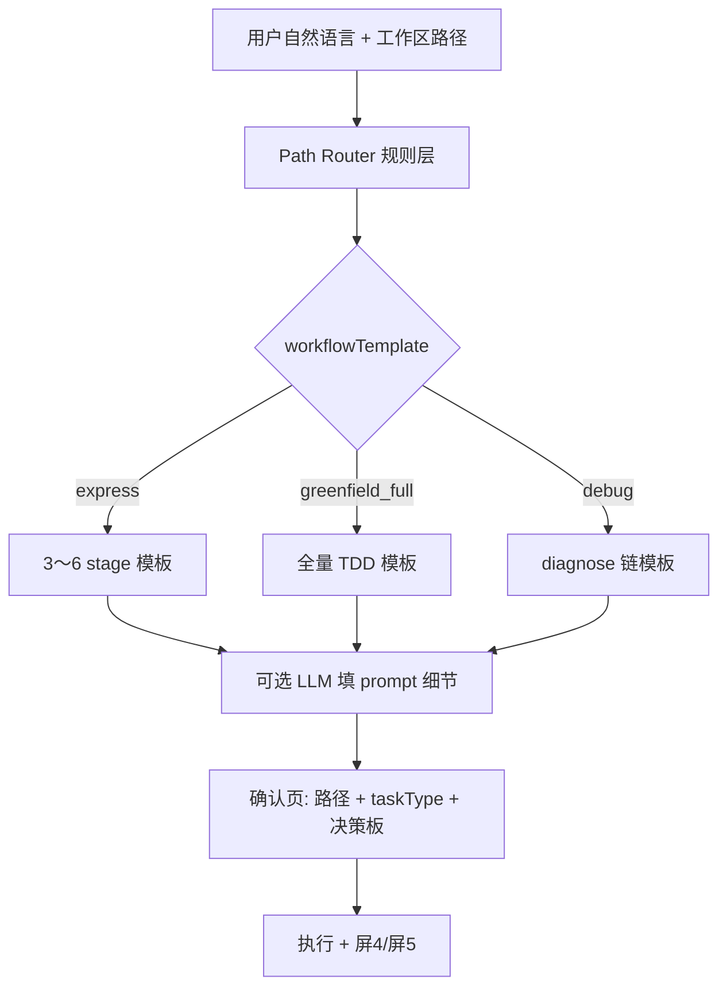

# auto_skills
**成本不敏感、只追求软件产品质量**时，UI 不应是「三步 wizard 的壳」，而应是一套 **质量契约驾驶舱**：人在高杠杆点签字，引擎与客观验证占满屏，LLM 退到工位标签之后。

下面按 **用户旅程 + 页面职责 + 与引擎对齐** 给出目标设计（可渐进落地，但愿景按「顶配」写）。

---

## 1. 设计信条（质量优先）

| 信条 | UI 含义 |
|------|---------|
| **质量可签、可追、可复验** | 每个阶段有「通过/未通过」与 provenance，不靠感觉 |
| **人只签高杠杆** | Charter、信封、架构决策、验收；不签 pytest 日志 |
| **A 轨压过 B 轨展示** | 测试/门禁/DoD 比决策散文更显眼 |
| **引擎活动默认可见** | repair / replan / fix 链是产品能力，不是 debug 秘密 |
| **无歧义状态** | 软失败 = 黄；通过 = 绿；终态失败 = 红；从不「红了又绿」 |

---

## 2. 目标旅程（5+1 屏，取代现行 3 屏）

```
┌─────────────┐   ┌─────────────┐   ┌─────────────┐   ┌─────────────┐   ┌─────────────┐   ┌─────────────┐
│ 0 主旨·信封  │ → │ 1 深澄清     │ → │ 2 规划驾驶舱 │ → │ 3 决策·计划  │ → │ 4 执行·验证  │ → │ 5 质量报告   │
│ (仓库级)     │   │ (任务级)     │   │ (生成+审阅)  │   │ (签字闸门)   │   │ (引擎主导)   │   │ (验收签字)   │
└─────────────┘   └─────────────┘   └─────────────┘   └─────────────┘   └─────────────┘   └─────────────┘
```

顶栏从 `输入 › 确认 › 执行` 扩展为 **六步质量流水线**；每步未通过不得进入下一步（引擎闸门 + UI 闸门双重）。

---

## 3. 分屏设计

### 屏 0 · 主旨与质量信封（仓库级，可跳过但首次强制）

**目标**：在写需求前锁定「什么叫好产品」。

**布局**：双栏 — 左编辑，右「影响预览」。

| 区块 | 内容 |
|------|------|
| Charter 编辑器 | prefer / avoid / constraint；与 `AGENTS.md` 双向同步 |
| DoD 构建器 | 可交付物 checklist、smoke 命令、文件存在性；写 `.stagent/dod.json` |
| 质量档位 | Strict / AFK / Research 预设 + 自定义 gate 表（export hard、flaky 2 次等） |
| 技术栈声明 | Python/Node、venv、测试框架；约束 Planner 不幻觉 MdApi 类 |

**签字**：`本仓库质量信封 v3 · 已确认` — 之后每个任务继承，可任务级覆盖。

**质量收益**：生成与验收有同一套尺子；AFK 不再只靠设置里散落开关。

---

### 屏 1 · 深澄清（任务级，生成前 — 加强版 clarify）

**目标**：在花钱生成完整 DAG 前，消灭需求歧义。

**布局**：Grill 式多轮卡片（非一次性 3–5 题）。

| 区块 | 内容 |
|------|------|
| 需求摘要 | polish 结果 + 用户原话对照 |
| 结构化问题流 | 范围 / 边界 / 非目标 / 兼容性 / 已有代码复用；每题：选项 + 自由文本 + 「让 Charter 代答」 |
| 仓库扫描摘要 | 相关目录树、已有测试、requirements；可点进文件 |
| 风险预检 | 「可能缺 venv / conftest / 决策」黄标 |

**签字**：`需求已澄清 · 可进入规划` — 后端 `clarifyAnswers` + 可选 `envelopeOverrides`。

**与成本无关的增强**：可多轮 clarify直到模型置信度 > 阈值；人可随时「加一问」。

**质量收益**：减少「plan 整体跑偏 → 整单重生成」。

---

### 屏 2 · 规划驾驶舱（生成 + 审阅，可两阶段）

**目标**：高质量 plan，而不只是 JSON 列表。

**推荐两阶段（成本不敏感时）**：

```
Phase A：骨架 plan（切片 + decide 问题 + 验证策略，无 impl 细节）
    → 人在屏 3 先批架构决策
Phase B：完整 plan（自修复链、test_run、venv 链）
    → 人在屏 3 批计划与风险
```

**布局**：三列。

| 左：结构 | 中：语义 | 右：风险 |
|----------|----------|----------|
| DAG / 波次 | 切片 RED→GREEN 叙事 | Plan completeness、M40 修复、self-heal 缺口 |
| 阶段角色标签 | 每 slice 客观 DoD | 幻觉 API 预警（pypi-symbol） |
| 系统插入区分 M40 / runtime-replan | AFK/HITL 分类 | 预估 LLM 轮次与 gate 硬块 |

**实时**：生成流式展示 + 「已插入 stage_venv_*」「已补 fix_if_failed」引擎事件（非裸 streamChunk）。

**质量收益**：决策在完整 DAG 前可先定方向；结构问题在 exec 前暴露。

---

### 屏 3 · 决策与计划签字（现行 confirm 的顶配版）

**目标**：执行前一次性锁定 **B 轨决策 + A 轨计划**。

**布局**：上决策、中计划、下闸门。

**① 决策板（frontloaded 必选）**

- 每条：`问题 · stage_decide_* · 拟答 · provenance · 置信度 · 对下游影响（哪些 impl/test）`
- 状态：auto / conflict / uncovered / lowconf — 升级项必须清零
- Charter 冲突时：**并排展示**冲突条文 + 强制选边

**② 计划审查**

- 阶段卡片带 **角色色**：Worker / Verify / Repair / Engine-replan / Decision
- 点击 slice → 展开「test_write → impl → test_run → fix」闭环图
- M40 / runtime-replan 插入 **不同视觉**（与 P3 UI 方案一致）

**③ 客观预审（引擎跑 dry-run）**

- 在「开始执行」前跑轻量检查：plan lint、symbol 预检、路径契约 — 结果列表
- 红灯：禁止执行；黄灯：可执行但记入质量报告

**签字按钮**（分两级，质量优先时用严格级）：

- `批准决策与计划并开始执行`（升级项 = 0 且预审无红灯）
- 次级：`仅保存草案` / `退回重新规划`

**质量收益**：B 轨不散落执行中；plan 与决策同一屏可交叉核对。

---

### 屏 4 · 执行与验证（引擎主导驾驶舱）

**目标**：用户看见「产品在变绿」，而不是「阶段在跑」。

**布局**：四层叠加（此前 UI 方案的顶配）。

```
┌─ Engine Activity Feed（固定顶栏，时间序）────────────────────┐
│ gate-repair ✓ │ replan pip │ fix 2/2 │ rewind test_run        │
├─ 左：Slice 健康度 ─┬─ 中：当前阶段 ─┬─ 右：客观验证 ─────────┤
│ 每 slice 灯        │ 角色+状态       │ 最近 test_run 摘要      │
│ 🟢🟡🔴            │ deferred 黄态   │ exit / flaky / playbook │
├─ 底：仅 HITL / 终态失败 ─────────────────────────────────────┤
│ pause-bar │ 升级决策 │ workflowFailed                           │
└──────────────────────────────────────────────────────────────┘
```

**Slice 健康度**（质量 UI 核心创新）：

- 每切片一行：`impl ✓ · pre-gate ✓ · test_run ✗(deferred) · fix 进行中`
- 点击 → 展开该 slice 的引擎事件链

**test_run 软失败**：专用 **黄态 deferred 卡**，文案「引擎修复中，请勿 Retry」；主 CTA「查看修复链」。

**错误卡分级**（成本不敏感可更严）：

- 自动链进行中：**隐藏** upstream-fix 主按钮
- 链耗尽：才显示「人工修代码 / 升级 HITL」

**质量收益**：与 P0–P3d 引擎语义一致；减少误操作破坏 AFK 链。

---

### 屏 5 · 质量报告（完成页，非一句「完成」）

**目标**：回答「这是不是一件可以放心合并的产品」。

**布局**：成绩单 + 可展开证据。

| 区块 | 内容 |
|------|------|
| 总评 | AFK 通过 / 有条件通过 / 未通过 |
| A 轨 | 验证阶段稳定通过 x/y；flaky 列表；smoke |
| B 轨 | 人工介入次数；决策 provenance 摘要 |
| 引擎 | `runtimeReplanCount`、gate-repair 次数、fix 链次数 |
| DoD | 逐项 ✓/✗，缺文件可一键打开路径 |
| Charter | 覆盖率；违反 warn 列表 |
| 建议 | 「可合并 / 需补测试 / 需人审架构」 |

**签字**（可选，团队流程）：`验收通过 · 记录至 experience 库`

**质量收益**：H2（DoD）与 E4（验证）在 UI 闭环；可沉淀为下次生成 few-shot。

---

## 4. 侧栏与全局（始终可见）

| 组件 | 作用 |
|------|------|
| **任务列表** | 状态 + 质量灯（非仅 running/done） |
| **AI Controls** | AFK/档位一键切换 + 当前信封版本 |
| **待办** | 仅 `escalate` 决策 + 终态失败；不含引擎自动步骤 |
| **质量时钟** | 本任务：验证次数、replan 次数、人工介入 |

---

## 5. 与三层架构的映射



- **人**：4 次签字（信封、澄清、计划、验收）
- **引擎**：规划预审 + 执行驾驶舱 + 质量报告数据
- **LLM**：藏在角色标签与活动 feed 的「原因」里，不抢主视觉

---

## 6. 与现行 Stagent 的差距（顶配要补什么）

| 能力 | 现状 | 顶配 UI 需要 |
|------|------|----------------|
| 决策前置 | confirm + frontloaded | 屏3 顶配决策板 + Phase A/B 规划 |
| 生成前澄清 | clarify 轻量 | 屏1 多轮 Grill |
| DoD / Charter | 文件 + 后端 | 屏0 编辑器 + 屏5 报告 |
| 引擎事件 | debugLog | 屏4 Activity Feed + slice 健康度 |
| 完成验收 | done 横幅 | 屏5 质量报告 |
| 两阶段生成 | 无 | 屏2 Phase A/B（成本允许时） |

---

## 7. 落地优先级（质量优先、仍可分 PR）

即使一次做不全，**质量收益/工程量** 建议顺序：

1. **屏4 执行驾驶舱** + slice 健康度 + deferred 黄态（直接减少误操作与误判）
2. **屏5 质量报告**（DoD + AFK + replan 上屏）
3. **屏3 决策板顶配**（影响面、预审红灯）
4. **屏0 信封/DoD 编辑器**
5. **屏1 深澄清 + 屏2 两阶段规划**（成本最高，质量上限也最高）

---

## 8. 一句话

**成本不敏感时，UI 应从「工作流编辑器」升级为「质量契约流水线」**：人在信封、澄清、决策+计划、验收四处签字；中间两屏交给引擎做规划预审与执行验证；LLM 只以工位和事件出现。这样生成的不只是「跑完的 workflow」，而是 **可证明达标、可复盘、可合并的软件产品**。

若你之后要在 `stagent_vscode` 落地，建议从 **屏4 + 屏5** 开刀（与已实现的 P0–P3d 引擎最直接对齐）；需要的话我可以把屏4/5 拆成具体 message 协议 + 组件清单 PRD。


根据这几轮对话，可以分成 **你现在能做的** 和 **产品/engine 该补的** 两条线。

---

## 一、你现在就可以做（验证「最小环」是否通）

目标：先证明 **一条简单任务能走完**，再谈复杂任务。

1. **Reload Window**（吃掉跨切片 I-25 修复）
2. **新任务**，不要复用计算器实例，工作区用**空目录**
3. 需求直接粘贴（**不润色**）：

   ```
   空目录 Python 项目。单文件 greet.py，函数 greet(name) 返回 "Hello, {name}"。
   单切片 TDD：test_write → impl → test_run，pytest 验收。
   不要架构决策，不要多切片，不要多模块。
   ```

4. 点 **生成工作流** → 澄清可跳过或简单答 → **确认页检查**：
   - stage 数量 **≤ 8** 为宜
   - taskType：要 pytest 链选 **`software`**；只想极简可试 **`other`**
   - 若仍多切片 / `plan_completeness_blocked` → 改需求或重新生成，**不要硬跑**

5. 批准后看：**屏 4**（切片/时间线）→ 跑完是否进 **屏 5 质量报告**

**这一条过了**，说明引擎主环可用；**过不了**，把确认页闸门信息和 debug log 贴出来，再针对性改。

---

## 二、短期优先补的产品缺口（建议实现顺序）

按「堵你反复踩坑」排序：

| 优先级 | 做什么 | 解决什么 |
|--------|--------|----------|
| **P0** | **workflowTemplate / 路径路由**（对齐 WORKFLOW P1–P5） | 简单任务不再默认多切片全量 |
| **P0** | 路由输入：`需求 + 工作区扫描`（文件数、有无 `CONTEXT.md`、是否「单 slice」关键词） | 自动走 **Express**，而不是只靠 `prototype` 猜 |
| **P1** | `prototype` / `other` 生成约束：**强制单切片上限**（如 ≤6 stage） | 计算器类不再 19 stage |
| **P1** | `impl` 阶段注入 **本切片 AC + 禁止项**（「不得实现下一切片行为」） | 减少 I-25 / 跨切片写太多 |
| **P2** | 确认页展示 **建议路径**（Express / Greenfield 全量 / Debug）+ 一键切换 | 替代晦涩的 taskType 七选一 |
| **P2** | `prototype` + `test_run` 自动 self-heal 或放宽闸门 | 确认页少拦 `missing-self-heal-chain` |
| **P3** | 屏 4：happy path 也发轻量 `engineActivity`；`test_write` 标 Verify | 驾驶舱不「空」、标签更准 |

**Contract-First 架构（`stagent.contract.*`）**

- [x] P0 InfraChain SSOT（`contract-infra/`）
- [x] P1 Plan Preflight 编排（`plan-preflight/`）
- [x] P2 CommitmentSnapshot（`commitment/`）
- [x] P3 Runtime Preflight + escalation（`runtime-preflight/`）
- [x] P4 窄写入 gate + deterministic HITL 跳过（`impl-write-scope`）
- [x] P5 诊断路由（`diagnostic-router/`）

**P0 的核心**：把 B-ROUTE 里「融合一次生成」升级成 **两阶段**——先 Path Router（规则 + 扫描），再按模板生成 stage。这和你在 WORKFLOW.md 里看到的一致。

---

## 三、推荐的技术路线（一张图）


