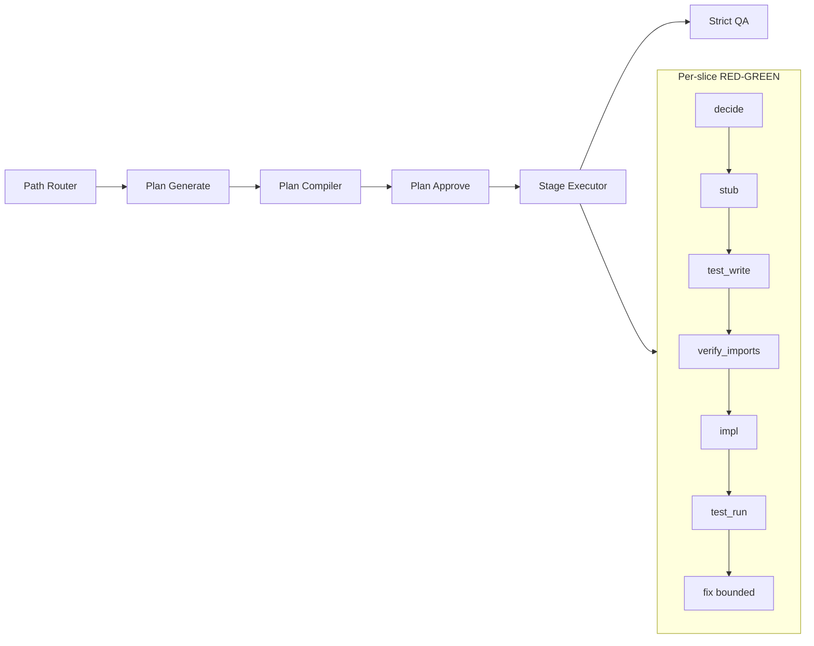

# Stagent 产品需求文档 · 工程师评审版

> **读者**：资深软件开发工程师（架构 / 平台 / 质量）  
> **角色**：在 1–2 小时内理解 Stagent **要做什么、已做到哪、理想态差距、如何验真**  
> **规范正文**：[STAGENT-PRD.md](./STAGENT-PRD.md)（v1.7，产品总纲）  
> **实现规格**：[../stagent_docs/B-ROUTE-SOLUTION.md](../../stagent_docs/B-ROUTE-SOLUTION.md)  
> **Live 事实源**：[t4-live-iteration-log.md](./t4-live-iteration-log.md)  
> **版本**：Engineer Review v1.5（§4.3.1 行为规格 SSOT P0–P2 已落码）  
> **日期**：2026-06-12  

---

## 0. 三十秒结论

| 维度 | 结论 |
|------|------|
| **产品** | Skill-native **AFK 软件开发引擎**：需求 → 工作计划（`WorkflowDefinition`）→ 按 stage 自执行 → 客观验收 |
| **差异化** | 不是「Cursor 里手动 `/tdd`」；是 **机器可读 DAG + Plan Compiler + Gate 双轨把关** |
| **代码重心** | `autoAI/packages/stagent-core/`（700+ 单测，精确数以 `npm test` 输出为准）；`stagent_vscode/` 为 UI 壳 |
| **压测任务** | **T4** — 南华期货自动下单，Python 5 模块绿场（indicators / signals / risk / broker / system） |
| **理想验收** | T4 **`strict delivery pass`**：pipeline 完成 + 全切片 pytest 绿 + MVP 目录 + traceability |
| **当前 Live 现实** | 引擎与契约层 **快速演进中**；T4 multi-module **尚未稳定 strict 绿**（Run #21 indicators 首次 pytest 绿，Run #22 因弱测试/`sys.modules` 回退；signals 切片 exports 漂移曾 gate 阻断） |
| **工程师应关注** | **结构契约 SSOT**（exports / import / deps）与 **行为规格 SSOT**（§4.3.1，signals 主卡点）；Gate 时序；Live 回归金字塔（G11） |

**图例（全文通用）**

| 标记 | 含义 |
|------|------|
| ✅ | 已实现且在单测或 mock headless 验证 |
| 🟡 | 部分实现 / Live 不稳定 / warn-only |
| ❌ | 未实现或 Live 反复失败 |
| 🎯 | 理想态（产品承诺方向，非当前事实） |

---

## 1. 问题与产品论题

### 1.1 要解决什么

Matt Pocock Skills（grill → PRD → issues → TDD）在 **人工 Cursor session** 中有效，但：

- 无 **机器可读执行清单** → 无法 AFK、无法客观验收、无法断点续跑  
- 多 session **上下文断裂**  
- 小任务过度工程 / 大任务被 express 压扁  

### 1.2 Stagent 论题

**把 Skills 语义内化进引擎**，用 **工作计划 + Gate** 替代人工串联：

```
Path Router → 澄清 → Plan Generate → Plan Compiler → Execute(stages) → Strict QA
```

- **A 轨**：pytest、verify_imports、module-contract — exit 0 才前进  
- **B 轨**：decide / Charter — HITL 或代答，可审计  

### 1.3 非目标（避免误读）

| 不做 | 说明 |
|------|------|
| 替代 GitHub Issues | 可选导出，非调度源 |
| 主路径 = Copy prompt 到 Cursor | 仅工程师调试 |
| 单次 AFK 任务自改 `stagent-core` | 平台演进见 §8，非运行时能力 |
| 通用低代码 | 聚焦 software 交付工作流 |

---

## 2. 架构（工程师视图）

### 2.1 分层

```
体验层     headless CLI · VS Code webview · 🎯 六屏质量驾驶舱
编排层     Path Router · WorkflowGeneration · Plan Compiler · Phase Gate
执行层     llm-text · code-runner · file-write · fix_if_failed · runtime-replan
持久层     .stagent/instances · experiences.jsonl · ADR · CONTEXT.md
```

### 2.2 仓库地图

| 路径 | 职责 |
|------|------|
| `autoAI/packages/stagent-core/` | **引擎核心** — 生成、编译、执行、Gate、prompt 拼装 |
| `stagent_vscode/` | VS Code 扩展（三屏 MVP） |
| `autoAI/scripts/headless/` | T1–T5 无人值守回归 |
| `skills-main-lastest/` | Skill 规范源（行为语义，非运行时） |
| `T4/.headless-iter/` | Live T4 工作区（迭代污染，非 golden fixture） |

### 2.3 核心数据流（一次 Feature）



### 2.4 Agent vs 引擎边界

- **LLM 负责**：decide 散文、test_write、impl、fix 的 **文本生成**  
- **引擎负责**：DAG 调度、落盘路径、Gate、venv/pip、pytest  invocation、fix 次数上限、prompt SSOT 注入  
- 详见 [stagent_agent_work_flow.svg](../../stagent_docs/stagent_agent_work_flow.svg)

---

## 3. 能力矩阵（理想 vs 现状）

> **读法**：「理想」= 产品应然；「Live T4」= `npm run feedback:live:t4` 多模块 strict 路径上的实证（截至 Run #45）。  
> ❗「Live T4」列仅为**写作时快照**，会随迭代过时；事实源以 [t4-live-iteration-log.md](./t4-live-iteration-log.md) 为准，冲突时以迭代日志为真。

| 能力 | 理想 🎯 | 实现 | Live T4 | 备注 |
|------|---------|------|---------|------|
| **工作计划生成** | 骨架展开 + 语义填充，5/5 进入执行 | ✅ skeletonCompiler 默认开 | 🟡 能进执行，全链路 strict 未稳 | §14 过渡档 2/3 |
| **Plan Compiler** | artifact-graph 0 误报 | ✅ | ✅ express 13 stage 曾 workflowCompleted (#16) | 全量 JSON 仍有方差 |
| **Path Router multiModule** | ≥4 模块禁 express | ✅ 规则在 PRD | ✅ | |
| **decide + decisionArtifacts** | 机读 exports/deps SSOT | ✅ R2/R3/R3b | 🟡 exports 合成偶有噪声 | Run #44→#45 `pruneExportNoise` + 显式短语优先 |
| **decide 产物质量 lint + AFK 重试** | 低 confidence / 缺章节 → 同 stage 重生成 | ✅ `DecisionLintGate` + harness retry | ✅ Run #25 根治 | `scripts/headless/run.mjs` `drainHitl` |
| **materialize_stub** | stub exports = 契约 | ✅ 同源 resolveModuleExports | 🟡 decide/decideRecord 漂移曾阻断 | Run #19 |
| **post test_write module-contract** | import 模块名 + 符号 hard | ✅ AFK hard | ✅ 曾拦 `from __init__`、SignalGenerator | Run #18/#21 |
| **verify_imports --strict** | impl 前文件存在 | ✅ | ✅ / 🟡 | 不替代符号契约 |
| **层1 API align prompt** | `from indicators import` | ✅ | 🟡 | Run #19 |
| **层3 test→impl 桥** | impl 读 test import | ✅ | 🟡 | |
| **GREEN 行为桥** | impl 读 test 全文 + 行为断言 | ✅ | 🟡 indicators 曾 pytest 绿 (#21) | 依赖 test 质量；**非** §4.3.1 行为规格 SSOT |
| **行为规格 SSOT（behaviorSpec）** | decide 机读 conditions + edge_rules | 🟡 P0/P1/P2 已落码 §4.3.1 | 🟡 离线已验（Run #52 golden），Live 待复验 | Run #42/#45/#50；P2 gate + decide 硬拒已实现 |
| **契约 exports runtime SSOT** | prompt 覆盖骨架静态示例 | ✅ Run #22 代码 | ❌ Run #22 未验 signals | indicators 先败 |
| **post test_write 弱断言 hard block** | 禁 `is not None` only | ✅ AFK `testQualityLint` hard | ✅ Live 已验证（#23+） | **P0(a)** ✅ |
| **post test_write sys.modules hard block** | 禁劫持被测包 | ✅ AFK hard | ✅ Live 已验证 | **P0(a)** ✅ |
| **gate 失败 → 同 stage 重试 test_write** | 自动重写 | ✅ `MAX_TEST_WRITE_GATE_RETRIES=2` | ✅ Live 已观测重试 | **P0(b)** ✅ |
| **语义填充 plan completeness 根治** | generate 后 sanitize prompt | ✅ `sanitizeSemanticFillWorkflow` | ✅ #49 generate 通过 | Run #48→#49 |
| **main 跨模块 patch SSOT** | test_write 注入各切片 exports | ✅ `buildCrossModulePatchExportsPromptSuffix` | ✅ #50 通过 main | Run #49→#50 |
| **config.yaml 嵌套键 SSOT（main）** | 禁止发明 trade/modules 顶层键 | ✅ `buildConfigYamlAccessGuide` | 🟡 #43 仍败，#44 prompt 已加强 | mutate 重试专项反馈 |
| **testfix 假红修复（_set_ideal_* 顺序）** | 边界列须在 helper 之后覆盖 | ✅ testfix prompt SSOT | 🟡 Run #45 待 #46 复验 | `buildReplanStage` |
| **post test_write patch 契约** | 禁 patch 未声明 export | ✅ hard | ✅ #41/#42 | 含跨模块 `indicators.*` |
| **smoke CSV 种子** | config 引用 CSV 落盘 | ✅ pre-gate | ✅ #40 本地验证 | `smokeDataBootstrap` |
| **smoke CLI 参数推断** | 有 `stage_write_config` 时附 `--config` | ✅ 确定性 | ✅ #31 | `smokeStage.ts` |
| **并发/死锁防御** | 静态检测不可重入锁 | 🟡 prompt only + timeout | 🟡 #32 timeout 兜底 | **gap**：无结构性 gate |
| **blocked pip 依赖** | talib 等不可 pip | ✅ denylist | ✅ #37 | `blockedPipDependencies` |
| **R3b post impl/fix gate** | export + deps hard | ✅ | 🟡 | |
| **fix 链有界** | max 2 → replan | ✅ | ✅ | |
| **blockDeliveryOnTestFailure** | test 红不 delivery | ✅ | 🟡 未到 delivery 已失败 | |
| **T4 strict delivery（5 模块全绿）** | 产品 North Star | 🟡 单切片/短链曾绿 | ❌ multi-module 未稳定 | **核心差距** |
| **autoApprovePlan AFK** | headless 零点击开跑 | 🟡 配置存在 | 🟡 | UI 监督档未对齐 |
| **六屏质量 UI** | 屏 0–5 驾驶舱 | ❌ | — | 现三屏 MVP |
| **Experience 学习闭环** | 失败模式沉淀复用 | 🟡 jsonl 有写入 | ❌ 未证改善 Live | |
| **Platform Evolution Loop G11** | Live 回归强制 | 📝 PRD §5.8 | 🟡 团队在跑 | 全量单测 pass ≠ T4 绿 |

---

## 4. 核心工作流规格（理想态）

### 4.1 Phase Gate（理想）

| Gate | 进入条件 |
|------|----------|
| `CanGeneratePlan` | `workflowTemplate` 已定 |
| `CanApprovePlan` | plan lint 无硬错误；无未处理 `MustEscalateToHuman` |
| `CanAutoApprovePlan` | 上项 + `autoApprovePlan` + Charter 覆盖澄清 |
| `CanExecute` | `planApproved == true` |
| `CanDeliver` | 全部 `stage_test_run_*` exit 0（software 默认） |

🟡 **现状**：headless 部分 Gate 默认 hard；UI/API 的 `planStatus` 状态机未完全对齐（M2 未完成项）。

### 4.2 切片 RED→GREEN 链（理想 · Python software）

```text
decide → materialize_stub → test_write → [module-contract HARD]
  → verify_imports --strict → impl → [export/module-contract HARD]
  → ensure_requirements → pip → test_run
       ↓ red (bounded)
  fix → [module-contract] → retry test_run
```

**理想测试质量（TDD 语义）**：

- RED：断言 **行为/输出/列名**，非 `assert True` / 仅 `is not None`  
- 必须 `from <slice_module> import <contract exports>`  
- **禁止** `sys.modules['indicators']=…`、内联 Test Double 替代生产模块  

🟡 **现状**：post `test_write` 在 AFK 下 **hard**（P0(a) 已实现）；`test_run` 前仍为 warn。Run #22 为 pre-P0 快照 —— **待 Live 验证** P0 是否堵住同类路径。

### 4.3 契约 SSOT（理想 · R3b）

| 字段 | SSOT 来源 | 消费方 |
|------|-----------|--------|
| `modules[].name` | decide / 合成 | import 模块名 lint |
| `modules[].exports` | sidecar → decisionRecord 合成 | module-contract、stub、prompt |
| `dependencies[]` | decide sidecar | declared-deps、pip merge |

**三道防线（理想）**：

1. **层1 规范注入** — prompt 写 canonical import / exports  
2. **层2 Gate** — 落盘后 hard lint  
3. **层3 上下文桥** — impl/fix 读已落盘 test  

✅ 代码已落地；Live 仍受 **LLM 方差 + test 质量 gate 缺口** 影响。

### 4.3.1 行为规格 SSOT（理想 · R3b+ · **草案**）

> **定位**：在 §4.3 **结构契约**之上，为「多条件布尔业务」（尤其 **signals**）提供 **机读、全链路共享** 的行为真源。  
> **现状**：🟡 **P0/P1/P2 已落码**；`decisionArtifacts.behaviorSpec` schema + decide prompt + test_write/impl/fix/testfix 注入（P0/P1）、`behavior-spec-test-write` gate + decide 硬拒（P2）均已离线验证（单测 + Run #52 golden 回归），待 Live 复验（P3）。散文 `decisionRecord`、GREEN 桥接、replan 分散规则为补充，非 SSOT 真源。  
> **事实源**：Run #31 后结构卡点显著下降，signals 反复失败转为 **语义/行为对齐**（#42/#45/#50/#51）；见 [t4-live-iteration-log.md](./t4-live-iteration-log.md)。

#### 两层 SSOT 对照

| 层级 | 回答的问题 | 典型字段 / 机制 | Gate 可验证性 |
|------|------------|-----------------|---------------|
| **结构契约**（§4.3） | 谁在场、叫什么、从哪 import | `modules[].exports`、`dependencies[]` | ✅ 高（静态 lint） |
| **行为规格**（本节） | 什么输入下应返回什么、边界怎么判 | `behaviorSpec`（草案） | 🟡 中（条件名 + edge_rules 可静态查；真值需 fixture / 金样例） |

**类比**：结构 SSOT = 演员表 + 制服规定；行为规格 SSOT = **分镜脚本**（何时上场、做什么动作）。仅有前者时，群戏（signals AND 链）易「各演各的」。

#### 为何需要（Live 实证）

结构 Gate + exports SSOT **解决不了** 下列失败类（fix 链亦不能改 test）：

| Run | 现象 | 结构 Gate 能否拦截 |
|-----|------|-------------------|
| #42 | MACD 零轴 / 布林带行为断言 4/14 红 | ❌ export/import 已绿 |
| #45 | `_set_ideal_*` 覆盖 MA → 测试假红 | ❌ 属 fixture 顺序语义 |
| #50 | `generate_bear_signal()` 返回 None，CCI AND 与 fixture 不一致 | ❌ 属条件真值语义 |
| #51 | `index_sh` 混入 exports | ✅ 已由 `pruneExportNoise` 收敛（偏结构） |

**现有缓解 ≠ 行为规格 SSOT**：

| 机制 | 作用 | 缺口 |
|------|------|------|
| `buildSliceContractExportsPromptSuffix` | 符号名 SSOT | 不规定条件语义 |
| `buildTestGreenBridgePromptSuffix` | impl **事后**读 test | test 本身可能假红/与 decide 散文不一致 |
| `buildTestRewriteImplBridgePromptSuffix` | testfix **事后**读 impl | 无 decide 定稿的「正确答案」 |
| `signalsSliceReplanRules` / fix CCI 提示 | 单点补丁 | 非全链路、非机读、非 gate 基准 |

#### 理想产物：`decisionArtifacts.behaviorSpec`（草案 schema）

在 `stage_decide_<semantic>`（**首期：signals 必填**，其余切片可选）的 sidecar 中，与 `modules[]` 并列：

```json
{
  "version": 1,
  "behaviorSpec": {
    "module": "signals",
    "functions": [
      {
        "name": "generate_bear_signal",
        "returns": "Signal | None",
        "when_non_null": "all",
        "conditions": [
          { "id": "ma_convergence", "desc": "MA5..MA9 spread < spread_threshold (strict <)" },
          { "id": "cci_cross_down", "desc": "CCI[-2] >= cci_cross_band AND CCI[-1] < -cci_cross_band" },
          { "id": "macd_bear", "desc": "MACD line < signal AND MACD_hist < 0" }
        ]
      }
    ],
    "edge_rules": [
      "Threshold comparisons use strict < unless noted (not <=).",
      "Fixture helpers _set_ideal_* MUST run before boundary column overrides.",
      "index_sh / index_sz are market inputs, never module exports."
    ],
    "fixture_hints": [
      "typical_bear_indicators_ok must satisfy all condition ids for generate_bear_signal."
    ]
  }
}
```

**字段约定（评审用，非最终实现）**：

| 字段 | 含义 |
|------|------|
| `functions[].when_non_null` | `all` = AND 链；`any` = OR 链（默认 `all`） |
| `conditions[].id` | 稳定标识，供 test / gate / 日志引用 |
| `edge_rules[]` | 跨用例边界纪律（比较符、helper 顺序、禁止 export 的占位符） |
| `fixture_hints[]` | 命名 fixture 与条件 id 的对应关系（可选） |

DecisionRecord **散文保留**（人读）；`behaviorSpec` 为 **机读 SSOT**，冲突时 **以 behaviorSpec 为准**（与 exports 覆盖骨架示例同一原则）。

#### 消费链（理想）

```
stage_decide_signals
  → 产出 decisionArtifacts.behaviorSpec（+ decisionLint 校验 JSON 形状）
  → test_write：注入「须覆盖的 condition id + edge_rules」
  → impl：注入「AND 链实现须逐条满足 conditions」
  → testfix / fix：注入 behaviorSpec + 已落盘 test/impl（③ 反馈密度）
  → （可选）post test_write gate：静态检查 edge_rules 违反（如 _set_ideal_* 顺序）
  → （可选）金样例 gate：对命名 fixture 做 mock 运行，断言与 spec 一致
```

**落点（实现状态）**：

| 阶段 | 交付 | 文件 | 状态 |
|------|------|------|------|
| **P0** | schema + decide prompt 要求产出 + 解析校验 | `behaviorSpecSchema.ts`、`decisionArtifactsSchema.ts`、`parseDecisionArtifacts.ts`、`expandGreenfieldPythonSkeleton.ts` | ✅ Run #53 |
| **P1** | `buildBehaviorSpecPromptSuffix` 接入 decide→test_write/impl/fix/testfix | `behaviorSpec.ts`、`LlmTextInvokeStep.ts`、`fixRoutingPromptSuffix.ts` | ✅ Run #53 |
| **P2** | 轻量 gate：条件 id 覆盖 / `_set_ideal_*` 顺序 lint（`behavior-spec-test-write`，AFK 默认 hard，block 走 P1 同 stage 重写）+ decide 硬拒缺 spec（`evaluateApproveBehaviorSpecOrReject`，触发 decide 重试链）+ synthesize 保留 behaviorSpec | `BehaviorSpecLint.ts`、`postStageGates.ts`、`DecisionLintGate.ts`、`decisionRecordExports.ts`；设置 `python.behaviorSpecLint` | ✅ 离线（18 单测 + Run #52 golden） |
| **P3** | Live 复验 signals strict 路径；iteration log + 附录 B 增行 | Run #53+ | 🟡 进行中 |

#### 与 §8.1 四原则的关系

| 原则 | 行为规格 SSOT 的贡献 |
|------|----------------------|
| ① Gate | P2 起可静态拦截已知 edge_rules 违反 |
| ② SSOT | **填补** decide → 下游 的语义真空（不只 exports） |
| ③ 反馈信息密度 | fix/testfix 重试附带 **同一份 conditions**，而非每次新写 CCI 散文 |
| ④ 重试结构 | 行为类失败仍走 test_write / testfix replan；spec 降低「再赌」方差 |

#### 验收标准（signals 首期）

- [x] 缺 `behaviorSpec` 时 decide 硬拒并触发重试链（`evaluateApproveBehaviorSpecOrReject`，hard 档；Run #52 真实产物离线回归证实可拦截）；`stage_decide_signals` 稳定产出仍待 Live 复验
- [ ] test_write / impl system 后缀含 **同一份** `conditions` + `edge_rules`
- [ ] Run #45 / #50 类失败在 **不重写 PRD 散文** 前提下，同 stage 重试可引用 condition id 自愈或明确报缺 spec
- [ ] T4 Live：signals `test_run` 绿率相对 #42–#51 基线可度量提升（连续 2–3 次 strict pass 仍为 North Star）

🟡 **非目标（首期）**：用 gate 证明「策略 economically 正确」或替代 quant 回测；仅保证 **测试与实现共享同一机读规格**。

### 4.4 非功能需求与运行边界（NFR）

> AFK 引擎的可用性不止于功能正确；以下边界均以代码 / artifacts 为事实源。

**时长预算**

| 项 | 现状（事实） | 理想 🎯 |
|----|--------------|---------|
| T4 live 单次 run | 最近一次 ~365s 失败终止（`artifacts/headless-feedback.json` `elapsedMs=364953`，未到 delivery） | 5 模块全量成功路径 **≤ 30 分钟**（建议值，待 strict 绿后用实测校准） |
| 单 stage code-runner | 默认 60s 超时（`SandboxExecutor.ts` `DEFAULT_TIMEOUT_SEC`） | 维持；超时计入 fix 链而非无限等待 |

**Token 预算（SSOT：`packages/stagent-core/src/InputTokenBudgets.ts`）**

| 常量 | 值 |
|------|-----|
| 上下文总额 `DEFAULT_CONTEXT_TOTAL_TOKEN_LIMIT` | 60,000 |
| 单输入截断 `DEFAULT_STAGE_INPUT_TRUNCATE_TOKENS` / 阶段输入总额 | 3,000 / 12,000 |
| 输出预留 `DEFAULT_RESERVED_FOR_OUTPUT_TOKENS` | 8,000 |
| 决策记录 / 全局决策 / 代码库 / 用户输入占比 | 0.35 / 0.25 / 0.10 / 0.15 |

**沙箱安全边界（SSOT：`packages/stagent-core/src/SandboxExecutor.ts`）**

- 内存默认 **512MB**（`DEFAULT_MEMORY_MB`）；超限 → `sandbox-memory-exceeded`
- 超时默认 **60s**；超时 → `code-runner-timeout`
- `networkAllowed=false` 时经 proxy（`127.0.0.1:9`）阻断出网 → `sandbox-network-blocked`，并统计 `blockedNetworkAttempts`
- 写路径受 `writeablePathGlobs` 限制；降级时回调 `onDegraded`（可审计）

**成本计量** — ✅ headless 层已落地（2026-06-11）：`scripts/headless/lib/llm-usage.mjs` 计量每次 LLM 调用 token（厂商 `stream_options.include_usage` 为准，缺失时按 chars/4 估算并标记 `estimated`）；报告含 `llmUsage` 字段；设 `LLM_PRICE_INPUT_PER_MTOK` / `LLM_PRICE_OUTPUT_PER_MTOK` 后输出估算费用。🎯 余项：UI / VS Code 宿主路径尚未计量。

---

## 5. 验收与验真（工程师操作手册）

### 5.1 三层金字塔（G11 · 理想流程）

| 层 | 命令 / 动作 | 证明什么 |
|----|-------------|----------|
| ① 单测 | `cd autoAI/packages/stagent-core && npm test` | Gate/lint 逻辑正确（700+ pass，以命令输出为准） |
| ② 构建 | `npm run build:core` | TS → dist 与 headless 一致 |
| ③ mock headless | headless T* mock LLM | 编排/Gate 接线无回归 |
| ④ **Live LLM** | `npm run feedback:live:t4` | **真实方差**；strict delivery 唯一 North Star |

❗ **禁止**：仅用 ①②③ 宣称 T4 产品就绪。

### 5.1b 成功率批量跑批与沉淀工具（2026-06-11 新增）

| 工具 | 命令 | 作用 |
|------|------|------|
| 批量跑批 | `npm run feedback:live:t4:batch`（= `--repeat 5`，阈值默认 ≥3） | 直接执行 §6.1 成功率口径；汇总 `artifacts/headless-batch.json`，逐 run 归档 `artifacts/batch/run-<i>.json` |
| 迭代日志草稿 | `npm run log:manifest`（初始化变更预测 manifest）+ `npm run log:draft`（`--batch` 读批量报告） | manifest 含 predictedFixes/Regressions；draft 自动核对预测并归档 manifest；根因/修复仍人工填写 → `artifacts/run-log-draft.md` |
| 引擎失败快照 | `npm run extract:engine-failure`（`--workspace` / `--instance` 可选） | 读 `.wf-state.json` + `.wf-failures.jsonl` + `.wf-debug.log`，结构化输出问题 stage（exitCode / fix 链 / replan / gate 事件）→ `artifacts/engine-failure-snapshot.json` |

### 5.2 Strict 两档（ADR-0004）

| 档位 | 含义 |
|------|------|
| pipeline pass | 工作流跑完 / 无引擎级失败 |
| **strict delivery pass** | pipeline + **全 pytest 绿** + MVP 目录 + traceability + `workflowCompleted` |

### 5.3 失败诊断路径（理想 RCA）

0. `npm run extract:engine-failure` — 一键结构化快照（问题 stage / fix 链 / gate 事件），替代人工通读步骤 1–2  
1. `autoAI/artifacts/headless-feedback.json` — 终态  
2. `.stagent/instances/<id>/.wf-state.json` — stage stdout、fix 次数  
3. 落盘 `tests/test_*.py` vs `*/__init__.py` — **测的是否为写的**  
4. 对照附录 B / iteration log Run #  

Run #22 范例：`sys.modules` mock → impl 已绿仍 pytest 红 → fix 不可改 test → 应 **gate @ test_write**，非加长 fix。

---

## 6. 里程碑：理想路线图 vs 勾选现实

### 6.1 理想 North Star（M5+ 产品就绪）

> **统计口径（统一定义，替代「一次绿」）**：在 LLM 方差下，单次 strict 绿不可证伪（可能是运气）。产品就绪以 **成功率** 度量：**N=5 连跑，strict delivery pass ≥ 3 次**（阈值为建议值，最终数值由评审定案；通过后再收紧至 ≥4/5）。

- [ ] T4 multi-module **连续 5 次 Live 生成均进入执行**（§14 目标档）  
- [ ] T4 **strict delivery pass 达成上述成功率口径**（N=5 ≥3；首个 strict 绿仅作里程碑信号，不作就绪依据）  
- [x] post `test_write`：**弱断言 + sys.modules 劫持** hard block + 同 stage 重试（P0(a)+(b) 已实现，§7；**待 Live 验证**）  
- [ ] 六屏 UI 或等价 headless 报告满足 README 质量驾驶舱  
- [ ] `autoApprovePlan` + Charter headless 默认对齐  
- [ ] skeletonVersion 快照测试 + PR 回归（模板维护）  

### 6.2 已实现主干（可代码审）

**M2–M3 引擎（✅ 为主）**：

- WorkflowDefinition 生成 + Plan Compiler + artifact graph  
- skeletonCompiler + `expandGreenfieldPythonSkeleton`  
- R2/R3/R3b 契约生命周期 + fix 路由 + pip merge  
- GREEN 行为桥 + exports SSOT prompt  
- headless T1–T5 脚手架；`blockDeliveryOnTestFailure`  

**M1 / M4 / UI（🟡❌ 为主）**：

- Project/Setup/Charter API 一体化 — 🟡  
- 屏 2 规划驾驶舱、屏 4/5 — ❌  
- T4 过渡档 2/3 Live batch — ❌ 未达标  
- Experience 驱动 replan — 🟡  

---

## 7. Live T4 迭代摘要（事实，非愿望）

| Run | 里程碑 | 终态 |
|-----|--------|------|
| #16 | Plan Compiler 短链验收 | ✅ workflowCompleted（express 级，非 5 模块全量） |
| #18 | export 表面 SSOT | FAIL @ verify_imports `from __init__` |
| #19 | 层1+层3 桥接 | FAIL @ impl export 漂移 |
| #20 | decisionRecord exports 合成 | FAIL fix 耗尽（行为对齐） |
| #21 | GREEN 桥接 | **indicators pytest 首次绿**；FAIL @ signals test_write gate |
| #22 | exports runtime SSOT | FAIL indicators fix 耗尽（弱 test + sys.modules） |
| #23–#24 | P0/P1 + replan 链 | indicators 行为假红 → replan 链闭合 |
| #43 | 四切片 pytest 绿后 main | FAIL config-contract @ impl_main |
| #44 | config 嵌套 SSOT | FAIL exports 噪声 @ indicators |
| #45 | exports prune + indicators 绿 | FAIL signals fix 耗尽（testfix 假红） |

**当前瓶颈（工程师优先级）**：

1. **P0 — test 质量 Gate + 同 stage 重试** — **✅ Live 已验证**（#23+，不再复现 Run #22 弱 test 路径）  
2. **P2** — signals testfix 边界规则 Live 复验（#45 `_set_ideal_*` 顺序假红 → #46 prompt 根治）  
3. **P3** — multi-module 全链路 **strict delivery** 可复现（#45 曾达 indicators 绿 + 四切片部分推进）  

完整流水：[t4-live-iteration-log.md](./t4-live-iteration-log.md)

---

## 8. 平台演进闭环（理想维护流程 · §5.8）

维护者（非 AFK 用户）演进引擎：

```
Live 失败 → RCA(log+落盘) → 改 stagent-core/Gate/prompt → 单测 → Live t* → 附录B+iteration log
```

**理想 PR 门禁**：

- 行为变更：附 Live instance id 或声明「仅文档」  
- 每个 Live 失败模式：附录 B 一行 + 对应 gate 或 prompt 规则  

### 8.1 根治机制框架（四条原则）

从「能跑一点」到「可重复、可验收」，依赖 **四条并列原则**（不是「三层 + 重试附属说明」）：

| # | 原则 | 作用 | 典型落点 |
|---|------|------|----------|
| **① Gate** | 确定性检测，hard 时阻断 | 同样烂的输入每次在同一点失败 | `*Lint.ts`、`postStageGates` / `preStageGates` |
| **② SSOT** | prompt 注入唯一契约，降低 LLM 漂移概率 | 决策/落盘文件 → `LlmTextInvokeStep` 后缀 | 结构：`sliceContractExports`、`buildConfigYamlAccessGuide`；行为：**§4.3.1 `behaviorSpec`（P0–P2 已落码）** |
| **③ 反馈信息密度** | 重试 prompt 须含**可操作的上下文** | 决定同 stage 重试是「修正」还是「再赌」 | `buildTestRewriteImplBridgePromptSuffix`、`buildMutateGateRetrySystemAppend` |
| **④ 重试 / 升级结构** | 拦了要能改；改不了则 replan | 有界同 stage 重写 → fix 链 → testfix replan | `LlmTextStageRunner`、`planDeterministicReplan` |

**③ 与 ① 同等重要**：Run #23→#24 的关键不是「加了重试」，而是 testfix replan **注入 impl 文件全文**——此前 LLM 虚构 `SimBroker(...)` 构造签名，是因为重试里根本看不到实现代码。反馈的信息密度与 gate 硬度共同决定重试成功率。

**SSOT 的上游也要 Gate（② 的前置条件）**：`stage_decide` 产出的 `decisionArtifacts` / `decisionRecord` 本身可能低质（confidence 0.1、缺章节、exports 噪声）。若不在 decide 拦截，污染源会进入所有下游 SSOT 注入；下游 gate 只能在各自点位报错，**根因仍在 decide**。Run #25：decision lint 拒绝 → AFK 挂死 → harness `engine.retry(stageId, lint反馈)`（≤2 次）。

```
decide [decisionLint + 同 stage 重试]     ← SSOT 源头门禁
  → test_write [gate + 反馈密集重试]
  → impl/fix   [gate + 反馈密集重试]
  → test_run   [pre-gate / timeout 兜底]
  → smoke/delivery
```

### 8.2 失败模式 → 机制对照表（Live 实证）

| 问题 | 首选机制 | 仓库落点 | 备注 |
|------|----------|----------|------|
| 坏测试（弱断言、`sys.modules` 劫持） | Gate hard + test_write 同 stage 重试 | `TestQualityLint`、`testWriteGateRetry` | Run #22 |
| 乱导包 / patch 未声明 export | Gate + exports SSOT | `ModuleContractLint`、`sliceContractExports` | Run #18/#21/#41 |
| 乱配置（发明 `trade`/`modules`） | Gate + config SSOT + mutate 专项反馈 | `ConfigContractLint`、`buildConfigYamlAccessGuide`、`mutateGateRetry` | Run #43/#44 |
| impl 与 test 语义不对齐 | 反馈密集 GREEN 桥接 + fix/replan | `buildTestGreenBridgePromptSuffix`、`buildTestRewriteImplBridgePromptSuffix` | Run #23→#24 |
| **signals 多条件 AND 语义漂移** | **行为规格 SSOT** + 轻量 gate | §4.3.1 `behaviorSpec`（P0–P2 已落码：注入 + `BehaviorSpecLint` gate + decide 硬拒） | Run #42/#45/#50；离线已验（Run #52 golden），Live 待复验 |
| **决策产物质量低**（confidence / 缺章节） | Gate hard + decide 同 stage 重试 | `DecisionLintGate`、`drainHitl` 重试链 | Run #25 |
| decisionRecord exports 噪声 | SSOT 抽取规则 + 可选 decide 重试 | `decisionRecordExports` | Run #22/#44 |
| smoke 缺 `--config` | 确定性 smoke 命令推断 | `smokeStage.ts` | Run #31 |
| smoke 缺 mock CSV | pre-gate 种子 fixture | `smokeDataBootstrap` | Run #40 |
| **broker 死锁 / 不可重入锁** | Prompt SSOT（threading 禁嵌套 acquire） | `testImportBridgePromptSuffix` | Run #32；**gap：无静态 gate，仅 test_run timeout（60→120s）兜底** |
| 计划残缺（无 test_run） | 生成期 hard gate | `plan-completeness-hard` | Run #6–#8 |
| talib 等不可 pip 依赖 | denylist + requirements prune | `blockedPipDependencies` | Run #37 |

### 8.3 Gate / SSOT PR Checklist

**合并前逐项勾选**：[gate-ssot-pr-checklist.md](./gate-ssot-pr-checklist.md)（§0 关联信息 → §7 稳定性；含 PR 四问与分路径重试说明）。

config 契约类改动的典型文件序见该文档 [附录 A](./gate-ssot-pr-checklist.md#附录-aconfig-契约典型文件序)（`ConfigContractLint.ts` → … → Live + iteration log）。

---

## 9. 风险 register（评审焦点）

| 风险 | 严重度 | 状态 | 理想缓解 |
|------|--------|------|----------|
| LLM 计划结构方差 | 高 | 🟡 骨架模板 | skeleton 默认 + 快照测试 |
| LLM 测试反模式（mock 被测包） | 高 | 🟡 Live 稳定性待证 | P0(a)+(b) 已实现（AFK hard + 同 stage 重试）；待 `feedback:live:t4` 验证不再复现 Run #22 路径 |
| fix 链改不了 test | 高 | 🟡 已知 | gate 前移 + 重试反馈须含 test/impl 全文（§8.1③） |
| decide 低质契约污染下游 SSOT | 高 | 🟡 harness 已重试 | decisionLint + decide 同 stage 重试（§8.1）；exports 抽取噪声待收敛 |
| 并发死锁无静态 gate | 中 | 🟡 timeout 兜底 | Run #32；prompt 禁嵌套 acquire；结构性防御开放 |
| 契约 prompt vs 骨架静态示例漂移 | 中 | 🟡 SSOT 已加强 | Live 复验 signals |
| **signals 行为语义无机读 SSOT** | 高 | 🟡 P0–P2 已落码，Live 待复验 | `behaviorSpec` 注入 + gate + decide 硬拒已实现；P3 Live 复验（Run #53+） |
| Token 截断致后期 stage 劣化 | 中 | 🟡 引用式注入 | 执行 §4.4 预算 SSOT（`InputTokenBudgets.ts`：总额 60k、单输入截断 3k、决策记录占比 0.35），超预算项走引用注入而非 inline 全文 |
| mock headless 假绿 | 中 | 🟡 | G11 强制 Live |
| UI/API 与 headless 行为分叉 | 中 | 🟡 | 共享 `@stagent/core` 单源 |

---

## 10. 建议代码审入口（2 小时 tour）

| 顺序 | 路径 | 看什么 |
|------|------|--------|
| 1 | `plan-compiler/compilePlan.ts` | 生成后确定性变换 |
| 2 | `plan-skeleton/expand-greenfield-python-skeleton.ts` | T4 DAG 展开 |
| 3 | `quality-gates/postStageGates.ts` | module-contract 时序 |
| 4 | `quality-gates/preStageGates.ts` | test_run 前 lint |
| 5 | `TestQualityLint.ts` | 测试坏味（post test_write AFK hard；test_run 前 warn） |
| 6 | `stage-runners/LlmTextInvokeStep.ts` | prompt SSOT 注入链 |
| 7 | `commitment/sliceContractExports.ts` | exports runtime SSOT |
| 8 | `executor-loop/StageStepDriver.ts` | fix 上限 / replan |
| 9 | `test/r3b-contract-lifecycle.test.ts` | 契约生命周期单测 |

**命令**：

```bash
cd autoAI/packages/stagent-core && npm test
cd autoAI && npm run build:core && npm run feedback:live:t4
```

---

## 11. 开放问题（供评审人表态）

| # | 问题 | 选项 A | 选项 B | 状态 / 推荐 |
|---|------|--------|--------|------------|
| EQ-1 | T4 产品就绪定义 | 一次 strict 绿即可发 M5 | 连续 N 次 strict 绿 | **已决议**：采用 §6.1 成功率口径（N=5 ≥3），仅阈值数值待定 |
| EQ-2 | test_write gate 失败 | 同 stage 自动重试 LLM（M4+） | 升级人工改 test | **推荐 A**（即 P0(b)，与 P0(a) 捆绑交付，§7）；重试上限耗尽后 B 作兜底 |
| EQ-3 | Path Router | 长期独立服务 | 保持融合生成 + 显式 trace | 开放 |
| EQ-4 | fix 是否允许改 test | 永不（保持 TDD 纪律） | 条件允许 fix test_write 路由 | **推荐 A**：与 §4.2 TDD 纪律及 P0(b)（test 问题在 test_write 阶段解决）一致 |
| EQ-5 | Experience store | 仅日志 | 驱动 prompt/Gate 热修复 | 开放 |

---

## 12. 与规范 PRD 的关系

| 文档 | 用途 |
|------|------|
| **本文** | 工程师评审：理想 vs 现状 vs Live 差距 |
| [STAGENT-PRD.md](./STAGENT-PRD.md) | 产品总纲、Gate 细则、里程碑勾选、附录 B |
| [B-ROUTE-SOLUTION.md](../../stagent_docs/B-ROUTE-SOLUTION.md) | 模块级实现地图 |
| [B-ROUTE-RCA-AND-FIXES.md](../../stagent_docs/B-ROUTE-RCA-AND-FIXES.md) | 历史故障 R1–R4 规格 |
| [WORKFLOW.md](../../stagent_docs/WORKFLOW.md) | Skills 方法论源 |

**冲突时**：以 STAGENT-PRD.md 为产品规范；以 Live iteration log 为 **验收事实**；以 stagent-core 代码为 **行为真源**。

---

## 附录：理想 T4 成功剖面（验收清单）

当以下 **全部** 为真、且满足 §6.1 成功率口径（N=5 连跑 strict ≥3 次，而非单次绿）时，可称 T4 multi-module 达到产品理想态：

- [ ] `workflowCompleted` + `pass.strict` delivery 绿  
- [ ] 5 切片均：module-contract 绿 → impl → test_run exit 0（fix 链未耗尽）  
- [ ] 无 `from __init__ import`、无 exports 漂移、无未声明第三方  
- [ ] 测试含 **行为级断言**（非仅 `is not None`）；无 `sys.modules` 劫持  
- [ ] MVP 目录 + 需求 traceability 脚本绿  
- [ ] instance id 写入 iteration log + 附录 B 无新增未闭合 P0  

---

*本文随 Live 迭代更新；Engineer Review v1.2 对齐 STAGENT-PRD v1.7 与 T4 Run #22（P0 代码态已落地，Live 待证）。*

*v1.1（2026-06-11）变更：P0/P1 合并为捆绑交付单元（§7）；产品就绪改为成功率口径 N=5 ≥3 并决议 EQ-1、EQ-2/EQ-4 给出推荐（§6.1/§11）；新增 §4.4 非功能需求与运行边界（时长 / Token 预算 / 沙箱 / 成本缺口）；消除单测数等易腐硬编码；§9 Token 截断缓解量化至 `InputTokenBudgets.ts`。*

*v1.1 同日增补：评估迭代系统四缺口落地——`--repeat` 成功率批量跑批（§5.1b）、迭代日志草稿生成 `log:draft`、headless LLM token/费用计量（§4.4 成本计量 ✅）、引擎 stage 级失败快照 `extract:engine-failure`（§5.3 步骤 0）。*

*v1.2（2026-06-11）：§3 P0(a)(b) 行、§7 瓶颈、§6.1 勾选、§9「LLM 测试反模式」同步为「已实现、待 Live 验证」；gate 缺口状态改为 Live 稳定性待证。*

*v1.3（2026-06-12）：§8.1 四条根治原则（Gate / SSOT / **反馈信息密度** / 重试结构）；SSOT 上游 decide 须 gate；§8.2 失败模式对照表扩至 Run #25/#31/#32/#43；§8.3 链至 [gate-ssot-pr-checklist.md](./gate-ssot-pr-checklist.md)；§3 增 decide lint、smoke `--config`、死锁 gap 行；§9 增 decide 污染与死锁风险。*

*v1.4（2026-06-12）：新增 **§4.3.1 行为规格 SSOT（草案）**——区分结构契约 vs `behaviorSpec`；signals Live 实证；schema / 消费链 / P0–P3 路线图；§3 能力矩阵、§8.1/§8.2、§9 同步缺口行。*

*v1.5（2026-06-12）：§4.3.1 P2 落码——`BehaviorSpecLint`（条件 id 覆盖 / `_set_ideal_*` 顺序）+ `behavior-spec-test-write` gate（AFK 默认 hard，block 走同 stage 重写）+ decide 硬拒缺 spec + `synthesizeSliceDecisionArtifacts` 保留 behaviorSpec；新增 Run #48/#52 golden fixture 离线回归（`run48PlanShapes.ts`、`run52-golden.json`，零 API 消耗）。Live 暂停（DeepSeek 402），P3 待复验。*
