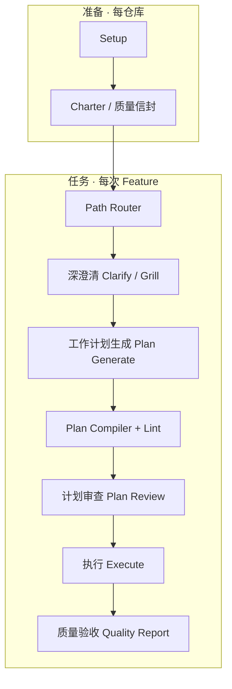
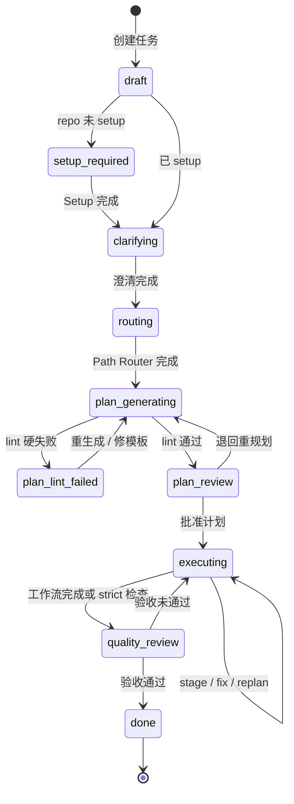
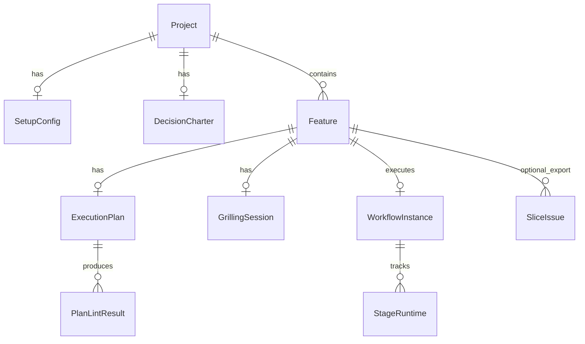
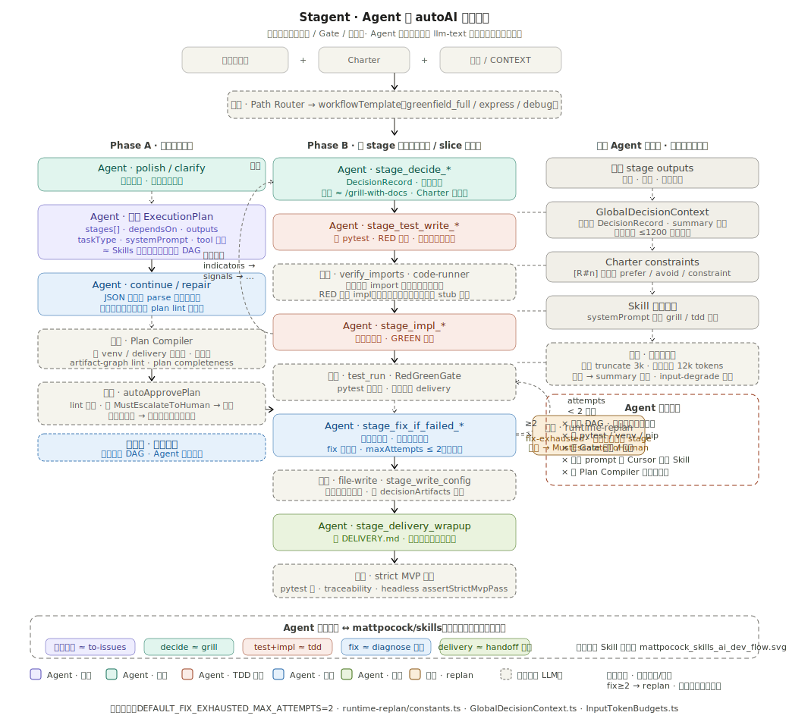

# Stagent 产品需求文档（PRD）

> **产品名称**：Stagent — Skill-native 软件开发自动化平台  
> **Skill 规范**：[mattpocock/skills](https://github.com/mattpocock/skills)（本仓库 `skills-main-lastest/`）  
> **方法论来源**：[WORKFLOW.md](../../stagent_docs/WORKFLOW.md)  
> **版本**：v1.7  
> **状态**：Draft — 供评审与实施  
> **日期**：2026-06-10  
> **v1.7 变更**：新增 G11 与 §5.8「平台演进闭环」；附录 B 增补 Run #22（`sys.modules` 劫持、弱断言 warn-only）。  
> **工程师评审版**：[STAGENT-PRD-ENGINEER.md](./STAGENT-PRD-ENGINEER.md) — 理想 vs 现状 vs Live 差距（供资深工程师 1–2h 评审）。  
> **v1.6 变更**：§5.6 补 Python import 语义 SSOT、三道防线、包布局与 export 表面；同步 R3b 门禁表与 §15；附录 B 增补 T4 live 复盘。  
> **v1.5 变更**：骨架模板 M3 并行启动；§5.6 `verify_imports` 决策；§14 分层成功率；§11.4 归档 ADR；§15 合并处置状态。  
> **v1.4 变更**：§11.4 架构评审纪要；Agent 职责图补 fix 上限 / runtime-replan / 上下文降级。  
> **v1.3 变更**：§11 嵌入 [stagent_agent_work_flow.svg](../../stagent_docs/stagent_agent_work_flow.svg)（Agent vs 引擎职责图）。  
> **v1.2 变更**：删除全部 A 路线 / 人驱动 Guided / 外发 Cursor 相关表述；`autoAI` AFK 自执行为唯一产品路径。

---

## 文档地图（读本文前不必翻其他文件）

| 文档 | 角色 | 与本文关系 |
|------|------|------------|
| **本文 STAGENT-PRD.md** | **唯一产品需求总纲** | 定义做什么、为谁做、验收标准 |
| [STAGENT-PRD-ENGINEER.md](./STAGENT-PRD-ENGINEER.md) | **工程师评审版 PRD** | 理想态 + 实现矩阵 + Live T4 事实；评审入口 |
| [WORKFLOW.md](../../stagent_docs/WORKFLOW.md) | Skills 方法论 | 源流程；Path Router 规则与之对齐 |
| [B-ROUTE-SOLUTION.md](../../stagent_docs/B-ROUTE-SOLUTION.md) | 引擎实现规格 | 模块分层、执行链、质量主线 |
| [B-ROUTE-RCA-AND-FIXES.md](../../stagent_docs/B-ROUTE-RCA-AND-FIXES.md) | 故障复盘 | R1–R4 修复规格 |
| [`autoAI/docs/t4-live-iteration-log.md`](./t4-live-iteration-log.md) | Live T* 迭代日志 | §5.8 观测/沉淀；附录 B Run # 追溯 |
| [stagent_agent_work_flow.svg](../../stagent_docs/stagent_agent_work_flow.svg) | Agent 职责图 | §11；引擎调度下 LLM 做什么 |
| [adr/0001-agent-flow-architecture-review.md](../../stagent_docs/adr/0001-agent-flow-architecture-review.md) | Agent 架构评审 ADR | §11.4 归档；风险处置见 §15 |
| [mattpocock_skills_ai_dev_flow.svg](../../stagent_docs/mattpocock_skills_ai_dev_flow.svg) | Skills 手动流程图 | [WORKFLOW.md](../../stagent_docs/WORKFLOW.md)；与上表对照 |
| [../README.md](../README.md) | 质量优先 UI 愿景 | 屏 0–5 驾驶舱；与本文 §10 对齐 |

### 核心概念（一句话）

| 概念 | 含义 |
|------|------|
| **Skill** | `SKILL.md` 定义的可复用能力（grill、tdd、to-issues…） |
| **路径模板 `workflowTemplate`** | 选哪条大路：`greenfield_full` / `express` / `debug` 等 |
| **工作计划 `ExecutionPlan`** | 本次任务的 **步骤级施工图**（`WorkflowDefinition`：几十个 stage、依赖、产出引用） |
| **Path Router** | 需求 + 仓库快照 → 推荐 `workflowTemplate` |
| **Plan Compiler** | 工作计划生成后的确定性层：补标准步骤、检查引用、lint |
| **双轨把关** | A 轨客观验证（测试绿）/ B 轨主观决策（人批或 Charter 代答） |

**关键关系**：`workflowTemplate` 回答「走全量还是快速通道」；**工作计划** 回答「这条路上具体经过哪些路口、数据怎么传」。没有工作计划，引擎无法无人值守执行、无法断点续跑、无法在生成期拦截结构错误。

---

## 1. 问题陈述

### 1.1 Skills 单独使用时的痛点

开发者在 Cursor/Claude 中手动串联 `/grill-with-docs` → `/to-prd` → `/to-issues` → `/tdd` 时，常见问题：

| 痛点 | 后果 |
|------|------|
| 跳过关键阶段（未 grill 直接写代码） | PRD/决策缺失，返工 |
| Issue 拆分不符合 vertical slice | 水平切片、不可测 |
| 多 session context 断裂 | handoff 靠人工 |
| 无人记住「该走 express 还是全量」 | 小任务过度工程化，或大任务被简化 |
| **没有机器可读的执行清单** | 无法 AFK、无法客观验收、无法 plan lint |

### 1.2 Stagent 要解决的问题

**在 `autoAI` 中，Stagent 不是「帮专业开发者在 Cursor 里更方便地点 Skill」的提示词外壳，而是面向非专业操作者的 AFK 自动化引擎**：用户给出需求（+ 可选 Charter），系统尽量少问人、自动生成可执行工作计划、按步骤跑完并做客观验收。

将 Matt Pocock Skills **内化**为引擎能力，而非让人手动串联：

1. **不替代 Skills 语义** — 决策/TDD/澄清等 **行为** 仍以各 `SKILL.md` 为规范来源  
2. **编排 + 工作计划** — 把 Skill 链 **展开成 stage 级 DAG**，机器可读、可 lint、可续跑  
3. **机器把关优先** — Gate、Plan Compiler、测试红阻断 delivery；人只在 **升级项** 介入  
4. **默认自执行** — `autoAI` / headless / VS Code 扩展均以 **引擎按 stage 执行** 为唯一产品路径（见 §2.1、§6.2）

### 1.3 实证动机（T4）

T4（南华期货自动下单，Python 多模块）压测表明：

- 仅加大 LLM 输出上限 → 解决「计划截断」，**不解决**「步骤引用接错」  
- 执行期加固（测试失败阻断 delivery）**前提是工作计划能成功生成**  
- 多模块绿场任务需要 **工作计划** 显式包含 decide → test_write → impl → test_run 链

---

## 2. 产品定位与目标

### 2.1 定位

**Skill-native AFK 软件开发引擎**（`autoAI` 工作流平台核心）：

- **输入**：几句话需求 + 仓库上下文 +（可选）Charter / 质量信封  
- **输出**：可运行、可测试、可验收的软件产物  
- **过程**：尽量少依赖非专业人员做架构/流程决策；澄清与决策尽量由 **Charter 代答 + 引擎 Gate** 完成；客观步骤（测试、lint、delivery）**全自动**

Skills 是引擎的 **能力库**，不是让用户在聊天框里逐条 `/command` 的菜单。

### 2.2 目标用户（优先级排序）

| 角色 | 优先级 | 诉求 |
|------|--------|------|
| **非专业操作者 / 业务方** | **P0** | 提需求即可；不问「该用哪个 Skill」；只看进度与最终是否验收通过 |
| **AFK Operator** | **P0** | headless 无人值守；`feedback:live:t*` strict 验收 |
| **Tech Lead / 守护者** | P1 | 配置 Charter、质量信封；审计升级决策；不日常陪跑 |
| **Platform Builder** | P1 | 可扩展 stage 类型、模板、Gate |
| ~~Solo Dev 手动 Cursor~~ | **非目标** | 应直接使用 `skills-main-lastest`，而非 Stagent 主路径 |

### 2.3 产品目标（Goals）

| # | 目标 |
|---|------|
| G1 | 完整 Feature 流水线：Setup → 澄清 → **路径选择** → **工作计划生成与审查** → 执行 → 验收 |
| G2 | **工作计划** 为一级产物：可生成、可 lint、可签字、可持久化、可续跑 |
| G3 | Path Router：需求 × 仓库 → `workflowTemplate`（与 WORKFLOW §4 对齐） |
| G4 | Phase Gate：无 setup 不可 grill；无澄清不可生成计划；plan lint 红灯不可执行 |
| G5 | Artifact 中枢：`CONTEXT.md`、ADR、PRD、slice、DecisionRecord、`.stagent/` 实例 |
| G6 | Charter：**默认代答**可预见决策；仅升级项人工确认（非专业人员日常零决策） |
| G7 | **引擎自执行**：生成工作计划 → Plan Compiler → 按 stage 跑完；**不依赖**用户 Copy prompt 到 Cursor |
| G8 | 客观验收：DoD、pytest、traceability；software 任务测试红则阻断 delivery |
| G9 | headless 回归：`feedback:live:t*` 分 pipeline pass vs strict delivery pass |
| G10 | **计划可无人审批**（AFK）：plan lint 全绿 + 无 `MustEscalateToHuman` 项时，可 `autoApprovePlan` 开跑 |
| G11 | **平台演进须经 Live 回归**：`stagent-core` / Gate / prompt 变更不得仅依赖 mock headless 或单测；须 `build:core` + `feedback:live:t*`（strict）验收，并沉淀至附录 B + live 迭代日志（§5.8） |

### 2.4 非目标（Non-Goals）

| # | 不做 |
|---|------|
| NG1 | 重写 Skill 内容 — 只做 orchestration |
| NG2 | 替代 GitHub/GitLab — 默认集成 issue tracker，不自建 |
| NG3 | MVP 不做多租户 SaaS 计费 |
| NG4 | **不把「复制 prompt 到 Cursor」作为主产品能力** — 仅保留工程师调试开关 |
| NG5 | 不做通用低代码平台 — 聚焦软件交付工作流 |
| NG6 | 不面向「熟练开发者手动编排 Skill」— 该人群用 Skills 原生体验即可 |

### 2.5 未来（Post-MVP）

- 工作计划 **骨架模板**（绿场 Python 多模块）：系统展开 DAG，AI 只填步骤说明（见 §8.4）— **P0 地基，M3 起并行 Phase0，非 M5 末位可选项**  
- Cursor SDK 全自动回写  
- 模板市场、Skill 版本 pin  
- 屏 0–5 质量驾驶舱完整 UI

---

## 3. 解决方案概览

### 3.1 三层架构

```
┌─────────────────────────────────────────────────────────────┐
│  体验层：Webview / Headless CLI /（未来）六屏质量驾驶舱      │
├─────────────────────────────────────────────────────────────┤
│  编排层：Path Router · 工作计划生成 · Plan Compiler · Gate   │
├─────────────────────────────────────────────────────────────┤
│  执行层：Stage 工具（llm-text / code-runner / file-write）   │
│          双轨把关 · HITL · self-heal · runtime-replan        │
├─────────────────────────────────────────────────────────────┤
│  持久层：.stagent/instances · experiences · docs/adr         │
└─────────────────────────────────────────────────────────────┘
```

### 3.2 端到端用户旅程（目标六屏）

```
屏0 主旨·信封 → 屏1 深澄清 → 屏2 规划驾驶舱 → 屏3 决策·计划签字
    → 屏4 执行·验证 → 屏5 质量报告
```

与引擎阶段映射见 §6、§10。

### 3.3 产品形态（autoAI 为准）

| 形态 | 说明 | 地位 |
|------|------|------|
| **`autoAI` + `@stagent/core`** | headless / 可嵌入 VS Code；引擎自执行 `ExecutionPlan` | **产品核心** |
| **VS Code 扩展 `stagent_vscode`** | 带 UI 的同一引擎 | 交互壳 |

**工作计划 + 引擎执行** 是 Stagent 区别于「裸 Skills」的本质。

---

## 4. 核心工作流

### 4.1 总览图



### 4.2 Phase → 节点映射（完整）

| Phase | Node ID | 对应 Skill / 能力 | 产物 | 必做 |
|-------|---------|-------------------|------|------|
| 0 | `setup` | `setup-matt-pocock-skills` | `SetupConfig` | 每 repo 一次 |
| 0.5 | `charter` | —（平台内编辑） | `DecisionCharter`、DoD | 推荐 |
| 1 | `clarify` | `grill-with-docs` / `grill-me` | `GrillingSession`、`CONTEXT.md` diff | 正式 Feature 推荐 |
| 1.5 | `path-router` | —（确定性规则 + 扫描） | `workflowTemplate`、`pathRouterReason` | **是** |
| **2** | **`plan-generate`** | **工作流生成 LLM / 骨架模板** | **`ExecutionPlan` 草案** | **是（Autonomous）** |
| **2.5** | **`plan-compile`** | **Plan Compiler** | **lint 结果、注入 venv/delivery 等** | **是** |
| **3** | **`plan-review`** | **确认页 / HITL** | **`planApprovedAt`、决策前置批准确认** | **Autonomous 推荐** |
| 4 | `execute` | 映射 tdd / decide / test_run 等 **按 stage** | 代码、测试、DecisionRecord | 是 |
| 4+ | `zoom-out` | `zoom-out` | moduleMap | Brownfield 按需 |
| 4+ | `diagnose` | `diagnose` | 修复 | debug / 失败链 |
| — | *(内化)* | to-prd / to-issues / tdd 语义 | 已展开进 `stages[]` | 非独立人工步骤 |
| 6 | `quality-report` | DoD + strict MVP | 验收报告 | strict 档位 |
| 6 | `arch-review` | `improve-codebase-architecture` | HTML 报告 | 定期 |
| — | `triage` | `triage` | label 流转 | 横切 |
| — | `handoff` | `handoff` | 交接文档 | 横切 |

> **说明**：Stagent **不**提供「人去 Cursor 点 `/tdd`」的主流程。to-prd、to-issues、tdd 的 **语义** 由引擎写入各 stage 的 `systemPrompt` 与工具链，一次工作计划跑到底。

### 4.3 Feature 状态机（修订 — 含工作计划）



**按 `workflowTemplate` 跳过/简化**：

| 模板 | 跳过 |
|------|------|
| `express` | PRD、slice、多模块 plan；最小 plan → 直接 execute |
| `debug` | PRD、slice；入口 diagnose |
| `greenfield_full` / `brownfield_full` | 无（完整 plan） |

### 4.4 Phase Gates（修订）

| Gate ID | 允许进入 | 条件 |
|---------|----------|------|
| `CanCreateFeature` | 创建任务 | `setupStatus == complete` |
| `CanClarify` | 澄清 | Setup 完成 |
| `CanRoute` | Path Router | 澄清完成或 express 豁免 |
| `CanGeneratePlan` | 工作计划生成 | `workflowTemplate` 已确定 |
| `CanCompilePlan` | Plan Compiler | 生成产出可解析为 `ExecutionPlan` |
| **`CanApprovePlan`** | **计划签字 / 执行** | **plan lint 无硬错误**；无未处理 `MustEscalateToHuman` |
| **`CanAutoApprovePlan`** | **AFK 免人工批计划** | `CanApprovePlan` + `autoApprovePlan=true` + Charter 覆盖澄清项 |
| `CanExecute` | 引擎执行 | `planApproved == true` |
| `CanDeliver` | delivery 阶段 | 所有 `stage_test_run_*` exit 0（software 默认） |
| `MustEscalateToHuman` | 反向：禁止代答 | ADR 级 / 越 Charter 约束 / 低置信 |

### 4.5 Path Router

输入与规则与 [WORKFLOW.md §4.1–§4.4](../../stagent_docs/WORKFLOW.md#41-路径如何划定需求--仓库状态) 一致。

**输出 `workflowTemplate`**：

| 模板 | 场景 | 默认链（摘要） |
|------|------|----------------|
| `greenfield_full` | 绿场、多模块 | 澄清 → **完整工作计划** → 执行 |
| `brownfield_full` | 棕场、跨模块 | + zoom-out → 完整计划 → 执行 |
| `express` | 单切片、行为清晰 | 澄清 → **最小计划** → 执行 |
| `debug` | bug / 回归 | diagnose → 修复计划 → 回归测试 |
| `arch_review` | 架构治理 | improve-codebase-architecture |

**多模块硬规则**（T4）：`taskType=software` 且需求含 ≥4 个 path-like 模块 token → **禁止 express**；须 `greenfield_full` + `plan.requireCompleteness`。

---

## 5. 工作计划（Execution Plan）

### 5.1 定义

**工作计划**是本任务的可执行编排，技术类型为 `WorkflowDefinition`（version 2.0）：

- `meta`：title、taskType、userInput、isGreenfield、**workflowTemplate**、**skeletonVersion**（可选）
- `stages[]`：步骤列表，每步含 tool、toolConfig、input、outputs、dependsOn 等
- `globalConfig`：language、stackProfile、enableDagScheduler 等

### 5.2 工作计划 vs 其他概念

| 概念 | 粒度 | 谁产生 | 用途 |
|------|------|--------|------|
| `workflowTemplate` | 路径级 | Path Router | 选大路 |
| PRD / Slice Issue（可选导出） | 文档 / ticket 级 | 执行完成后 **可选** 同步到 issue tracker | 审计、协作；**非执行主路径** |
| **工作计划** | **步骤级** | **plan-generate + plan-compile** | **唯一执行编排；引擎主路径** |

### 5.3 生成模式

| 模式 | 说明 | 适用 |
|------|------|------|
| **全量 JSON 生成**（现状） | LLM 一次产出完整 `stages[]` | 默认；小任务 |
| **骨架模板 + 语义填充**（规划） | 系统展开标准 DAG；LLM 只填 `stagePrompts` 映射 | `greenfield_full` + Python + 多模块；见 §8.4 |
| ~~人工 slice TDD~~ | — | **非 Stagent 产品路径** | 用裸 Skills |

### 5.4 Plan Compiler 管道

```
工作计划草案
  → sanitizeInfraStages（剥离 LLM 误写的 venv/npm 步骤）
  → applyDiskBootstrap（幂等注入 venv、conftest、delivery、smoke）
  → lintArtifactGraph（file-write 引用必须可达）
  → lintPlanCompleteness（多模块切片、测试链、Python 布局）
  → 输出可执行计划 或 硬失败列表
```

### 5.5 标准步骤类型（stage 角色）

| 角色 | 典型 id 模式 | tool | 说明 |
|------|--------------|------|------|
| Decision | `stage_decide_*` | llm-text | 产出 decisionRecord + decisionArtifacts |
| Test Write | `stage_test_write_*` | llm-text | RED：写 pytest |
| Verify Import | `stage_verify_imports_*` | code-runner | import 检查 |
| Impl | `stage_impl_*` | llm-text | GREEN：写实现 |
| Test Run | `stage_test_run_*` | code-runner | 跑 pytest |
| Fix | `stage_fix_if_failed_*` | llm-text | 测试失败修复 |
| Infra | `stage_venv_*` 等 | code-runner | **引擎注入**，LLM 不生成 |
| Delivery | `stage_delivery_wrapup` | — | 交付收口 |

### 5.6 关键契约（硬规则）

1. `stage_test_run_*` 必须为 `code-runner`  
2. 决策阶段必须声明 `decisionRecord`；可声明 `decisionArtifacts`（机读 JSON）  
3. `file-write` 的 `sourceOutputKey` 必须在上游 `outputs` 或 decisionArtifacts 虚拟 key 中可达  
4. **config.yaml** 等配置文件：应从 **`stage_decide_*` 的 decisionArtifacts** 引用，不从 `stage_impl_*` 的 code 引用  
5. software + `blockDeliveryOnTestFailure`：任一 test_run 红 → 不进入 delivery  
6. **`verify_imports` 时序与边界**（software · Python）— **已采纳**：
   - **链顺序（不变）**：`decide → materialize_stub → test_write → verify_imports → impl → test_run`（骨架模板含 stub 注入；Plan Compiler 标准注入 verify/fix）
   - **校验范围**：测试文件存在且可解析；stdlib / 第三方根模块在 SSOT 白名单（`python-external-module-roots.json`）；默认 pre-impl **soft-skip** 项目内待实现模块
   - **strict 档**（`python.verifyImportsStrict`；AFK 默认 true）：plan 含 `stage_materialize_stub_*` 时 `verify-python-test-imports.mjs --strict` 在 impl 前校验项目内模块已落盘
   - **项目内 import（符号 + 模块名）**：`test_write` 后 **module-contract gate**（`python.moduleContractLint`；AFK 默认 **hard**）：
     - import 的**符号** ⊆ 该切片 `decisionArtifacts.modules[].exports`
     - import 的**顶层模块名** = 该切片 `modules[].name`（如 `indicators`），**禁止** `from __init__ import` / `import __init__` 等把文件名当模块名
   - **切片 decide**：须声明 `decisionArtifacts.modules`（slice 优先于 global architecture）
   - **test_write prompt**：RED 阶段优先行为级断言；仅 `from <模块> import <契约 exports>`，其中 **`<模块>` = `modules[].name`**，与 impl 落盘路径（`foo.py` 或 `foo/__init__.py`）无关
   - **门禁分工（替代 IDE 红线）**：
     - **主检**：post `test_write` / post `impl` / post `fix` 的 **module-contract**（落盘后立即 hard block）
     - **辅检**：`verify_imports --strict`（impl 前校验项目内模块**文件**已落盘；不替代符号/模块名契约）
     - **防**：prompt / stub 注入 canonical import 范例与禁止列表（不得从 `writeOutputToFile` 路径 `basename` 推导 import 模块名）
     - **桥**（GREEN 行为）：`impl_*` / `fix_if_failed_*` 注入**已落盘** `tests/test_<semantic>.py` 全文 + pytest 失败摘要（`buildTestGreenBridgePromptSuffix` · T4 Run #21）
7. **契约生命周期（R3b）**（software · Python · 多模块）— **R2/R3 延伸**：计划期定契约 → 执行期各 stage **只兑现**契约 → 机读 lint **在变异后**拦住漂移；`stage_fix_if_failed_*` 保留为安全网，**不得**成为符号/API 漂移的主路径（见下节）。

#### Python import / export 语义 SSOT（绿场包布局）

无人值守链路须统一以下约定（实现：`WorkflowArtifactRegistry`、`registryCoversPythonTopLevelModule`、`ModuleContractLint`、`PythonExportContractLint`）：

| 概念 | 规则 | 常见 LLM 幻觉 |
|------|------|----------------|
| **impl 落盘路径** | 绿场默认 `indicators/__init__.py` 等包布局 | 与 import 模块名混为一谈 |
| **import 模块名** | `from indicators import …`（= `modules[].name`）；**≠** `__init__` | `from __init__ import`（T4 Run #18） |
| **计划路径契约（M39）** | `from foo import` 被覆盖 ⟺ 计划含 `foo.py` 或 `foo/__init__.py` | 仅认 `foo.py` 导致 pre-`test_run` 误拦 |
| **对外 export 表面** | 仅模块**顶层** `def`/`class` + `__all__`；嵌套 helper 不算契约 export | 嵌套 `def ema` 触发 `python-impl-export-extra` 误报（已修） |

#### 契约生命周期（R3b）

**定位**：R2 提供 `decisionArtifacts.modules[]`（exports SSOT）；R3 在 **post `test_write`** 做一次 module-contract gate，并为 `test_write` / `impl` 接线 `decisionRecord` + `decisionArtifacts`。R3b 把同一契约规则延伸到 **所有会改写磁盘 Python 的阶段之后**，闭合「test 过了、fix 改坏、test_run 才爆」的缺口。

**原则**（与 §8.4「生成只填语义、执行只兑现」一致）：

| 阶段 | 允许做什么 | 禁止做什么 |
|------|------------|------------|
| `decide_*` | 声明 / 细化 `modules[]`（及可选 `dependencies[]`） | 发明未写入 sidecar 的 export 名 |
| `test_write_*` | 仅 `from <模块> import <契约 exports>`（`<模块>` = 切片 `modules[].name`） | 发明符号名、`from __init__`、跨切片 import 其他项目模块 |
| `impl_*` | 实现契约 exports；第三方 import ⊆ 已声明依赖 | `import talib` 等未在契约/依赖表中的包 |
| `fix_if_failed_*` | 按诊断 **路由**修复（见下） | 无 gate 地改 import / 换库 / 改 export 名 |

**机读门禁时间表**（同一 `decisionArtifacts.modules` SSOT）：

| 时机 | 门禁 | 状态（v1.6） | 说明 |
|------|------|--------------|------|
| post `test_write` | module-contract（**模块名 = 切片名** + 符号 ⊆ exports）+ declared-deps | **已实现** · AFK hard | 主检；早于 `verify_imports` |
| post `impl` | export-contract + module-contract + declared-deps | **已实现** · AFK hard | export 仅计顶层符号 |
| pre `test_run` | sdk-path-contract（M39.2）+ declared-deps + requirements-merge + pip-resync | **已实现** · AFK hard | 含包布局 `pkg/__init__.py` |
| post `fix_if_failed` | module-contract + declared-deps（同 post impl） | **已实现** · AFK hard | fix 非契约漂移主路径 |
| pre `test_run`（辅助） | `python.pypiSymbolLint` | warn / 可 hard | 第三方 API 幻觉符号 |

**`decisionArtifacts` 扩展（R2 可选字段，供 R3b 依赖门禁）**：

```json
{
  "version": 1,
  "modules": [{ "name": "signals", "exports": ["compute_ma"] }],
  "dependencies": ["pytest", "numpy", "pandas"]
}
```

- `modules[]`：项目内符号 SSOT（slice 优先于 global architecture，与 R2 相同）。  
- `dependencies[]`：允许出现在 `impl` / `fix` 中的第三方包；与 `stage_ensure_requirements_baseline` 合并写入 `requirements.txt` 后 `pip install -r`。未声明的 import（如决策仅「可选」提及的 `talib`）在 pre-`test_run` 或 post-fix **hard 阻断**。

**`fix_if_failed` 错误路由**（R3b；避免 fix 只改 `.py`）：

| 诊断 | fix 允许动作 |
|------|----------------|
| `ModuleNotFoundError`（契约内依赖） | 更新 `requirements.txt` + 触发 venv pip 重装 |
| 第三方 import ∉ `dependencies` | 改回契约内实现 **或** 先扩展 decide sidecar 再装包（禁止静默 `import talib`） |
| 测试 import 符号 ∉ exports | 只改回契约 exports，禁止发明新符号 |
| 断言失败（真 RED） | 对齐 impl 与 test 行为，不改 export 名 |

**与 RED 链分工**（§5.6#6 不变）：

```text
decide → materialize_stub → test_write → [module-contract] → verify_imports --strict
  → impl → [export/module-contract] → venv(pip -r) → test_run
       ↓ 红
  fix → [module-contract + pypi-symbol] → 重试 test_run（次数有界；非主路径）
```

**验收（R3b）**：

- T4 live：`fix` 引入未声明 `talib` 或 export 漂移时，在 **下一次 `test_run` 之前** gate 阻断（post-fix module-contract / declared-deps）。
- `from __init__ import` 在 post `test_write` 被 module-contract 阻断，**不得**依赖 `verify_imports` 才失败。
- gate 阻断当前为 `workflowFailed` 终态；**同 stage 自动重写**（gate 失败 → 带错误重试 LLM）为后续增强，非 v1.6 必达。
- `fix` 次数耗尽后仍 `workflowFailed` 分钟级终态（§M5 P0，已实现）。

### 5.7 生成期成功指标（分层）

| 类别 | 指标 | 目标 | 适用阶段 |
|------|------|------|----------|
| 模板结构 | 模板预置的引用边错误 | **0** | 骨架模板上线后 |
| 模块识别 | 与需求模块数一致（T4：5） | 一致或显式 fallback + 日志 | 全阶段 |
| AI 语义 | 说明表解析失败、缺 key | 可重试；T4 strict 下缺 key 阻断 | 全阶段 |
| 整体 · **过渡档** | T4 连续 3 次生成，≥2 次进入执行 | **67%** — 全量 JSON 生成不稳定期的**临时门禁** | M3–M4（pre-skeleton） |
| 整体 · **目标档** | T4 连续 5 次生成，**5 次均**进入执行 | **100%** | M5 骨架模板默认开启后 |

### 5.8 平台演进闭环（Platform Evolution Loop）

> **受众**：Platform Builder / 引擎维护者（§2.2 P1）。**非** AFK 用户主路径 — 与 §6.2「工程师调试」、§6.3 任务内 `fix_if_failed` / runtime-replan **分工不同**：后者改 **workspace 产物**；本节改 **引擎 / Gate / prompt**，并用 Live 任务族验收。

当 Live T4（或 T1–T5 族）暴露引擎缺口时，维护者按下列闭环演进平台能力（与 [B-ROUTE-RCA-AND-FIXES.md](../../stagent_docs/B-ROUTE-RCA-AND-FIXES.md) 规格化、与 `autoAI/docs/t4-live-iteration-log.md` 留痕对齐）：

| 步骤 | 动作 | 证据源（Stagent 已具备） |
|------|------|--------------------------|
| **1 · 观测** | 跑 `npm run build:core && npm run feedback:live:t4`（或对应 `t*`） | `autoAI/artifacts/headless-feedback.json`；`.stagent/instances/<id>/.wf-state.json`、`.wf-debug.log` |
| **2 · 诊断** | 从终态往回追：fix 耗尽 → pytest stdout → gate 消息 → **落盘 test / impl 对比** | 区分「impl 错」vs「测的不是 impl」（如 Run #22：`sys.modules` 注入 mock，fix 无权改 test） |
| **3 · 修复** | 优先 **引擎层**（post-stage gate、lint、prompt SSOT），避免只 patch 当次 workspace | `stagent-core`：`TestQualityLint`、`postStageGates`、`testImportBridgePromptSuffix` 等 |
| **4 · 验证** | **三层金字塔**（均须绿，不可跳层） | ① `npm test`（stagent-core）→ ② mock headless T* → ③ **Live LLM 实例**（G9 strict delivery） |
| **5 · 沉淀** | 现象 → 根因 → PRD 条款 → 代码勾选 | 附录 B 增一行；`t4-live-iteration-log.md` 记 Run #；重大决策可选 ADR |

**与 §5.6 三道防线的关系**：Live 失败应 **上升为 gate 或 prompt 规则**（「测行为不测实现」「禁止劫持被测包 import」），而非仅在 fix 链里碰运气。gate 阻断且 fix 无法触达的文件（如 `tests/test_*.py`）→ 须 **post `test_write` hard block + 同 stage 重试**（§5.6#7，M4+）。

**非目标（NG 延伸）**：

- 不在单次用户 AFK 任务中 **自动修改** `stagent-core`（无「自改引擎」产品承诺）。
- mock headless 绿 **不能** 替代 Live 回归关闭 G11。

**验收（G11）**：

- 每次引擎/Gate 变更的 PR 须附：单测通过 + 至少一次 Live `t*` strict 结果（instance id）或说明「仅文档 / 无行为变更」。
- Run #22 待落地项（M3 P1）：post `test_write` 对 `sys.modules` 劫持被测 slice、`test-tests-implementation`（仅 `is not None`）**hard block** — 见附录 B。

---

## 6. 执行模型

### 6.1 双轨把关

| 轨道 | 内容 | 把关方式 |
|------|------|----------|
| **A 轨 · 客观验证** | test_run、smoke、verify_imports | exit 0 自动前进 |
| **B 轨 · 主观决策** | stage_decide_* | HITL 批准 / Charter 代答 + provenance |

### 6.2 执行模型（仅引擎自执行）

| 档位 | 人工介入 | 流程 |
|------|----------|------|
| **AFK（默认）** | 无（或仅终态验收） | 澄清(Charter 代答) → 生成计划 → lint 通过 → **autoApprovePlan** → 引擎跑完 → strict 验收 |
| **监督（可选）** | 屏 3 批计划；HITL 仅升级决策 | 同上，但 `autoApprovePlan=false`，升级项清零后才执行 |
| **工程师调试** | 本地单步 / mock LLM | `headless` mock、`npm test`；**非产品承诺** |

**不存在**「主流程 = 组 prompt → 用户去 Cursor 执行」的产品档位。

### 6.3 引擎能力（已实现）

- DAG / 线性调度、`dependsOn`  
- stage 级 HITL（AdaptiveHITLPolicy）  
- self-heal（fix_if_failed）、runtime-replan  
- 实例持久化、跨会话 resume  
- Experience 沉淀（`.stagent/experiences.jsonl`）

### 6.4 Headless 与 Strict 验收

| 档位 | 含义 |
|------|------|
| pipeline pass | 工作流跑完、无引擎级失败 |
| **strict delivery pass** | pipeline + pytest 全绿 + MVP 目录 + 需求 traceability（T4/T5） |

配置：`pass.strict: true`；`blockDeliveryOnTestFailure: true`（software 默认）。

---

## 7. Charter（决策主旨）

- **四象限**：prefer / avoid / acceptable / constraints  
- **`autoAnswerMode`**：`off` | `suggest` | `auto-with-escalation`（headless AFK 推荐 `auto-with-escalation`）  
- **provenance**：`human` | `charter_direct` | `charter_inferred` | `escalated`  
- **`MustEscalateToHuman`**：ADR 级、越界、低置信 — **不可绕过**；非专业用户 **仅在此类** 被打断  

Charter 与 Path Router、**工作计划** 正交：任何 `workflowTemplate` 均可叠加 Charter。详见 [WORKFLOW.md §5.5](../../stagent_docs/WORKFLOW.md#55-phase-05决策主旨charter可选)。

---

## 8. 技术方案要点

### 8.1 代码库结构（现状）

| 包 / 目录 | 职责 |
|-----------|------|
| `skills-main-lastest/` | Skills 源（`SKILL.md`） |
| `autoAI/packages/stagent-core/` | 引擎核心（生成、执行、Plan Compiler） |
| `stagent_vscode/` | VS Code 扩展 UI |
| `autoAI/scripts/headless/` | 无人值守回归（T1–T5） |

### 8.2 Path Router 实现

- **显式路由**（推荐演进）：`path-router/PathRouter.ts`，生成前确定 `workflowTemplate`  
- **融合生成**（现状）：判别与 stages 在同一次 LLM 调用 — trace / 确认页展示 `meta.taskType`

### 8.3 Plan Compiler 实现

- `plan-compiler/compilePlan.ts`  
- `disk-bootstrap/applySoftwarePipeline.ts`  
- `plan-preflight/artifactGraphPreflight.ts`  
- `plan-completeness/lintPlanCompleteness.ts`

### 8.4 工作计划骨架模板（P0 — M3 并行启动）

**问题**：全量 JSON 生成对 40+ stage 任务仍有结构方差（引用接错）；AFK 承诺建在计划生成之上，此能力为**地基**而非末位优化。  
**方案**：`greenfield_full` + Python + 多模块时，系统展开标准 DAG，LLM 只填步骤说明表。

| 项 | 内容 |
|----|------|
| **优先级** | **P0**；**M3 并行**启动 Phase0 验证门禁（不等 M5） |
| 触发条件 | `workflowTemplate=greenfield_full` ∧ Python ∧ software ∧ multiModuleLayout ∧ `contract.skeletonCompiler=true` |
| 模板版本 | `skeletonVersion`（如 `greenfield-python-v2`）；PR 必跑快照测试 |
| 工期 | Phase0 验证 1–2 人日（**M3 第 1–2 周**）；完整落地 5–7 人日（**M3–M5 滚动**） |
| Phase0 门禁 | `compileGreenfieldPythonSkeletonPlan` + T4 mock lint 绿（`stagent-core` 单测）；决策→config 引用在展开期固定；生成链 `skeletonCompiler` 已接入（`WorkflowGenerationRunner` + headless T4 override） |
| M5 完成定义 | T4 multi-module **默认**走骨架路径；§14 目标档 5/5 连续进入执行 |

---

## 9. 数据模型

### 9.1 ER 概览（增补 ExecutionPlan）



### 9.2 Feature（增补字段）

| 字段 | 类型 | 说明 |
|------|------|------|
| `workflowTemplate` | enum | Path Router 输出 |
| `pathRouterReason` | JSON | 推荐理由 |
| **`executionMode`** | enum | 固定 `autonomous`（保留字段供遥测；无 guided 产品档） |
| **`autoApprovePlan`** | boolean | AFK 下 lint 通过后免人工批计划（默认 headless `true`） |
| **`planStatus`** | enum | `not_started` \| `generating` \| `lint_failed` \| `review` \| `approved` |
| **`planId`** | UUID? | FK → ExecutionPlan |
| `planApprovedAt` | datetime? | 签字时间 |
| `skeletonVersion` | string? | 骨架模板版本 |

### 9.3 ExecutionPlan（新增实体）

| 字段 | 类型 | 说明 |
|------|------|------|
| `id` | UUID | |
| `featureId` | UUID | FK |
| `workflowDefinition` | JSON | 完整 `WorkflowDefinition` |
| `stageCount` | int | |
| `workflowTemplate` | enum | 冗余便于查询 |
| `skeletonVersion` | string? | |
| `lintStatus` | enum | `pending` \| `passed` \| `failed` |
| `lintIssues` | JSON[] | plan_completeness、artifact-graph 等 |
| `structuralRepairs` | JSON[] | Plan Compiler 自动修复记录 |
| `generatedAt` | datetime | |
| `approvedAt` | datetime? | |

### 9.4 WorkflowInstance（执行期）

| 字段 | 类型 | 说明 |
|------|------|------|
| `instanceId` | UUID | `.stagent/instances/<id>/` |
| `planId` | UUID | 执行哪份计划 |
| `currentStageId` | string? | 续跑指针 |
| `status` | enum | `running` \| `paused_hitl` \| `completed` \| `failed` |
| `stageRuntimes` | JSON | 每步产出与 exit code |

### 9.5 其他实体（摘要）

| 实体 | 用途 |
|------|------|
| `SetupConfig` | issue tracker、triage 词汇、docs 路径（每 repo 一次） |
| `GrillingSession` | 澄清 Q&A、provenance、CONTEXT diff |
| `DecisionCharter` | 四象限 + `autoAnswerMode`（Project / Feature 级） |
| `SliceIssue` / `TddRun` | **可选导出** 到 issue tracker；**不参与**引擎调度 |

---

## 10. UI 规格（质量驾驶舱）

与 [README.md §2–§5](../README.md) 对齐。

| 屏 | 名称 | 对应引擎阶段 | 签字点 |
|----|------|--------------|--------|
| 0 | 主旨·信封 | Charter + DoD | 仓库质量信封 |
| 1 | 深澄清 | clarify / grill | 需求已澄清 |
| 2 | 规划驾驶舱 | plan-generate + 流式展示 | 可进入计划审查 |
| 3 | 决策·计划签字 | plan-review + 决策前置 | **批准并开始执行** |
| 4 | 执行·验证 | execute | HITL 仅升级项 |
| 5 | 质量报告 | quality-report / strict MVP | 验收通过 |

**屏 2 要点**：三列（结构 DAG / 语义叙事 / 风险 lint）；区分引擎插入 vs LLM 生成步骤。  
**屏 3 要点**：决策板 + 计划卡片（角色色）+ 客观预审（plan lint 列表）；红灯禁止执行。

当前 MVP（VS Code）：`输入 → 确认 → 执行` 三屏对应屏 1 简化、屏 3 合并、屏 4。

---

## 11. Skills 如何进入引擎（非「外发 Cursor」）



> **图例**：彩色框 = Agent（工作计划生成 + `llm-text` stage）；灰虚线框 = 引擎（Path Router、Plan Compiler、pytest、Gate、`file-write`）；橙框 = `runtime-replan`（fix 链耗尽）。右列含上下文降级（truncate / summary）。手动串联 Skills 的全量路径见 [mattpocock_skills_ai_dev_flow.svg](../../stagent_docs/mattpocock_skills_ai_dev_flow.svg)（[WORKFLOW.md](../../stagent_docs/WORKFLOW.md) §图示）。

### 11.1 内化方式

Skills **不**以「用户复制 `/tdd` 到聊天框」方式使用，而是：

1. **生成期**：工作流生成 prompt 引用 Skill 约束块（taskType 分支、TDD 红绿语义、决策四标题等）  
2. **执行期**：每个 `llm-text` stage 的 `systemPrompt` 由引擎拼装（含已批准 DecisionRecord、Charter 片段）  
3. **工具期**：`code-runner` / `file-write` 由引擎直接调用，无需外部 Agent  

### 11.2 Charter 与少决策设计

| 决策类型 | 处理方式 |
|----------|----------|
| 可预见（栈、目录、测试框架） | Charter **直接代答** |
| 可推断（模块边界常规切分） | Charter **推断代答** + 日志可审计 |
| 高风险 / 越界 / 低置信 | `MustEscalateToHuman` → **唯一**允许打断非专业用户 |

非专业用户 **不应** 被要求选择 workflowTemplate、slice 粒度、或手动点 TDD。

### 11.3 可选：Issue Tracker 导出

执行完成后，可将 PRD/切片摘要 **导出** 为 GitHub issue，供团队协作审计；**不**作为执行调度源。

### 11.4 架构评审（归档）

2026-06-10 对 [stagent_agent_work_flow.svg](../../stagent_docs/stagent_agent_work_flow.svg) 的评审结论：**方案可行**；完整纪要已归档至 [adr/0001-agent-flow-architecture-review.md](../../stagent_docs/adr/0001-agent-flow-architecture-review.md)。

**PRD 内活文档**：风险项 **处置状态**（已实现 / 部分实现 / 未实现）统一维护于 **§15**，避免本节与规范正文漂移。`verify_imports` 边界决策见 **§5.6 规则 #6**。

---

## 12. API 概要（增补计划相关）

| Method | Path | 说明 |
|--------|------|------|
| POST | `/projects/:id/features/route` | Path Router |
| POST | `/features/:id/plan/generate` | 触发工作计划生成 |
| GET | `/features/:id/plan` | 获取计划 + lint 结果 |
| POST | `/features/:id/plan/approve` | 批准计划，进入执行 |
| POST | `/features/:id/plan/regenerate` | 退回重生成 |
| POST | `/features/:id/execute/start` | 启动引擎 |
| GET | `/features/:id/execute/status` | 执行进度 |
| POST | `/features/:id/execute/resume` | 续跑 |

| POST | `/projects` | 创建 project |
| POST | `/projects/:id/setup` | 保存 setup |
| PUT | `/projects/:id/charter` | Charter |
| POST | `/projects/:id/features` | 创建任务 |

---

## 13. 里程碑

### M1 — 基础（2–3 周）

- [ ] Project + Setup + Charter  
- [ ] Path Router API / 扩展内路由  
- [ ] Gate 引擎（含 `CanGeneratePlan`、`CanApprovePlan`）

### M2 — 工作计划管线（3–4 周）【大部分已完成】

- [x] `WorkflowDefinition` 生成 + parse retry  
- [x] Plan Compiler + artifact graph lint  
- [x] 确认页（plan-review 简化版）  
- [ ] 屏 2 规划驾驶舱（流式 + 三列）  
- [ ] `planStatus` 状态机与 API 对齐

### M3 — 执行与验收 + 骨架模板 Phase0（3–4 周）

- [x] 引擎自执行 + HITL  
- [x] headless T1–T5  
- [x] strict MVP + `blockDeliveryOnTestFailure`  
- [ ] 屏 4/5 执行驾驶舱与质量报告  
- [x] **`verify_imports` 对齐 §5.6#6**（`verify-python-test-imports.mjs` pre-impl soft-skip；`--strict` 保留 M5 严格档）  
- [x] **骨架模板 Phase0**（与上项并行，**P0**）：`expand-greenfield-python-skeleton.test.ts` T4 mock + `compileGreenfieldPythonSkeletonPlan` lint 绿  
- [x] `expandGreenfieldPythonSkeleton` 原型 + `applySemanticFillToSkeleton` + `fillSkeletonStagePrompts`（`plan-skeleton/` · **R1**）  
- [x] 切片 `decisionArtifacts.modules` sidecar + plan lint（**R2**）  
- [x] `test_write` / `impl` 双接 `decisionRecord` + `decisionArtifacts`（Rule20 normalize · **R3**）  
- [x] post `test_write` module-contract gate（`python.moduleContractLint` · AFK hard · **R3**）  
- [x] `stage_materialize_stub_*` + `verify_imports --strict` + `stage_ensure_requirements_baseline`（pytest/numpy/pandas · **R4** 环境链）  
- [x] **R3b** post `impl` export-contract + module-contract 复验（AFK hard，与 post `test_write` 同 SSOT）  
- [x] **R3b** pre `test_run` `python-declared-deps` + `python-pypi-symbol` hard（第三方 import ⊆ `dependencies`；`python-requirements-merge` + `pip-resync`）  
- [x] **R3b** post `test_write` / `fix_if_failed` declared-deps + module-contract 复验（AFK hard）  
- [x] **R3b** `decisionArtifacts.dependencies[]` 机读 + pre-test_run merge（`PYTHON_BASELINE_DEPENDENCIES` 合并）  
- [x] **R3b** fix 链错误路由（`additionalWriteTargets` 多文件落盘 + `buildFixRoutingPromptSuffix`；pip 由 `python-pip-resync` 触发）
- [x] **Python 包布局 SSOT**（M39）：`registryCoversPythonTopLevelModule`；`indicators/__init__.py` ↔ `from indicators import`（T4 Run #2→#3）
- [x] **export 表面 SSOT**：`extractExportedSymbols` 仅模块顶层符号（嵌套 `def` 不计 export · T4 Run #17）
- [x] **test_write 切片 import 模块名** gate：`python-test-slice-import-module-mismatch`（禁止 `from __init__` · T4 Run #18）
- [x] **层1 规范注入对齐**：`decisionApiAlignPromptSuffix` + `resolveSlicePythonImportModuleName`；`indicators/__init__.py` → `from indicators import`（T4 Run #19）
- [x] **层3 上下文桥接**：`buildTestImportBridgePromptSuffix` 于 `impl_*` 读取已落盘 `tests/test_<semantic>.py` import 行注入 prompt（T4 Run #19）
- [x] **切片 exports 合成 SSOT**：无 JSON sidecar 时从 `decisionRecord` 抽取 exports；`materialize_stub` / `resolveModuleExports` / module-contract 同源（T4 Run #20）
- [x] **GREEN 行为桥接**：`impl_*` / `fix_*` 注入落盘 pytest 全文 + 失败输出；主路径 RED→GREEN 对齐（T4 Run #21）
- [x] **契约 exports 运行时 SSOT**：`buildSliceContractExportsPromptSuffix` 覆盖骨架静态示例；`decisionRecord` 抽取过滤内置类型噪声（T4 Run #22）

### M4 — AFK 与少决策（2–3 周）

- [x] 生成链 `contract.skeletonCompiler`：`resolveSkeletonCompilerGate` → `generateWorkflowFromSkeleton`（跳过 LLM JSON）；headless T4 family 默认开  
- [ ] `autoApprovePlan`：lint 绿 + 无升级项 → 免屏 3 人工签字（**仅 headless 默认开**；UI 监督档默认关 — 见 OQ-2）  
- [ ] `plan.stageCountThreshold`：`greenfield_full` 且 stage 数超过阈值 → 强制人工审批（缓解语义盲区）  
- [ ] Charter `auto-with-escalation` 与 headless 默认配置对齐  
- [ ] 非专业用户 UI：仅进度 + 终态报告（隐藏 stage 技术细节）  
- [ ] 骨架模板 T4 live：**过渡档** ≥2/3 进入执行（§14）

### M5 — 骨架模板默认化（2–3 人日收尾）

- [x] T4 multi-module **默认** `contract.skeletonCompiler=true`（`resolveSkeletonCompilerEnabledForGate`；VS Code 可显式关闭）  
- [x] stub 模块注入（`stage_materialize_stub_*`）+ `verify_imports --strict`（`python.verifyImportsStrict`；AFK 默认开）  
- [x] `failWorkflowStageFromGate` 补发 `workflowFailed`（fix 耗尽分钟级终态）  
- [ ] **目标档**：连续 5 次生成均进入执行；模板预置引用错误 = 0（待 live batch）

---

## 14. 成功指标

| 指标 | 目标 | 备注 |
|------|------|------|
| Setup 完成率 | > 90% active projects | |
| 澄清后再生成计划 | > 95%（Gate） | |
| **T4 生成 · 过渡档** | 连续 3 次中 **≥2 次**进入执行 | 全量 JSON 期临时门禁（M3–M4） |
| **T4 生成 · 目标档** | 连续 **5 次均**进入执行 | 骨架模板默认开启后（M5+） |
| **模板预置引用错误** | **0** | 骨架模板上线后硬指标 |
| Path Router 与最终模板一致率 | > 85% | |
| strict delivery vs pipeline 分栏报告 | 100% headless 任务 | |
| Charter 升级精确率 | > 95% | |
| Feature 完成率 | 较无平台 baseline +20% | |

---

## 15. 风险与缓解

> 处置状态列维护架构评审（[ADR-0001](../../stagent_docs/adr/0001-agent-flow-architecture-review.md)）跟踪项，随里程碑更新。

| 风险 | 影响 | 处置状态 | 缓解 |
|------|------|----------|------|
| 工作计划生成失败阻塞全链路 | 高 | **部分实现** | **骨架已接入生成链**（`contract.skeletonCompiler` M5 条件默认 + T4 headless）；语义填充 `fillSkeletonStagePrompts`；artifact-graph lint；continue/repair |
| ExecutionPlan 语义合理但 lint 无法检出 | 中 | **部分实现** | R3 module-contract @ test_write（含模块名=切片名）；R3b post-impl/fix；M39 包布局 registry SSOT；`plan.stageCountThreshold`（M4） |
| fix 链导致契约漂移（符号/API/未声明第三方） | 中 | **大部分实现** | §5.6 R3b post-fix gate；GREEN 行为桥接减轻断言漂移（Run #21） |
| pytest 断言失败（真 RED / impl 行为） | 高 | **部分实现** | 主路径：test 全文注入 impl（GREEN 桥接）；fix 注入 test+pytest 摘要；仍依赖 LLM 质量；耗尽 → runtime-replan |
| LLM 混淆路径 / 模块名 / export 表面（如 `from __init__`） | 中 | **大部分实现** | §5.6 三层防御已落地；Run #19 仍可能因 stub/decide exports 漂移（`compute` vs `compute_ma`）阻断 |
| `stage_fix_if_failed` 无限循环 | 高 | **已实现** | `DEFAULT_FIX_EXHAUSTED_MAX_ATTEMPTS=2` → runtime-replan → MustEscalate |
| 上下文 Token 累积致后期 stage 失效 | 中 | **部分实现** | Decision summary（≤1200 字符/条）；输入 12k 总量 / 3k 单源截断；**引用式代码注入**（impl 读 test import · M3 P1） |
| Charter prefer/avoid 被 LLM 忽视 | 中 | **部分实现** | `[R#n]` 结构化块；impl 后 lint；生成期 constraint lint（待做） |
| `verify_imports` 与 TDD RED 时序冲突 | 中 | **已实现** | soft-skip 默认；`materialize-python-module-stub.mjs` + `--strict`（stub 后 AFK 默认）；符号契约由 module-contract gate 承接 |
| 模板维护成本 | 中 | **未实现** | skeletonVersion + 快照测试 + PR 回归 |
| 非专业用户仍被过多 HITL 打断 | 高 | **部分实现** | Charter auto-with-escalation；autoApprovePlan（M4）；仅升级项暂停 |
| Charter 过度自信 | 高 | **部分实现** | MustEscalateToHuman；UI 监督档默认 suggest/off |
| 工作量低估（骨架模板） | 中 | **进行中** | M3 Phase0 门禁；5–7 人日滚动交付 + 缓冲 |

---

## 16. 验收标准（Release）

### 16.1 通用

1. 用户可完成 Setup，创建 Feature，走 Path Router 并看到 reason。  
2. 澄清 Gate 生效；未澄清不可生成计划（autonomous）。  
3. Charter 可配置，grill provenance 可审计。

### 16.2 工作计划（Autonomous）

4. 系统可为 `greenfield_full` 任务生成含 ≥40 stage 的工作计划（T4 类）。  
5. Plan Compiler 在 generate 期拦截 artifact-graph 硬错误。  
6. 用户（或 headless）批准计划后引擎可执行至 workflowCompleted 或明确失败。  
7. software 任务 test_run 红时 delivery 被阻断。  
8. headless T4 `pass.strict` 报告 pipeline 与 strict delivery 分栏。

### 16.3 AFK 少决策（M4）

9. headless 默认 `autoApprovePlan`；无升级项时零人工点击即可跑完。  
10. T4 非专业场景：用户仅提供需求文档路径 + API key，不需选择 Skill 或模板。

### 16.4 骨架模板（M3 Phase0 → M5 默认化）

11. **M3 Phase0**：`expandGreenfieldPythonSkeleton` 原型对 T4 mock 任务产出 lint 绿计划 ≥1 次。  
12. **M5**：`contract.skeletonCompiler=true` 为 T4 multi-module **默认**；模板预置引用错误 = 0。  
13. **M5**：连续 5 次 T4 live 生成 **均**进入执行（§14 目标档）。  
14. 模块识别日志可人工复核。

### 16.5 平台演进（G11）

15. 引擎 / Gate / prompt 行为变更：`stagent-core` 单测绿 + 至少一次 Live `feedback:live:t*` strict 留 instance id；附录 B 或 live 迭代日志有对应 Run # 条目。

---

## 17. 开放问题

| # | 问题 | 建议 |
|---|------|------|
| OQ-1 | Path Router 独立服务 vs 融合生成 — 长期统一为？ | 显式路由 + 模板展开；生成只填语义 |
| OQ-2 | `autoApprovePlan` 默认开还是仅 headless 开？ | **已决**：headless / `pass.strict` 默认开；VS Code 监督档默认关；切换条件写入 M4 验收 |
| OQ-3 | Issue 导出是否与 ExecutionPlan 双向链接？ | 可选导出，非调度源 |
| OQ-4 | 骨架模板是否成为 multi-module 唯一生成路径？ | **已决**：M5 默认开启；**验证通过** = Phase0 单测绿 + T4 过渡档 2/3 + 目标档 5/5（§14 / §16.4） |

---

## 18. 参考文献

- [WORKFLOW.md](../../stagent_docs/WORKFLOW.md) — Skills 全流程；§4 路径；§19 矩阵  
- [B-ROUTE-SOLUTION.md](../../stagent_docs/B-ROUTE-SOLUTION.md) — 引擎模块、WorkflowDefinition 契约  
- [B-ROUTE-RCA-AND-FIXES.md](../../stagent_docs/B-ROUTE-RCA-AND-FIXES.md) — 引擎故障复盘  
- [../README.md](../README.md) — 六屏质量 UI  
- `skills-main-lastest/` — Skill 定义  
- `autoAI/docs/adr/0004-t4-delivery-hardening.md` — T4 严格验收 ADR  
- [`autoAI/docs/t4-live-iteration-log.md`](./t4-live-iteration-log.md) — Live T* 迭代事实源（§5.8）

---

## 附录 A：用户故事（增补工作计划）

22. As a **Solo Dev**, I want the platform to **generate an execution plan** from my clarified requirements, so that I can see every stage before code runs.  
23. As a **Tech Lead**, I want **plan lint** to block execution when module slices or file-write edges are wrong, so that AFK runs do not start from a broken DAG.  
24. As an **AFK Operator**, I want headless runs to **resume from the last stage** using the approved plan, so that long T4 tasks do not restart from scratch.  
25. As a **Solo Dev**, I want to **approve the plan and decisions on one screen** before execution, so that B-track choices are not scattered across the run.  
26. As a **Platform Builder**, I want **skeleton templates versioned and snapshot-tested**, so that template changes do not silently break all greenfield Python projects.

---

## 附录 B：T4 失败案例（需求追溯）

| 现象 | 根因层 | PRD 对应 |
|------|--------|----------|
| 仅 5 stage | L1 输出截断 | §5.3 maxTokens；§8.4 骨架模板（M3 并行） |
| 46 stage 但 config 引用 impl | L3 结构接错 | §5.6 契约；§8.4 模板固定边 |
| 测试红仍 delivery | 执行期 Gate | §6.4 strict；G8 |
| express 压成单切片 | Path Router | §4.5 multiModule 硬规则 |
| verify_imports impl 前失败 | RED 与预检时序 | §5.6#6；stub + soft-skip / `--strict` |
| `from __init__ import` 通过 test_write | 路径≠模块名；gate 漏检模块名 | §5.6 语义 SSOT；M3 module-contract 模块名规则 |
| M39.2 `test-import-path-not-in-plan` @ pre-test_run | registry 仅认 `mod.py` | §5.6 包布局 SSOT；`pkg/__init__.py` |
| fix 误拦 `python-impl-export-extra`（嵌套 `def ema`） | export 表面 lint 过宽 | §5.6 export 表面 SSOT（顶层 only） |
| gate 后无自动重写 test_write | 产品未定义同 stage 重试 | §5.6#7 验收；待 M4+ |
| 契约全绿但 pytest 红（fix 链耗尽） | impl 未读落盘 test 行为 | §5.6 GREEN 行为桥接；M3 `buildTestGreenBridgePromptSuffix`（Run #20→#21） |
| test_write import 与 slice exports 不一致（如 SignalGenerator） | 骨架 prompt 静态示例 ≠ 已批准契约 | `buildSliceContractExportsPromptSuffix`；`isWeakModuleExports` 重合成（Run #21→#22） |
| decisionRecord 合成 exports=`int` | 类型注解 `int(0~3)` 误匹配 | `BUILTIN_EXPORT_NOISE` + 主方法 `` `generate` `` 抽取（Run #22） |
| impl 已绿但 pytest 仍红（fix 耗尽） | test 用 `sys.modules['indicators']=MagicMock` 劫持被测包；fix 不可改 test | §5.8 诊断范例；post `test_write` hard gate（`sys.modules` 劫持 · M3 P1 · Run #22） |
| `test-run-contract-lint` 报弱断言仍进入 impl | `test-tests-implementation` 仅 warn；`is not None` 通过 module-contract | §5.8；post `test_write` hard block 弱断言（M3 P1 · Run #22）；§5.6#7 同 stage 重试 |
| AFK 挂死 @ decide（decision lint 拒绝后 paused） | 低质 decisionRecord；harness 只 approve 一次 | §5.8；`DecisionLintGate` + harness `drainHitl` decide 重试（Run #25） |
| smoke `python3 main.py` 缺 `--config` 立即退出 | smoke 未推断 CLI 与 config 阶段关系 | `smokeStage.ts` 附 `--config config.yaml`（Run #31） |
| broker pytest 挂死 → code-runner-timeout | `threading.Lock` 嵌套 acquire 死锁 | GREEN 桥接禁嵌套 acquire（Run #32）；**无静态 gate，timeout 兜底** |
| main.py 发明 `trade`/`modules`/`data_source` 顶层键 | SSOT 仅列扁平键、mutate 反馈不足 | `buildConfigYamlAccessGuide` + config-contract mutate 专项反馈（Run #43/#44） |
| decide 正文噪声 → exports=`assign,KeyError,...` | `extractModuleExportsFromDecisionRecord` 过宽 | 显式「五个公开函数」短语优先 + `pruneExportNoise`（Run #44→#45） |
| signals `test_edge_convergence_exact_2_tick` 假红 | 先设 MA 再调 `_set_ideal_short_df` 被覆盖 | testfix prompt：边界列须在 helper **之后**覆盖（Run #45→#46） |
| decide_main lint 重试 3 次仍缺章 | AFK 重试注释写「背景/问题」≠ 校验器 `### 职责边界` | `buildDecisionLintRetryUserComment` SSOT（Run #47→#48） |
| generate `multi-file-prompt-mismatch` + `your_module` import | 语义填充 impl 多文件路径 / test_write 占位 import | `sanitizeSemanticFillWorkflow` post-fill（Run #48→#49） |
| main test_write patch `indicators.compute` 阻断 | 跨模块 patch 未对齐各切片 exports | `buildCrossModulePatchExportsPromptSuffix`（Run #49→#50） |
| signals fix 耗尽（`generate_*_signal` 返回 None） | impl AND 链与 fixture 数值不一致 | signals fix 路由 CCI/MA20 提示（Run #50→#51） |
| signals impl 要求导出 `index_sh` | decide sidecar 混入行情全局变量 | `pruneExportNoise` 剔除 `index_sh/index_sz`（Run #51→#52） |

---

*本文档为 Stagent 唯一完整 PRD。实施时以本文为准；Skill 行为变更请同步更新 Gate、工作计划约束与 WORKFLOW.md。*
