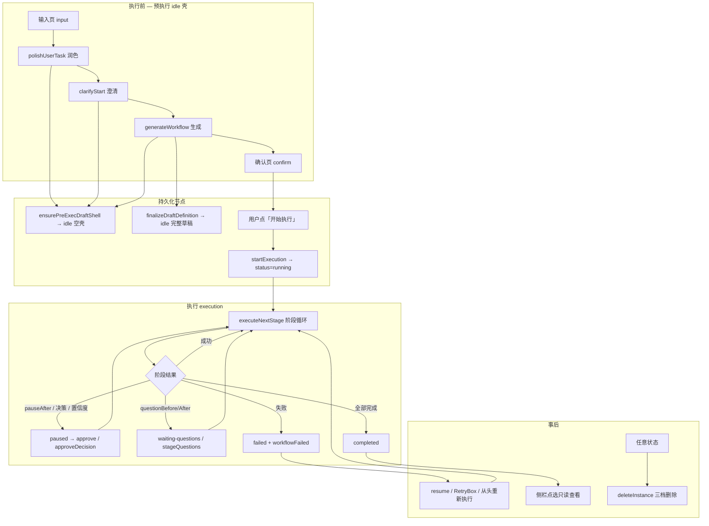

# autoAI 任务全生命周期说明

本文档描述 **autoAI**（Electron 宿主 + `@stagent/core` 引擎）中工作流「任务 / 实例（WorkflowInstance）」从输入到删除的完整生命周期，反映截至审查报告 §7 全部 12 项缺口补齐后的**当前实现**。

**范围**

| 层级 | 路径 |
|------|------|
| 引擎 | `autoAI/packages/stagent-core/` |
| IPC | `autoAI/src/main/stagent/stagent-ipc.ts` |
| 渲染状态机 | `autoAI/src/renderer/src/stagent/useStagentEngine.ts` |
| UI | `StagentPage.tsx`、`TaskTree.tsx`、`FileTree.tsx` |

---

## 1. 核心概念

### 1.1 任务 vs 实例

- **任务（侧栏条目）**：一个 `WorkflowInstance`，由唯一 **`instanceKey`**（UUID）标识。
- **工作流定义（WorkflowDefinition）**：阶段列表、元数据、全局配置；可在确认页编辑后再执行。
- **工作文件夹（taskWorkspacePath）**：用户选择的输出根目录；文件树展示此目录（**排除** `.stagent/`）。
- **实例状态目录（taskDir）**：`<taskWorkspacePath>/.stagent/instances/<instanceKey>/`，存放 `.wf-state.json`、调试日志等；**不在文件树中显示**。

### 1.2 双源持久化

| 存储 | 内容 |
|------|------|
| 宿主 `globalState`（键 `wf_instance_<key>`） | 完整 `WorkflowInstance` 快照 |
| 磁盘 `taskDir/.wf-state.json` | 同上，崩溃恢复真源 |

加载时经 `loadInstanceByKey()` 合并；磁盘缺失时会 purge 过期的 global 条目（`pruneStaleGlobalInstances`）。

### 1.3 实例级状态 `WorkflowStatus`

| 状态 | 含义 | 何时写入 |
|------|------|----------|
| `idle` | 确认页草稿，尚未执行 | 润色/澄清/生成入口 → `ensurePreExecDraftShell`；生成成功 → `finalizeDraftDefinition` |
| `running` | 执行中（含 HITL 暂停时实例级仍为 running） | `startExecution` |
| `completed` | 全部阶段终态完成 | 执行器 `workflowCompleted` |
| `failed` | 某阶段终态失败 | 执行器 `failWorkflowStage` |
| `paused` | **类型存在，实例级不写**；暂停在阶段级 `StageRuntime.status` |

侧栏展示：`failed` → 标签「失败」；`idle` →「草稿」。

### 1.4 阶段级状态 `StageStatus`

常见值：`pending` → `running` / `retrying` → `done` | `paused` | `waiting-questions` | `error` | `skipped`。（HITL 批准后阶段终态为 `done`，批准记录存于独立字段 `approvedDecisionRecord`，**无** `approved` 状态值。）

HITL 暂停、追问、决策审批均在**阶段级**表达；实例级保持 `running`。

---

## 2. 目录与产物落盘

```
<taskWorkspacePath>/                 ← 文件树根（用户可见）
├── 需求分析文档.md                  ← 开始执行时写入（writeProcessDocs）
├── 工作流规划.md
├── reader.py / …                    ← 阶段产物（默认 writePathBase=workspace）
└── .stagent/
    └── instances/
        └── <instanceKey>/
            ├── .wf-state.json       ← 实例状态
            ├── .wf-debug.log        ← 调试日志
            └── .wf-failures.jsonl   ← 失败记录（实例级；全局失败日志在 <globalStorage>/failure-logs/failures.jsonl）
```

- **默认落盘根**：`DEFAULT_TOOL_PATH_BASE = 'workspace'`（无 `taskWorkspacePath` 时引擎回退 `instance` / taskDir）。
- **`patchMode`**：与 `writeOutputToFile` 相同，走 `resolveOutputPath(..., writePathBase)`。
- **过程文档**：写到 `taskWorkspacePath` 根，而非 taskDir，以便出现在文件树。

---

## 3. 生命周期总览



---

## 4. 执行前阶段（不执行或仅草稿）

| 步骤 | 前端 `phase` | 触发消息 | 引擎方法 | 是否创建实例 |
|------|--------------|----------|----------|--------------|
| 输入 | `input` | — | — | 否 |
| 润色 | `input` | `polishUserTask` | `polishUserTask` | **是**：`ensurePreExecDraftShell`（`stages: []` 预执行壳） |
| 澄清 | `input` | `clarifyStart` | `generateClarifyQuestions` | **是**：复用或新建预执行壳 |
| 生成 | `input` → `confirm` | `generateWorkflow` | `generateWorkflow` | **是**：壳上 `finalizeDraftDefinition` → 完整 `idle` 草稿 |
| 确认 | `confirm` | — | — | 已存在 `idle` |

### 4.1 草稿实例（#1 + 方案 A）

- **预执行壳**：润色/澄清/生成入口调用 `ensurePreExecDraftShell()`——分配 `instanceKey`、`status: idle`、`stages: []`，立即写入 globalState + `.wf-state.json` + `.wf-debug.log`。
- **生成成功**：`finalizeDraftDefinition()` **原地更新**同一 key 的 definition / stageRuntimes（保留 `traceId` 与调试日志），不再新建 UUID。
- `workflowGenerated` / `userTaskPolished.instanceKey` → 渲染层 `draftInstanceKey` / `activeInstanceKey`。
- **侧栏立即可见**（可能显示空标题预执行草稿）；重启后 `resumeInstance(idle)` 回到确认页。
- **重新生成**：若当前 idle 草稿已有完整 stages，先删旧再建新；预执行空壳则幂等复用。
- **放弃并重来**：`reset` + `deleteInstance(draftKey)`。
- **工作区晚于润色**：润色时 taskDir 可能在 `globalStorage/instances/<key>`；后续填写工作区并生成时 `task_dir_rebound` 迁移至 `<taskWorkspace>/.stagent/instances/<key>`。

### 4.2 硬门禁（blocked）

Rule20 / 计划完整性等校验失败时，`workflowGenerated.blocked=true`，确认页只读；仍调用 `finalizeDraftDefinition()` 落 **idle 草稿 + instanceKey**，便于复制调试日志与重启恢复。

---

## 5. 开始执行（#4 实例复用）

**入口**：确认页「开始执行」→ `startExecution({ workflow, instanceKey })`。

**`resolveReuseInstance(instanceKey)`** 在以下情况**复用同一 key / taskDir**：

| 已有 status | 行为 |
|-------------|------|
| `idle` | 草稿转 `running`，新建 pending runtimes |
| `failed` / `completed` | 重置 runtimes 为 pending，`status→running`，保留 `traceId` / `artifactRegistry` |
| `running` | **不可** reuse-start（应 `resume` + approve/retry） |

未传 `instanceKey` 或不可复用时分配新 UUID（历史行为）。

**附带动作**

- `writeProcessDocs` 写入需求分析 / 工作流规划到工作区根。
- `normalizeWorkflow` + 不变式校验。
- 调用 `executeNextStage()` 进入阶段循环。

---

## 6. 执行阶段

**调度模式**

- **线性**（默认）：按 `stages[]` 顺序，`currentStageIndex` 递增。
- **DAG**（`globalConfig.enableDagScheduler=true`）：按 `dependsOn` / stage-output 依赖，`pickDagExecutionBatch` 支持有限并行；恢复时用 `syncDagCurrentStageIndex` 对齐游标。

**单阶段流程（`executeStageStep`）**

1. `skipIf` → `skipped`
2. `questionBefore` → `waiting-questions` → 用户 `answerQuestionsBefore`
3. 工具执行：`llm-text` / `code-runner` / `file-read` / `file-write` / `patchMode`
4. 置信度评分 → 可能触发 HITL 暂停
5. `pauseAfter` / 决策阶段 → `paused` → `approve` / `approveDecision`
6. `questionAfter` → `stageQuestions` → `answerQuestions`
7. 成功 → `done`（HITL 批准记录写入 `approvedDecisionRecord`），推进下一阶段

**失败路径（#6 UI 一致）**

终态失败统一走 `failWorkflowStage()`，依次推送：

1. `stageError`（含 `lastError` 持久化）
2. `stageStatusUpdate(status: error)`
3. `workflowFailed` → 渲染层 `state.failed` 顶部横幅

阶段卡片内 **RetryBox**（`retry` 消息）可带说明重试；失败实例另有 **「从头重新执行」**（`startExecution` 复用 key）。

---

## 7. 恢复（resumeInstance）

**入口**：侧栏「继续确认 / 继续执行 / 继续处理」→ IPC `stagent:resume` → `resumeInstance(key)`。

**前置：活跃实例守卫（#5）**

- 切换前 **flush** 旧实例到 globalState + 磁盘。
- 若 `executeNextStage` 执行中（`executionDepth > 0`）且目标 key 不同 → 拒绝，推送 `instanceSwitchBlocked`，UI 琥珀色提示条。

### 7.1 按实例 status 分支

| status | 恢复行为 | UI `phase` |
|--------|----------|------------|
| `idle` | 仅 `workflowGenerated`（带 `instanceKey`） | `confirm` |
| `failed` | `instanceResumed` + 重放阶段状态 + `stageError` | `execution` + 失败横幅 + RetryBox |
| `running` | `instanceResumed` + 重放；重置中断的 running/retrying → `pending`；**自动** `executeNextStage` | `execution` |
| `completed` | `instanceResumed` 只读回放 | `execution`（只读） |

**不自动续跑**：`failed` / `completed`（用户手动 Retry 或「从头重新执行」）。

### 7.2 DAG 恢复（#11）

- `resetInterruptedExecutionStages()`：重置**全部** `running/retrying` 阶段（非仅第一个）。
- DAG 模式调用 `syncDagCurrentStageIndex()` 对齐 `currentStageIndex` 到 paused / ready / pending。
- 线性模式：`currentStageIndex` 指向首个被重置的下标。

### 7.3 侧栏 recoverable（#9）

`TaskListItem.recoverable = isRecoverableInstance()`：

- **可恢复**：`idle` | `running` | `failed`
- **不可恢复**：`completed`（点选任务 + 文件树只读查看）

文案：`idle`→「继续确认」、`running`→「继续执行」、`error`→「继续处理」。

---

## 8. 渲染层状态机

**`StagentPhase`**：`input` | `confirm` | `execution`

**关键状态字段（`useStagentEngine`）**

| 字段 | 用途 |
|------|------|
| `draftInstanceKey` | 确认页 idle 草稿 |
| `activeInstanceKey` | 当前活跃实例（生成 / 恢复 / 执行 / 侧栏点选） |
| `workflow` | 当前工作流定义 |
| `stageStatus` / `outputs` / `errors` | 执行期各阶段 |
| `failed` | 顶部失败横幅（`workflowFailed` / `instanceResumed(failed)`） |
| `switchBlocked` | 切换实例被拒绝提示（#5） |
| `fileTreeRevision` | 产物落盘后刷新文件树 |

**任务选中（#10）**

- 优先 `activeInstanceKey` 匹配侧栏 `instanceKey`。
- 仅当同 `taskWorkspacePath` **恰好一个**任务时，才按路径 fallback 选中。
- 同工作区多实例：副标题显示创建时间；点选任务调用 `selectTask(key)` 同步 `activeInstanceKey`。

---

## 9. 删除（三档 #8）

| 档位 | `DeleteScope` | 效果 |
|------|---------------|------|
| 仅任务记录 | `record` | 删 globalState + `.stagent/instances/<id>/`；**保留**工作区产物 |
| 连同任务新建产物 | `artifacts` | record + 删 `artifactRegistry` 中 `existedBefore=false` 的文件 + 两份过程文档 |
| 整个工作文件夹 | `folder` | 递归删 `taskWorkspacePath`（深度护栏，不可恢复） |

计划由 `WorkflowDeletePlan.buildDeletionTargets()` 纯函数计算，引擎执行删除。

**仍不删**：`.stagent/experiences.jsonl`、全局 `failures.jsonl`（设计取舍）。

---

## 10. 消息协议摘要

### 10.1 前端 → 引擎（节选）

| 消息 | 作用 |
|------|------|
| `polishUserTask` | 润色需求 |
| `clarifyStart` | 澄清问题 |
| `generateWorkflow` | 生成工作流 + 草稿 |
| `startExecution` | 开始 / 重新执行（可选 `instanceKey`） |
| `approve` / `approveDecision` | HITL 继续 |
| `retry` | 失败阶段重试 |
| `answerQuestions` / `answerQuestionsBefore` | 追问 |

### 10.2 引擎 → 前端（生命周期相关）

| 消息 | 典型时机 |
|------|----------|
| `userTaskPolished` / `clarifyQuestions` | 执行前 |
| `workflowGenerated` | 生成成功 / idle 恢复 |
| `instanceResumed` | failed/running/completed 恢复 |
| `instanceSwitchBlocked` | 执行中切换其他任务 |
| `stageStatusUpdate` / `stageOutputUpdate` / `streamChunk` | 执行期 |
| `stageError` + `workflowFailed` | 失败 |
| `workflowCompleted` | 成功结束 |
| `downstreamReset` | 决策重试下游回滚 |

---

## 11. 单引擎与并发模型（#5）

- 引擎内存中**仅一个** `this.instance`（非多任务并行队列）。
- **允许**：HITL 暂停时切换到其他已暂停任务（`executionDepth === 0`），切换前 flush 旧实例。
- **禁止**：`executeNextStage` 执行过程中 resume / start 其他实例。
- Electron 应用层另有 `requestSingleInstanceLock()`，防止多开第二个 App 进程。

---

## 12. 审查报告 §7 对照（均已实施）

| # | 主题 | 要点 |
|---|------|------|
| 1 | 草稿实例 | `idle` 持久化、侧栏可见 |
| 2 | idle 类型复活 | 草稿使用 `idle` |
| 3 | 失败续跑 | `instanceResumed`、RetryBox、`lastError` |
| 4 | 避免重复 UUID | `startExecution` 复用 idle/failed/completed |
| 5 | 单活跃实例 | flush + executionDepth 守卫 |
| 6 | 失败 UI 一致 | `workflowFailed` + 横幅 |
| 7 | 产物可见 | 默认 workspace、过程文档写工作区根 |
| 8 | 删除三档 | record / artifacts / folder |
| 9 | recoverable 过滤 | 侧栏按状态文案 |
| 10 | 同工作区多实例 | activeInstanceKey 优先选中 |
| 11 | DAG 恢复 | 全量重置 + syncDag |
| 12 | patchMode 路径 | 与 writePathBase 一致 |

---

## 13. 典型用户路径（速查）

### 13.1  happy path

输入 → 润色 → 澄清 → 生成 → 确认 → 开始执行 → 阶段执行（可能多次 HITL 暂停审批）→ 完成 → 侧栏「已完成」，文件树可见产物。

### 13.2 中断后恢复

App 崩溃或关闭 → 重启 → 侧栏点「继续执行」→ 引擎重置中断阶段 → 自动续跑或停在 HITL 暂停点。

### 13.3 失败后重试

阶段失败 → 顶部横幅 + RetryBox → 填写说明点重试；或「从头重新执行」→ `startExecution` 复用同一 `instanceKey`。

### 13.4 放弃草稿

确认页「新建任务」→ 删除 idle 草稿 + 清空 UI。

---

## 14. 相关测试

| 区域 | 测试文件（示例） |
|------|------------------|
| 草稿 / 删除 / 恢复 | `workflow-engine-draft-delete.test.ts` |
| 统一调试日志（方案 A） | `workflow-engine-unified-debug.test.ts` |
| 恢复消息 | `workflow-recovery-view-model.test.ts` |
| DAG 恢复 | `workflow-dag-recovery.test.ts` |
| 活跃实例守卫 | `active-instance-guard.test.ts` |
| 渲染 reducer | `stagent-reducer-polish.test.ts` |
| 侧栏删除 | `task-tree-delete.test.tsx` |

验收命令（在 `autoAI/` 下）：

```bash
cd packages/stagent-core && npm test    # core 750+（精确数以命令输出为准）
cd ../.. && npm test                    # renderer 188+
npm run typecheck
```

---

## 15. 调试日志（方案 A）

| 文件 | 位置 | 覆盖 |
|------|------|------|
| `.wf-debug.log` | `<taskDir>/`（预执行壳创建后即存在） | **主追溯源**：润色 / 澄清 / 生成 / 执行全程 LLM 与 `debugLog` 事件 |
| `.session-debug.log` | `{globalStorage}/` | **fallback**：尚无实例时的 `llmTraceLog` 回退 |

**UI**：输入页与执行页均仅保留「复制调试日志」（`copyDebugLog`）；旧 `copySessionLog` IPC 已 alias 到同一实现。

**手测路径**：点润色后打开 `<taskWorkspace>/.stagent/instances/<key>/.wf-debug.log`（未填工作区时在 `{globalStorage}/instances/<key>/`），应见 `pre_exec_shell_created`、`llm_start`/`llm_end`；生成后追加 `codebase_snapshot` 等；失败时见 `gen_failed`。

---

## 16. 刻意不做 / 后续可选

- **多实例并行执行队列**（#5 仅守卫，不实现队列）。
- 删除时清理全局 `experiences.jsonl` / `failures.jsonl`。
- `completed` 侧栏不提供「恢复」（只读查看 + 「从头重新执行」在执行页）。
- 实例级 `paused` 仍不使用（阶段级 paused 为准）。

---

*文档版本：含方案 A（统一 `.wf-debug.log`）与审查报告 §7 全部补齐。*
