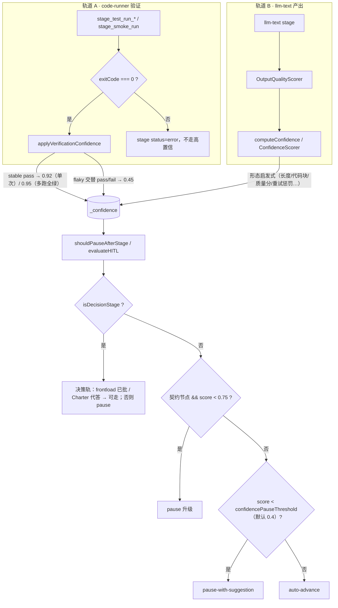

# Stagent 引擎设计文档 — 自执行工作流引擎

> **定位**：把 [WORKFLOW.md](./WORKFLOW.md) 的 mattpocock/skills 流程，落成为 **`autoAI` / `stagent_vscode` 自执行引擎**。用户给「几句话需求 + 主旨」，引擎自动判别场景、生成工作计划、按 stage 跑完，只在升级项 / 低置信 / 越界时打断。
> **一句话**：AFK 自执行引擎 + **双轨把关**（客观验证轨自动走 / 主观决策轨 HITL）+ **Charter 硬约束** + **DecisionRecord 驱动**。
> **产品需求**：[STAGENT-PRD.md](./STAGENT-PRD.md)
> **代码现状**：可运行骨架，`stagent_vscode/out/`、`autoAI/packages/stagent-core/`。模块名可直接对照源码。
> **版本**：v0.2

---

## 0. 可行性结论（先回答「能不能自动判别场景再规划执行」）

**能，且已实现。**

引擎当前把「**场景判别**」与「**工作流生成**」**融合成同一次 LLM 调用**（演进方向：生成前显式 Path Router，见 [STAGENT-PRD §8.2](./STAGENT-PRD.md#82-path-router-实现)）：

```
几句话需求  +  工作区扫描（codebase context）
        │
        ▼
  一次工作流生成 LLM 调用（WorkflowGeneration）
   ├── 判别 meta.taskType（software/refactor/debug/prototype/document/improve-architecture/other）
   ├── 判别 meta.isGreenfield（greenfield / brownfield）
   └── 直接产出 stages[] DAG（只遵守与 taskType 匹配的「类型约束块」）
        │
        ▼
  归一化 + 校验（normalizeWorkflow → PostParseValidationPipeline / Rule20 / PlanCompletenessGate）
        │
        ▼
  自执行（WorkflowExecutor / DagWaveScheduler）+ 实时 HITL 把关（AdaptiveHITLPolicy）
```

| 关键事实 | 源码出处 |
|----------|----------|
| 场景判别由 LLM 在生成时完成，写入 `meta.taskType` | `generated/PromptFragments.js` → `TASK_TYPE_CLASSIFICATION_TEXT` |
| 枚举固定 7 类，禁止臆造 | 同上（software/refactor/debug/prototype/document/improve-architecture/other） |
| 判别依据「需求 × 仓库状态」 | `WorkflowGeneration.buildGeneratorCodebaseContextBlock`（经 `CodebaseContextProvider` + `DependencyGraphAnalyzer`） |
| `isGreenfield !== true` 自动插 `stage_zoom_out` | `WorkflowPrompts.js` / `rule20-normalize/steps/zoom-out.js` |
| 生成后只遵守匹配类型的约束块 | `WorkflowPrompts.js`（taskType==='refactor'/'debug'/... 分支） |
| 用户的 `DEFAULT_TASK_TYPE` 只是兜底，会被分类覆盖 | `webview/webview-main.js` |

> **结论**：用户**不需要**手选「这是 bug 还是重构」。引擎读需求 + 扫仓库后自动判别场景，生成工作计划并自执行。

---

## 1. 用户画像与目标

| 用户 | 画像 | 在扩展里做什么 |
|------|------|----------------|
| **主旨持有者（Primary）** | 有明确架构哲学的开发者 / 技术负责人 | 一次写好「主旨」，之后扩展据主旨自动代答决策，只在冲突时找他 |
| **半专业创意者（Secondary）** | 懂一点技术、用 Cursor 写软件 | 给几句话需求 → 看流水线 → 在决策卡上拍板 |
| **守护者（Tertiary）** | 复核架构与高风险决策的人 | 复核 DecisionRecord、处理升级、看架构报告 |

**核心策略**：把人工压缩到「**前置一份主旨 + 运行中几次拍板**」。引擎自动跑，只有命中把关闸门才打断用户。

---

## 2. 用户旅程地图（端到端）

### Stage 0 · 一次性准备（每个仓库一次）

```
用户动作                         扩展响应                              数据产出
──────────────────────────────────────────────────────────────────────────────
① 安装扩展 / 首次启动            StagentOnboarding 引导               扩展设置
② （可选）写主旨 / setup         AGENTS.md · docs/agents · CONTEXT     项目上下文
③ 设置自动应答 / 置信阈值        StagentAiControlsProvider（侧栏）     HITL 策略
```

> 主旨示例（用户在 Stage 0 给定，引擎据此代答决策）：
> 「优先 headless 可测、interface 变窄；ports&adapters 拆 storage/globalState；
>  避免为减文件数合并 unrelated seam；测试先绿、小步 PR。」

### Stage 1 · 一句话需求 → 自动判别 → 生成工作流（自动）

```
输入：几句话需求
        ↓
  WorkflowStartCoordinator / WorkflowPreGenerationCoordinator 入场
        ↓
  扫描工作区：buildGeneratorCodebaseContextBlock
    （CodebaseContextProvider + DependencyGraphAnalyzer + WorkflowComplexityEstimator）
        ↓
  一次生成 LLM 调用（WorkflowGenerationService / WorkflowGenerationLlmLoop）
    ├── meta.taskType ← LLM 分类（7 类之一）
    ├── meta.isGreenfield ← LLM 判定
    └── stages[] ← 只装配匹配 taskType 的约束块
        ↓
  normalizeWorkflow → PostParseValidationPipeline
    （Rule20 / PlanCompletenessGate / 结构修复 WorkflowStructuralRepair）
        ↓
  确认页（webview/runtime/view-confirm）：用户可看 plan 摘要、taskType、isGreenfield
```

### Stage 2 · 自执行 + 实时把关（无人值守，命中闸门才停）

```
对每个就绪 stage（DagWaveScheduler 按 DAG 波次，最多 2 路并行）：
  解析输入（WorkflowInputResolver）
    + 注入已批准 DecisionRecord（GlobalDecisionContext）
  执行工具（StageLlmDelegate / StageCodeRunnerService / NonLlmToolRunner）
  校验 + 质量门（RedGreenGate / PlanCompletenessGate / BuiltinQualityGates）
  计算置信度（ConfidenceBands）
  HITL 评估（AdaptiveHITLPolicy.shouldPauseAfterStage）
    ├── auto-advance → 继续下一个 stage（无人值守）
    └── pause        → 主面板弹 HITL 卡，等用户：
                        批准 / 批准决策 / 回答问题 / 重试 / 修上游
```

### Stage 3 · 恢复与复盘（跨会话）

```
扩展重启 → offerRecoverableInstance → 可恢复实例 → ResumeCoordinator 续跑
完成 → WorkflowExperienceStore 写 .stagent/experiences.jsonl（经验记忆）
       AdrStore / AdrPersistence 写 docs/adr（架构决策沉淀）
```

---

## 3. 系统架构（分层 + 真实模块）

### 3.1 五层架构

```
① 宿主 / UI 层（VS Code Webview + 侧边栏 + 命令）
   StagentAiControlsProvider · StagentTaskListProvider
   WorkflowPanelFactory · WorkflowPanelMessageRouter · DecisionReviewUi · ExtensionCommands
        ↓ 依赖
② 编排 / 自执行引擎层
   WorkflowEngine · WorkflowExecutor / ExecutorLoop · executor-loop/DagWaveScheduler
   WorkflowInstanceManager · ResumeCoordinator · WorkflowGenerationOrchestrator
        ↓ 依赖
③ 决策 / 把关层（核心差异化）
   AdaptiveHITLPolicy · WorkflowHitlCoordinator · GlobalDecisionContext
   ApproveDecisionGate · DecisionRecordVerify
   QualityGate · RedGreenGate · PlanCompletenessGate · Rule20RuntimeGate · ConfidenceBands · PreGateRegistry
        ↓ 依赖
④ 阶段执行 / 工具层
   StageLlmDelegate · StageCodeRunnerService · StageMessagingDelegate · StagePathDelegate
   NonLlmToolRunnerRegistry · TestRunPreflight / FailurePlaybook · StaticAnalysisPipeline · PostParseValidationPipeline
        ↓ 依赖
⑤ 持久化 / 数据层
   WorkflowPersistence · WorkflowDiskBootstrap · WorkflowInstanceDiskIndex
   WorkflowExperienceStore（.stagent/experiences.jsonl）· AdrStore / AdrPersistence（docs/adr）
   WorkflowArtifactRegistry · ArtifactLifecycleManager
```

> 控制流向下，**DecisionRecord 与置信度反馈向上**：决策一经批准成为全局事实回注下游；置信度回流到把关层决定停或走。

## 4. 场景自动判别引擎

### 4.1 判别枚举（taskType）与场景映射

| meta.taskType | 场景 | 对应 WORKFLOW.md / SVG 路径 | 类型约束块 |
|---------------|------|------------------------------|------------|
| `software` | 完整可交付软件 / 扩展 / 全栈子项目 | P1 Greenfield / P2 Brownfield 全量 | SPEC §7.x 多模块、决策+实现+测试链 |
| `prototype` | MVP / 脚本 / Excel / CLI / 实验 | P3 Express（轻量） | `PROTOTYPE_CONSTRAINT_TEXT` |
| `debug` | 复现→根因→修复→回归 | P4 Bug / Debug | `DEBUG_CONSTRAINT_TEXT` |
| `refactor` | 现有代码重构、行为等价 | P5 Refactor | `REFACTOR_CONSTRAINT_TEXT` |
| `improve-architecture` | 深模块 / seam 分析 / 小步提取 | P5 Arch（improve-codebase-architecture） | `IMPROVE_ARCHITECTURE_CONSTRAINT_TEXT` |
| `document` | 以文档产出为主 | 横切 | — |
| `other` | 轻量自动化 | 兜底 | — |

### 4.2 判别如何用上「仓库状态」

`buildGeneratorCodebaseContextBlock` 把工作区证据装进生成提示：

- `CodebaseContextProvider` / `CodebaseContextLoader`：读代码库摘要（受 `CodebaseContextLimits` token 预算约束）。
- `DependencyGraphAnalyzer`：依赖图，识别**契约节点**（被 ≥2 处依赖）。
- `WorkflowComplexityEstimator`：从 userInput + snapshot 估算复杂度（impl 提示数等），驱动多模块 / 50 阶段预算告警。

→ LLM 据此判 `isGreenfield`（仓库是否已有实质代码）。`isGreenfield !== true` 时强制在首个 Layer3-4 模块前插 `stage_zoom_out(file-read)` 产 moduleMap，再由 `decide_X / impl_X` 消费——即 SVG 中的 **Brownfield 门禁**。

### 4.3 设计取舍：融合生成 vs 显式 Path Router

| 维度 | 融合生成（现状） | 显式 Path Router（演进） |
|------|------------------|--------------------------|
| 调用次数 | 1 次（判别+规划同步） | 2 段（先选路再规划/模板展开） |
| 一致性 | taskType 与 stages 天然自洽 | 需保证模板与生成对齐 |
| 可解释性 | 较弱 | 较强（`pathRouterReason` 可读） |

> 缓解：确认页展示 `meta.taskType` / `isGreenfield`；headless trace 记录 `path_router_resolved`。多模块任务优先演进显式路由 + 骨架模板（[STAGENT-PRD §8.4](./STAGENT-PRD.md#84-工作计划骨架模板roadmap--非-mvp-阻塞)）。

---

## 5. 工作流生成与执行

### 5.1 WorkflowDefinition 数据契约（生成产物）

```jsonc
{
  "version": "2.0",
  "id": "wf_<uuid>",
  "meta": { "title", "taskType", "userInput", "createdAt", "isGreenfield"? },
  "stages": [ /* Stage[] */ ],
  "globalConfig": { "language"?, "enableDagScheduler"? }
}
```

Stage 关键字段：`id, title, tool, toolConfig, input{sources, mergeStrategy}, outputs, pauseAfter`；可选 `isDecisionStage, aiTip, questionAfter, skipIf, dependsOn[]`。

- `tool`：常用 `llm-text`；`/^stage_test_run_/` 必须 `code-runner`（Rule 20-H）。
- 决策阶段：`isDecisionStage=true` → 必须 `llm-text`，outputs 含 `decisionRecord`（markdown）；引擎强制追加规范四标题（职责边界 / 关键设计决策 / ★ 边界压力测试 / AI 无法验证的假设）。
- 单文件落盘（M40）：每个 `writeOutputToFile` 阶段只产**一个**磁盘文件，多文件须拆多 stage。

### 5.2 生成 → 校验 → 执行链

```
WorkflowGenerationService
  → WorkflowGenerationLlmLoop（含 JSON 续写 DEFAULT_MAX_JSON_CONTINUATIONS）
  → parseWorkflowJson / JsonExtract
  → normalizeWorkflow（补 id/meta、ensureSoftwareWorkflowHasDecisionStage、Rule20 归一化）
  → orchestratePostParseValidation（PostParseValidationPipeline）
      ├── Rule20RuntimeGate / GeneratedWorkflowGate
      ├── PlanCompletenessGate（测试基础设施先于 test_run、入口装配可检测等）
      └── WorkflowStructuralRepair（结构兜底修复）
  → 确认页 → startExecution
```

### 5.3 自执行调度

```
executeNextStageLoop(params)
  ├── enableDagScheduler → executeNextStageLoopDag（DagWaveScheduler 波次并行，默认并行度 2）
  └── 否则               → executeNextStageLoopLinear（StageStepDriver 线性）
```

- 就绪条件：`dependsOn[]` 上游全部 done。
- 完成一个 stage → 评估 HITL → auto-advance 取下一波；命中暂停 → 挂起等用户。
- 跨会话：`WorkflowInstanceManager` 落盘，`ResumeCoordinator` 恢复。

---

## 6. 双轨把关 + LLM 上下文注入（贯穿 ②③④）

引擎是**双轨**设计，两轨同等重要；`verificationConfidence`（B-Q3）是客观轨与 `ConfidenceScorer`（Gate 3）的桥梁——`test_run` / `smoke` exit 0 时写入高置信 `_confidence`，与 LLM 输出形态启发式并列。

```
轨道 A · 客观验证轨（自动走）
  stage_test_run_* / smoke / verify_tsc / verify_imports / …
        → code-runner exit 0
        → verificationConfidence 抬高 _confidence
        → RedGreenGate / PlanCompletenessGate / BuiltinQualityGates 通过
        → auto-advance（无需人确认 exit 0）

轨道 B · 主观决策轨（停下或代答）
  stage_decide_*（职责边界 / 设计取舍 / 压力测试 / 不可验证假设）
        → 决策前置板 / HITL：人批或 Charter 主旨代答
        → runtime.approvedDecisionRecord
        → 低置信 / 越界 / 契约节点 → AdaptiveHITLPolicy 暂停

不同 taskType 两轨比例不同：software 客观验证最强；prototype / document 几乎全靠轨道 B。
Charter-Grill 主要服务轨道 B；轨道 A 不受主旨代答影响。
```

### 6.1 每次 llm-text 的 systemPrompt 拼装（`StageInputResolutionService`）

落盘顺序（从 stage 正文起依次 **append** 到末尾）：

```
stage.toolConfig.systemPrompt          // 本阶段任务说明
        ↓ appendGlobalDecisionContextToSystemPrompt
buildGlobalDecisionSystemPromptBlock() // 已批准 Grill Q&A / DecisionRecord（动态增长）
        ↓ augmentSystemPromptWithCharterConstraints
buildCharterConstraintsBlock()         // Charter avoid + constraint 全量（静态，每次）
```

| 注入块 | 模块 | 内容 | 时序 |
|--------|------|------|------|
| 已批准决策 | `GlobalDecisionContext` | `collectApprovedDecisionSnippets` → 格式化块 | 随工作流进度**动态增长**；仅已 done 的决策阶段 |
| Charter 硬约束 | `charter/CharterConstraintsBlock` | `avoid` + `constraint` 规则全文 | **全量、每次** llm-text；与是否被 Grill 问过无关 |

要点（`GlobalDecisionContext`）：

- 仅注入**已 done 且含决策正文**的决策阶段；已在 `input.sources` 显式引用的不重复注入（`filterSnippetsNotAlreadySourced`）。
- summary 模式单条截断 1200 字符，附「实现须与已批准 DecisionRecord 一致」。
- 校验：`DecisionRecordVerify` / `DecisionContentLintPolicy` 保证决策正文合规。

要点（`CharterConstraintsBlock`）：

- 从工作区 `docs/agents/charter.md`（`stagent.charter.relativePath`）加载；`stagent.charter.enabled` 关闭时不注入。
- 只注入 **avoid / constraint**，不注入 mission prefer（那些走决策前置代答，见 §11）。
- post-stage：`charter-constraint-warn` 对 impl 产出做关键词命中告警（`lintCharterConstraintHits`），与注入块互补。

> **设计要点**：轨道 B 分两层——**静态 Charter**（从未被 grill 过也始终生效，如「避免合并 unrelated seam」）与**动态 DecisionRecord**（本工作流内逐条批准的 Grill 结论）。二者都必须在 Agent 写代码的 systemPrompt 里，而不能只靠第二个。

### 6.2 置信度桥梁：客观验证 → `_confidence` → HITL

两轨在运行期汇合于 `runtime.outputs._confidence`（`CONFIDENCE_OUTPUT_KEY`），再由 `shouldPauseAfterStage` 决定是否暂停。`verificationConfidence` 是轨道 A 写入 `_confidence` 的主路径；轨道 B 的 llm-text 由 `ConfidenceScorer` + `OutputQualityScorer` 写入。



| 信号来源 | 模块 | 典型 score | 对 HITL 的影响 |
|----------|------|------------|----------------|
| test_run / smoke exit 0（稳定） | `verificationConfidence` | **0.92**（单次）/ **0.95**（`flakyRerunCount` 多跑全绿） | 远高于 `confidencePauseThreshold`（0.4）与契约节点阈值（0.75）→ **自动走** |
| test_run flaky（多跑 pass/fail 交替） | `verificationFlaky` | **0.45** | 高于 0.4 默认阈值但仍偏低；AFK 验收可能判失败 |
| llm-text 实现 / 决策正文 | `ConfidenceScorer` | 约 0.35–0.85（依输出质量） | 低于 0.4 → `pause-with-suggestion`；契约节点 < 0.75 → 升级暂停 |
| 决策阶段（不论 score） | `AdaptiveHITLPolicy` | — | 默认 **恒 pause**；`decisionMode=frontloaded` 且已前置批准 → 可 auto-advance |

要点：

- `applyVerificationConfidence` **不覆盖** llm-text 已写入的 `_confidence`（保留实现阶段评分）。
- 置信带（`ConfidenceBands`）：high ≥ **0.75** / medium ≥ **0.55** / low ≥ **0.35**；与 HITL 阈值独立，主要用于 UI 展示与 AFK 验收。
- 轨道 A 的 **block 级** Gate（如 preflight、RedGreen hard）在 stage **执行前**拦截；`_confidence` 与 HITL 在 stage **结束后**决定是否暂停——两层正交。

---

## 7. 实时 HITL 把关（AdaptiveHITLPolicy）

### 7.1 默认策略（与源码一致）

| 参数 | 默认值 | 含义 |
|------|--------|------|
| `confidencePauseThreshold` | `0.4` | 置信度低于此值暂停并附建议 |
| `contractNodePauseThreshold` | `0.75`（HIGH_MIN） | 契约节点置信度低于此值升级暂停 |
| `maxAutoRetriesBeforePause` | `2` | 自动重试上限，超出转人工 |
| `alwaysPauseDecisionStages` | `true` | 决策阶段恒暂停 |
| `dagMaxParallelism` | `2` | DAG 波次最大并行 |

置信带（`ConfidenceBands`）：high ≥0.75 / medium ≥0.55 / low ≥0.35。

### 7.2 判定顺序（`shouldPauseAfterStage` / `evaluateHITL`）

`_confidence` 的来源与数值见 **§6.2**（客观验证 0.92/0.95 vs LLM 启发式 vs flaky 0.45）。

```
1. stage.pauseAfter === true                         → pause
2. isDecisionStage && alwaysPauseDecisionStages      → pause（frontload 已批 / Charter auto-with-escalation 可例外）
3. 契约节点 && confidence < 0.75                      → pause（升级）
4. retryCount ≥ 2                                     → pause
5. confidence < 0.4                                   → pause-with-suggestion
6. 以上都不满足                                       → auto-advance
```

### 7.3 用户可执行的把关动作（`WorkflowHitlCoordinator`）

| 动作 | handler | 语义 |
|------|---------|------|
| 批准 | `handleApprove` | 接受当前 stage 输出，继续 |
| 批准决策 | `handleApproveDecision` | 批准 DecisionRecord，写入并注入下游 |
| 回答问题 | `handleAnswerQuestions` / `Before` | 回答 stage 追问后继续 |
| 重试 | `handleRetry` | 重跑当前 stage |
| 修上游 | `handleUpstreamFix`（retry/UpstreamFix） | 回到上游 stage 修复后重跑下游 |

---

## 8. 质量门 / Gate 体系

### 8.1 两轨与 Gate 的分工

| 轨道 | Gate 职责 | 典型结果 | 是否需要人 |
|------|-----------|----------|:----------:|
| **A · 客观验证** | 计划/执行前/后：**可执行**校验（命令、exit、契约、依赖） | block / warn / 自动修复后放行 | 否（block 时引擎停等重试/修上游） |
| **B · 主观决策** | 决策批准、Charter 代答/冲突、低置信、越界 | pause / frontload 批后放行 | 是（或主旨代答后自动） |
| **桥接** | `_confidence` + `AdaptiveHITLPolicy` | 把 A 的 exit 0 与 B 的 LLM 评分统一成暂停判定 | 仅低置信/决策/契约节点 |

注册入口：[`BuiltinQualityGates.ts`](../stagent_vscode/src/BuiltinQualityGates.ts) · `registerBuiltinQualityGates()` → `generateGates` / `preStageGates` / `postStageGates`（[`QualityGateRegistry`](../stagent_vscode/src/QualityGate.ts) 按 `phase` + `priority` 调度）。

### 8.2 按 phase 的内置 Gate 清单

Gate ID 单点定义：[`stagent_vscode/src/QualityGateIds.ts`](../stagent_vscode/src/QualityGateIds.ts)（常量 `GATE_ID_*`；全集见 `BUILTIN_QUALITY_GATE_IDS`）。下表 Gate ID 链到该文件对应行；实现分别见 [`generateGates.ts`](../stagent_vscode/src/quality-gates/generateGates.ts)、[`preStageGates.ts`](../stagent_vscode/src/quality-gates/preStageGates.ts)、[`postStageGates.ts`](../stagent_vscode/src/quality-gates/postStageGates.ts)。

**generate（工作流生成后，`orchestratePostParseValidation`）**

| Gate ID | 严重度 | 轨道 | 作用 |
|---------|--------|------|------|
| [`schema-validation`](../stagent_vscode/src/QualityGateIds.ts#L6) | block | A | JSON / WorkflowDefinition 字段合法 |
| [`rule20-violations`](../stagent_vscode/src/QualityGateIds.ts#L7) | block | A | Rule20 结构违规（test_run 须 code-runner、决策配对等） |
| [`plan-completeness`](../stagent_vscode/src/QualityGateIds.ts#L8) | block/warn | A | 测试基础设施先于 test_run、入口装配、自愈链缺口等 |
| [`prototype-data-contract`](../stagent_vscode/src/QualityGateIds.ts#L12) | warn | B | prototype 数据契约 |
| [`static-analysis-on-generate`](../stagent_vscode/src/QualityGateIds.ts#L13) | warn | A | 生成期静态分析（可选） |
| [`generator-meta-warnings`](../stagent_vscode/src/QualityGateIds.ts#L9) · [`dependency-graph-warnings`](../stagent_vscode/src/QualityGateIds.ts#L10) · [`complexity-warnings`](../stagent_vscode/src/QualityGateIds.ts#L11) | warn | — | 元数据 / 依赖图 / 复杂度告警 |

**pre-stage（每个 stage 执行前，`BUILTIN_PRE_STAGE_GATES`）**

| Gate ID | 严重度 | 轨道 | when / 触发 |
|---------|--------|------|-------------|
| [`debug-feedback-loop`](../stagent_vscode/src/QualityGateIds.ts#L16) | block/warn | A | debug taskType；复现优先于盲修 |
| [`red-green-pre-impl`](../stagent_vscode/src/QualityGateIds.ts#L17) | block/warn | A | impl 前跑配对 test；防空测试假绿（`stagent.tdd.redGreenGate`） |
| [`test-run-deps-install`](../stagent_vscode/src/QualityGateIds.ts#L18) | block | A | test_run 前自动 `npm install`（可写回 workflow） |
| [`test-run-preflight`](../stagent_vscode/src/QualityGateIds.ts#L19) | block | A | test_run 前磁盘 preflight（JS：jest/babel/tsconfig；**Python**：`.venv`、flat layout `conftest` 自动写盘） |
| [`sdk-path-contract-hard`](../stagent_vscode/src/QualityGateIds.ts#L20) | block | A | SDK 路径契约（hard） |
| [`python-export-contract`](../stagent_vscode/src/QualityGateIds.ts#L23) | warn/hard | A | Python test `from mod import Sym` 须在 impl 导出（`stagent.python.exportContractLint`，默认 warn） |
| [`test-run-contract-lint`](../stagent_vscode/src/QualityGateIds.ts#L21) | warn | A | test_run 前跨文件契约 lint |
| [`requirements-txt-preflight`](../stagent_vscode/src/QualityGateIds.ts#L22) | block/auto-fix | A | `pip install -r` 前校验/修正 `requirements.txt` 幻觉版本 |

**post-stage / workflow-end（stage 完成后）**

| Gate ID | 严重度 | 轨道 | 触发 |
|---------|--------|------|------|
| [`charter-constraint-warn`](../stagent_vscode/src/QualityGateIds.ts#L23) | warn | **B** | impl 完成后；`lintCharterConstraintHits` 对产出做 avoid/constraint 关键词命中告警 |
| [`post-impl-static-analysis`](../stagent_vscode/src/QualityGateIds.ts#L26) | warn | A | impl 后静态分析（可选） |
| [`run-end-contract-lint`](../stagent_vscode/src/QualityGateIds.ts#L27) | warn | A | 工作流结束跨文件契约复查 |

**非 QualityGateRegistry、但与轨道 A 并列的硬校验**

| 机制 | 时机 | 作用 |
|------|------|------|
| `CodeRunnerCommandLint` | 生成期 + 执行前 | 危险命令、tsc/npm 顺序等 |
| `RedGreenGate`（规划期） | 生成后 | horizontal-TDD 反模式 warning |
| `ApproveDecisionGate` | 决策 stage 结束 | 决策须批准 → `approvedDecisionRecord` |
| `injectSelfHealStages` | 生成归一化 | 自动补 `verify_tsc` / `verify_imports` / `fix_if_failed`（**Python**：`verify-python-test-imports`、`stage_venv_import_check`、跳过 `npm_install_server`） |
| `verificationFlaky` + `deterministicVerification` | test_run 执行 | 多跑判 flaky；确定性环境（B-Q3） |
| `evaluateAfkAcceptance` | workflow 结束 | AFK 模式验收（零人工干预 + 稳定验证） |

### 8.3 `charter-constraint-warn` 在轨道 B 的位置

Charter 对轨道 B 是**双点**覆盖，缺一不可：

```
执行前（预防）  buildCharterConstraintsBlock → 注入每次 llm-text systemPrompt
执行后（兜底）  charter-constraint-warn → impl 产出关键词命中 → warn（不 block，记入 gate 结果）
决策板（代答）  CharterAnswerRouter / matchMission → frontload 命中/冲突/未覆盖（§11）
```

注入是「让 Agent 看见规则」；post-stage warn 是「落盘后再扫一遍」——二者互补，不能互相替代。

---

## 9. WORKFLOW.md skills → 引擎 stage 映射

| WORKFLOW.md skill | 双轨 | 引擎 stage / 机制 |
|-------------------|:----:|-------------------|
| `/setup-matt-pocock-skills` | B 轨 | Stage 0 onboarding + AGENTS.md / docs/agents / Charter |
| `/grill-me`、`/grill-with-docs` | B 轨 | 决策阶段（`isDecisionStage`）+ Charter 代答 + HITL 升级 |
| `/to-prd` | B 轨 | 规划类 stage（需求/计划正文） |
| `/to-issues` | A+B | `stages[]` DAG（vertical slice + dependsOn） |
| `/tdd` | A+B | `stage_test_write_*` → `stage_impl_*` → `stage_test_run_*` |
| `/zoom-out` | B 轨 | `stage_zoom_out`（brownfield，产 moduleMap） |
| `/diagnose` | A+B | debug 约束 + `TestRunFailurePlaybook` |
| `/improve-codebase-architecture` | B 轨 | `improve-architecture` taskType |
| `/triage`、`/handoff`、`/caveman` | — | 横切；非主执行链 |

> **双轨**：A 轨 = code-runner / exit 0 客观验证；B 轨 = DecisionRecord / Charter / HITL。Skills **内化**为 stage 形状与约束块，不由用户在外部 Agent 手动 `/command`。

---

## 10. 数据模型与持久化（工作区磁盘，无 DB）

| 数据 | 落地 | 模块 |
|------|------|------|
| 工作流实例 / 状态 | 工作区磁盘 JSON | `WorkflowPersistence` · `WorkflowInstanceDiskIndex` · `WorkflowStateEnvelope` |
| 经验记忆 | `.stagent/experiences.jsonl`（默认上限 500 条） | `WorkflowExperienceStore` · `classifyFailurePatterns` |
| 架构决策 | `docs/adr/` + `CONTEXT.md` | `AdrStore` · `AdrPersistence` · `AdrContextLoader` |
| 产物 | 工作区文件 / instance 路径 | `WorkflowArtifactRegistry` · `ArtifactLifecycleManager` |
| 设置 / 主旨策略 | VS Code settings | `StagentSettings*` · `ExtensionSettingsBootstrap` |

---

## 11. 决策前置 UX + 对 AdaptiveHITLPolicy 的改动建议

> **动机**：现状 `alwaysPauseDecisionStages=true` 会让引擎在**执行中**每遇到一个决策 stage 就停下来等用户，决策散落、上下文反复切换。**决策前置**把全部「可预见」决策收敛到**执行前一块决策板**，引擎依主旨批量拟答，用户一次过完升级项，执行中基本不再因决策被打断。

### 11.1 一句话

把「执行中逐个打断」改为「执行前一次过」：生成工作流后立即收集全部 `isDecisionStage`，依主旨拟答 + 分类，摊成决策板；用户处理完升级项并按「批准并开始」，决策即写入 `DecisionRecord` 锁定，执行阶段对已批准决策走 `auto-advance`。

### 11.2 三段式 UI

```
① 主旨条（一次性）
   优先 / 避免 / 硬约束 + 自动应答程度（关 / 建议确认 / 自动+升级）
        ↓ 引擎据此代答
② 决策板（每个工作流 · 执行前）
   列出全部可预见决策，每条：决策问题 + stage_decide_* + 拟答 + 依据(provenance) + 状态徽章
   顶部进度：总数 / 自动决定 / 需拍板 / 待处理
        ↓ 升级项全部处理完
③ 执行闸门（ApproveDecisionGate 扩展）
   「批准全部并开始执行」——仅当待处理升级项 = 0 时点亮
   批准 → 写入 DecisionRecord → GlobalDecisionContext 注入下游每个实现 stage
```

### 11.3 决策项状态分类（对齐 STAGENT-PRD §7 Charter 命中/冲突）

| 状态 | 触发 | 徽章 | 是否需用户 |
|------|------|------|:----------:|
| `auto` | 主旨命中、方向一致 | 已自动决定（绿） | 否（默认采纳） |
| `conflict` | 命中 ≥2 条主旨但方向冲突（conflictScore > 0.4） | 主旨冲突 · 需拍板（橙） | 是 |
| `uncovered` | 无主旨覆盖（matchScore < 0.6） | 主旨未覆盖 · 需拍板（蓝） | 是 |
| `lowconf` | 有拟答但置信度 < `confidencePauseThreshold` | 低置信 · 请确认（橙） | 是 |

> UI 原型见交互画布 `canvases/stagent-b-route-architecture.canvas.tsx` 的「决策前置 UI」页签。

### 11.4 对 `AdaptiveHITLPolicy` 的改动建议（核心）

**目标**：在不破坏现有「实时把关」语义的前提下，新增「前置」模式。

1. **新增策略开关（向后兼容）**

```ts
type HITLDecisionMode = 'inline-pause' | 'frontloaded';

type AdaptiveHITLPolicy = {
  // …现有字段…
  decisionMode: HITLDecisionMode; // 默认 'inline-pause'，保持现状
};
```

2. **生成后新增「决策收集 pass」**（落在 `PostParseValidationPipeline` 之后、`startExecution` 之前）

```ts
// 伪代码：收集 + 依主旨拟答 + 分类 → 决策板
function collectFrontloadDecisions(def, mission): DecisionBoardItem[] {
  return def.stages
    .filter(s => s.isDecisionStage)
    .map(s => {
      const m = matchMission(s, mission);        // 对齐 Charter 命中/冲突阈值
      if (m.matchScore < 0.6)      return { stage: s.id, kind: 'uncovered' };
      if (m.conflictScore > 0.4)   return { stage: s.id, kind: 'conflict', proposal: m.proposal };
      if (m.confidence < policy.confidencePauseThreshold)
                                   return { stage: s.id, kind: 'lowconf', proposal: m.proposal };
      return { stage: s.id, kind: 'auto', proposal: m.proposal, basis: m.ruleRefs };
    });
}
```

3. **`shouldPauseAfterStage` / `evaluateHITL` 调整**：决策阶段若已在前置板批准，则不再停

```ts
function shouldPauseAfterStage(stage, runtime, confidence, policy, ctx) {
  if (stage.pauseAfter === true) return true;

  // 改动：frontloaded 模式下，已前置批准的决策不再实时暂停
  if (stage.isDecisionStage && policy.alwaysPauseDecisionStages) {
    if (policy.decisionMode === 'frontloaded'
        && runtime.approvedDecisionRecord
        && runtime.decisionSource === 'frontload') {
      // 已前置锁定 → 直接放行，继续注入下游
    } else {
      return true; // 现状行为
    }
  }

  // 以下「运行时升级」一律保留（前置兜不住的未知）
  if (escalateContractNodePause(...)) return true;
  return evaluateHITL(stage, runtime, confidence, policy).action !== 'auto-advance';
}
```

4. **不变的红线（运行时升级照旧）**：`retryCount ≥ maxAutoRetriesBeforePause`、`confidence < confidencePauseThreshold`、契约节点低置信、ADR 级 / 越界——这些是**未知的未知**，无论是否前置都必须实时打断。

5. **闸门**：`ApproveDecisionGate` 扩展为「前置批准闸门」——决策板上所有 `escalate` 项 resolved 后才允许 `startExecution`；`auto` 项默认采纳但可展开改写。批准后统一写 `approvedDecisionRecord` 并标 `decisionSource='frontload'`，供 `GlobalDecisionContext` 注入。

### 11.5 界面承载方式取舍

| 形态 | 决策板放哪 | 优点 | 代价 |
|------|-----------|------|------|
| **确认页内嵌（推荐）** | 复用 `webview/runtime/view-confirm`，生成后即展开 | 零新增面板；与「看计划」同屏；最快落地 | 决策多时确认页偏长 |
| 独立决策面板 | `WorkflowPanel` 新增「决策」页签 | 空间足、可分组折叠 | 多一个面板态，需路由 |
| 侧栏待办流 | `StagentTaskListProvider` 下挂「待你拍板」 | 随时回来处理、不阻塞 | 弱化「执行前一次过」的仪式感 |

### 11.6 红线

决策前置 **≠ 取消把关**：只压缩「可预见」决策，兜不住运行时新冒出的高风险。`decisionMode` 默认 `inline-pause`，`frontloaded` 作为可选增强，二者共用同一套 `DecisionRecord` 与 `ApproveDecisionGate`，不分叉决策载体。

---

## 12. 现状与缺口 → 落地路线图

### 12.1 已具备（out/ 中可见）

- 工作流生成（融合场景判别）、DAG 自执行、HITL 把关、DecisionRecord 注入、质量门、实例恢复、经验记忆、ADR 持久化、侧栏 + 主面板 UI。

### 12.2 待补 / 待验证缺口

| # | 缺口 | 影响 | 对策 |
|---|------|------|------|
| G1 | 场景判别可解释性弱 | 用户不知为何判成某 taskType | **B-R1 已落地**：确认页「场景判别」区展示 rationale + 可改 taskType/isGreenfield + 可锁定 |
| G2 | 主旨「代答决策」未形成显式 Charter 引擎 | 决策代答靠提示而非结构化规则 | **大部分落地（B-R2α/β/γ + R2.5）**：`charter/*` 解析/加载/回写、`buildCharterConstraintsBlock` 注入、Grill 代答 + provenance、**决策前置 UI**（`decisionMode=frontloaded`）、**session 结束 Charter 反馈环**（`charter.feedbackEnabled`）；待补：覆盖率度量、自动回写（B-R4） |
| G3 | 非专业人员术语门槛 | grill/slice/TDD 不友好 | Translation Layer 词典 + 屏 4/5 质量 UI（[STAGENT-PRD §10](./STAGENT-PRD.md#10-ui-规格质量驾驶舱)） |
| G4 | 里程碑「可感知验收」缺失 | 用户难判对错 | delivery_wrapup + strict MVP 报告 |
| G5 | code-runner PATH 缺失（exitCode 127） | 首个 exec 阶段就挂、`flutter`/`npm` 找不到 | 登录 shell 执行 + 工具路径探测（见 [RCA R1](./B-ROUTE-RCA-AND-FIXES.md)） |
| G6 | test-run-preflight 扫错目录（M38.1 误报） | monorepo 子目录配置被漏判、误阻断 | preflight 解析 effectiveCwd（[RCA R2](./B-ROUTE-RCA-AND-FIXES.md)） |
| G7 | writeOutputToFile 抽取脆弱（llm-invalid-output） | 散文/多文件围栏致落盘 0/残缺、重试风暴 | 抽取器加固 + 生成侧单文件硬拦（[RCA R3](./B-ROUTE-RCA-AND-FIXES.md)） |
| G8 | 测试 import 与产物/技术栈不符（M39.2 仅警告） | 测试必失败、jest-module-not-found | 注入产物路径/技术栈 + lint 命中重写（[RCA R4](./B-ROUTE-RCA-AND-FIXES.md)） |

> G5–G8 来自故障复盘，详见 [B-ROUTE-RCA-AND-FIXES.md](./B-ROUTE-RCA-AND-FIXES.md)；构成 R0 里程碑硬退出条件。

### 12.3 路线图（能力里程碑）

| 阶段 | 范围 | 退出标准 |
|------|------|----------|
| **B-R0 固化引擎** | 稳定生成→校验→执行→HITL→恢复主链；补单测；**修复 G5–G8（RCA R1–R4）**；Python venv **三阶段拆分**（create / pip / import，重依赖 pip timeout≥600） | 在 GUI 启动的 VS Code 中一条 software（monorepo server/+mobile/）端到端跑通且**不出现 R1–R4**，测试为真 RED→GREEN（非空壳） |
| **B-R1 判别透明化** | 确认页展示 taskType/isGreenfield 判别理由，可改可锁 | 用户可纠正误判（G1）— **已实现** |
| **B-R2 主旨/Charter** | 主旨结构化 + 决策代答命中/冲突判定 + provenance | 决策阶段按主旨代答，冲突才升级（G2） |
| **B-R2.5 决策前置** | `decisionMode='frontloaded'` + 决策板 + ApproveDecisionGate 扩展（见 §11） | 可预见决策执行前一次过，执行中仅运行时升级打断 |
| **B-R3 友好层** | Translation 词典 + 决策卡白话 + 里程碑演示 | 半专业用户全程「看流水线点拍板」（G3/G4）— **已实现（词典/决策板/Charter 反馈/验收提示）** |
| **B-R4 无人值守增强** | 自动应答 auto-with-escalation + 置信校准 + 经验反馈环 | AFK stage 端到端无人值守完成 — **已实现（`afk.enabled` 预设 + 验收门 `afk_acceptance`）** |

> **质量主线（B-R0 之后，见 §13）**：核心是 **B-Q1 有界 smoke/e2e**（直接用你机器上既有的工具链真跑真验）+ **B-Q3 轻量确定性**；**B-Q2 容器化为可选加固**（安全/CI，非能力前提）。基座=开发者机器本就存在、stagent 默认已在用，缺的是「会驱动它做验证」。

---

## 13. 真实执行 + 验证基座（质量主线，B-R0 之后）

> **动机**：现有「测试绿」可被空壳/弱测试放过（RCA §2.5），「完成」只是 stage 都 done。要真高质量，必须把 prompt 编排 + 落盘升级为「**真的跑起来、真的验证行为**」，作为 B-R0 之后的质量主线。

### 13.0 基座已存在 = 开发者的机器（重要前提，避免过度工程）

对「一个真实开发者用 VS Code/Cursor 在自己机器上交付」这一主场景：**「真实执行+验证基座」本就在用户机器上，stagent 默认也已在用它**——
- 机器自带 node/npm/python/flutter、浏览器、项目自身测试设施、可起 dev server；
- code-runner 经 `getMergedExecEnv`（登录 shell PATH）+ `ProcessRunner` 直接 `spawn`，且 `stagent.sandbox.enabled` **默认 false** → 命令本就跑在用户真实环境里（`npm test` / `flutter test`）。日志里的 127 是 PATH 没抓到（R1，已修），**不是缺基座**。

> **因此本质缺口不是「没有基座」，而是「stagent 不会驱动这套基座做验证」**。真正不可省的只有 **B-Q1 有界 smoke/e2e**（基座无关，直接在本机跑）+ **B-Q3 轻量确定性**。**B-Q2 容器化不是能力前提**，仅为「安全（blast radius）/ 跨机·CI 可复现」的**可选加固**——单人本地开发可后置或不做。

### 13.1 为什么不能直接「自动跑 demo」（约束根因）

`src/process/ProcessRunner.ts` 的 `spawnShellWithTimeout` 仅在子进程 `close` 时 resolve，否则等到 `timeoutMs` 触发 `SIGKILL`；而 `WorkflowExecutor` 逐 stage `await`。因此 `npm start` / `node server.js` 等**长驻进程永不 `close`** → 执行器干等一个超时再被杀、stage 判失败。

> **结论**：真实执行必须是**有界验证**（启动 → 探活 → 拿到信号即杀），而非前台 `await` 一个长驻命令。这正是质量主线第一刀的核心改造。

### 13.2 B-Q1 · 有界 smoke / e2e 阶段

| 项 | 内容 |
|----|------|
| **范围** | 新增「有界运行」执行模式：后台 `spawn`（detached）启动服务/入口 → 轮询健康信号（curl 健康端点 / 端口就绪 / headless 浏览器点一下断言 DOM·console·network）→ 命中即 `kill` 进程树。借鉴 `diagnose` skill 的「反馈环」与「非确定性提复现率」。在交付收口（PR-6 `stage_delivery_wrapup`）前自动注入一个 `stage_smoke_*`，把「怎么运行 + 一键自检」从文档升级为**真跑通的证据**。 |
| **涉及模块** | `ProcessRunner`（新增 detached + 探活 + 进程树 kill；区别于现有 `collectChildWithTimeout`）；`disk-bootstrap/` 注入器（仿 `deliveryWrapupStage`）；e2e 用 Playwright headless；CLI 用 fixture 输入 + 快照 diff |
| **依赖** | B-R0（R1 PATH / R2 preflight 已修，命令能跑） |
| **退出标准** | software 工作流在交付前，server/CLI/UI **真实启动并通过 smoke 断言**（健康端点 200 / 入口预期输出 / 关键交互可达），失败即阻断收口；长驻进程不再卡执行器 |

### 13.3 B-Q2 · 容器化 / 沙箱执行（**可选加固，非主线核心**）

> 对单人在自己机器上交付：基座=本机已够用（§13.0），本刀**不是高质量的前提**。它解决的是「**安全 blast radius**」与「**跨机/CI 可复现**」，而非「才能执行」。可后置；要无人值守跑陌生命令、或进 CI/团队协作时再做。

| 项 | 内容 |
|----|------|
| **范围** | 把 code-runner 放进隔离/可复现环境（升级现有 `SandboxExecutor` / 容器）：限制写范围与网络（防 `rm -rf`、污染 node_modules、误改真实 DB），可复现安装依赖、可拉起测试依赖服务。**默认仍直接用本机**；沙箱按需开启（`sandbox.enabled` 当前默认 false）。 |
| **涉及模块** | `SandboxExecutor` · `sandbox/SandboxCapabilityMatrix`（已有沙箱能力检测）；`CodeRunnerCommandLint` / `dangerousCommandLint`（命令风险拦截，已存在）；`TestRunAutoDepsInstall` |
| **依赖** | B-Q1（先有有界运行；隔离是它的可选承载） |
| **退出标准** | 危险/不可信命令在隔离下不伤宿主；同一工作流可在容器/CI 复现执行；**不开沙箱时仍能在本机正常跑（能力不依赖本刀）** |
| **当前进度** | `sandbox.verificationOnly`：仅 test_run/smoke 走沙箱；macOS `sandbox-exec` 内核隔离已存在 |

### 13.4 B-Q3 · 确定性验证

| 项 | 内容 |
|----|------|
| **范围** | 让验证信号确定、可信：钉版本（lockfile / 镜像 tag）、seed RNG、冻结时间与网络、隔离 FS；flaky 检测（同一验证多跑取稳定信号，借 `diagnose` 的「提复现率」），把 `confidence` 从输出形态启发式校准为**基于真实运行/测试结果**（治 RCA §2.6 置信度与正确性弱相关）。 |
| **涉及模块** | `ConfidenceScorer` / `ConfidenceBands`（接入真实测试/smoke 结果）；`FailurePatternAnalyzer` · `WorkflowExperienceStore`（flaky 经验回流）；`RedGreenGate`（真 RED 已 hard）/ `sdkPathContractLint`（已 hard） |
| **依赖** | B-Q1（B-Q2 可选，不阻塞） |
| **退出标准** | 同一工作流重跑结果一致；`confidence` 与真实测试/smoke 通过率相关；flaky 验证被识别并提率而非误判通过 |
| **当前进度** | `verification.flakyRerunCount` 多跑 + flaky 阻断；`verification.deterministic` 钉 lockfile/环境；`sandbox.verificationOnly` 轻量沙箱 |

### 13.5 质量主线与「不可压缩代价」

| 代价轴 | 说明 | 在本主线如何兑现 |
|--------|------|------------------|
| 驱动既有基座做验证（真正不可省） | 基座=用户机器已存在；缺的是 stagent 不会有界跑 smoke/e2e | **B-Q1**（基座无关，直接本机跑） |
| 时间 / token | 更多验证循环 | smoke/e2e 是延迟来源，需有界化控制（探活即杀） |
| 人类判断不可消除 | 主观/合规/真实外部集成机器证不了 | 保留里程碑验收（PR-6 收口 pause）+ HITL，不追求零人介入 |
| 「完整」须诚实收窄 | 非平凡 app 不可端到端全自动验收 | 机器证不了的部分显式标人工验收/暂存，不假装 completed |
| 安全 / 跨机复现（可选） | 自动跑陌生命令的 blast radius、CI 一致性 | **B-Q2**（容器/沙箱，按需，非能力前提） |

> **一句话（修正版）**：基座本就在你机器上、stagent 默认也在用；真正还没补的硬投入是 **B-Q1——让 stagent 有界地真跑 smoke/e2e 来验证行为**。容器化（B-Q2）是安全与可复现的可选加固，不是高质量的前提。

---

## 13.5 Contract-First 架构（三层合同 + 两级 Preflight）

> **目标**：消灭 venv/verify/conftest「注入 vs lint vs runtime preflight」分叉；生成期与执行期各一条 SSOT 编排链。

| 合同层 | 职责 | 模块 |
|--------|------|------|
| **Workflow Plan** | 阶段图、infra 链、切片、落盘清单 | `plan-completeness/`、`plan-preflight/PlanPreflightOrchestrator.ts`、`disk-bootstrap/` |
| **DecisionRecord** | 语义边界、接口、假设 → `Commitment[]` | `commitment/`、`HitlApproveDecision.ts`、`GlobalDecisionContext.ts` |
| **Disk Runtime** | `.venv`、conftest、符号、node_modules | `contract-infra/`、`TestRunPreflight.ts`、`runtime-preflight/` |

**两级 Preflight**

1. **Plan Preflight**（生成期，`stagent.contract.planPreflightV2`）：`normalize` → contract validate → raw lint → disk-bootstrap → final lint → 确认页（blocked 仍带 `planSummary`）。
2. **Runtime Preflight**（执行期，`stagent.contract.runtimePreflightV2`）：plan / decision / disk 对盘 → bootstrap / replan / `workflowEscalation`。

**诊断路由**（`stagent.contract.diagnosticRouter`）：`config | symbol | assertion | semantic` → bootstrap / gate_repair / fix_chain / reopen_decision；附在 `stageError.diagnosticRoute` 与质量报告。

**Feature flags**（`stagent.contract.*`）：`infraChainV2`（默认 true）、`planPreflightV2`、`commitments`、`commitmentsLlmFallback`、`runtimePreflightV2`、`boundExecution`、`diagnosticRouter`。

---

## 14. 关键设计决策与权衡

| 决策点 | 选择 | 放弃 | 理由 |
|--------|------|------|------|
| 形态 | `autoAI` + VS Code 扩展 | 云 SaaS / 外发 Cursor | 本机 AFK、零后端、工作计划自执行 |
| 场景判别 | 融合进生成 LLM 调用 | 独立 Path Router | 一次调用判别+规划自洽；已实现 |
| 决策载体 | DecisionRecord（批准即注入下游） | 自由文本主旨 | 可批准/可注入/可校验/可复用 |
| 把关时机 | 实时（每 stage 结束评估）；可选决策前置（§11） | 仅批量升级 | 跑偏立刻拦住；可预见决策又能执行前一次过 |
| 约束注入 | 已批准决策全量注入下游每个 LLM stage | 仅规划时注入 | Agent 写码时始终受约束 |
| 持久化 | 工作区磁盘（JSON/JSONL/ADR） | 数据库 | 单机自治、随仓库走、可 diff |
| 并行 | DAG 波次并行（默认 2） | 全线性 | 提速且可控 |
| 真实验证 | 有界 smoke/e2e 直接跑在用户机器（§13）；容器化可选 | 仅信「测试绿」/ 自建容器基座 | 「绿」可被空壳放过；基座=本机已存在，缺的是有界真跑，不必自建基座 |

---

## 15. 平台边界（明确不做）

- **不做代码托管**：产物落在用户工作区 / 仓库。
- **不外发主流程到 Cursor**：LLM 由引擎 stage 内调用；用户不在聊天框里手动串联 Skill。
- **不做云调度**：执行在本机，无后端、无队列、无对象存储。
- **不做风格评审**：质量门只验结构/测试/计划完整性，风格约束体现在 DecisionRecord 与约束块。

---

*本文档据 `stagent_vscode/out/` 与 `autoAI/packages/stagent-core/` 编写；产品需求见 [STAGENT-PRD.md](./STAGENT-PRD.md)，方法论见 [WORKFLOW.md](./WORKFLOW.md)。*
