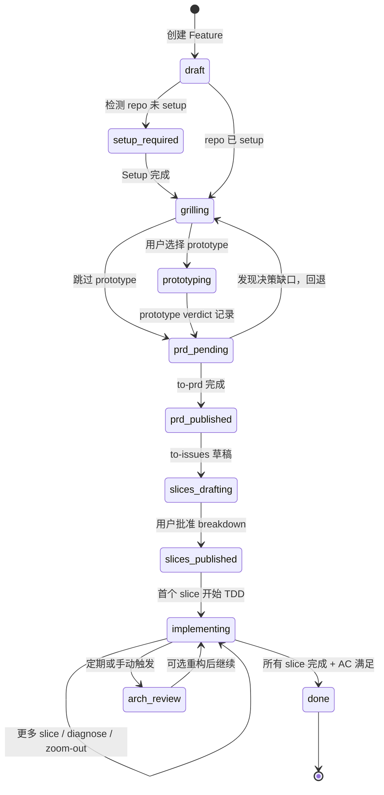
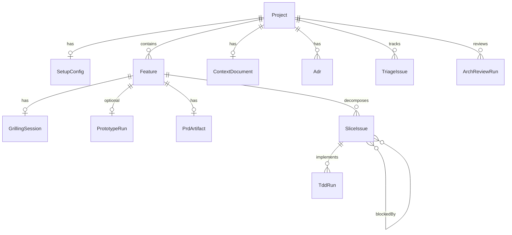

# 软件开发工作流平台 PRD

> **Product**: AI 辅助软件开发工作流平台（以下简称「平台」）  
> **来源**: 基于 [WORKFLOW.md](./WORKFLOW.md) §14 扩展  
> **Skill 规范**: [mattpocock/skills](https://github.com/mattpocock/skills)  
> **版本**: v0.1-draft  
> **状态**: Draft

---

## 1. Problem Statement

开发者使用 Matt Pocock Skills 时，需要在 Cursor/Claude 等 Agent 中**手动记忆并串联** `/grill-with-docs` → `/to-prd` → `/to-issues` → `/tdd` 等命令。常见问题：

- 跳过关键阶段（如未 grill 直接 to-prd），导致 PRD 缺决策
- Issue 拆分不符合 vertical slice 规则
- Triage 状态与 slice 依赖关系缺乏可视化
- 多 session 之间 context 断裂，handoff 靠人工
- Setup 配置（issue tracker、triage labels）与具体 feature 工作流脱节

平台将 Matt Pocock Skills 工作流**产品化**：用 **Path Router**（需求 + 仓库快照 → 工作流模板）、结构化 UI、状态机、产物管理和 Agent 编排，引导用户从「几句话需求」走到可交付代码，同时保留每个 Skill 的独立性与可组合性。

路径选型规则与 [WORKFLOW.md §4.1–§4.4](./WORKFLOW.md#41-路径如何划定需求--仓库状态) 对齐。

---

## 2. Solution

平台是一个 **Skill-native 工作流编排系统**，核心能力：

1. **Project 级 Setup Gate** — 绑定 repo、issue tracker、triage 词汇、domain docs 布局
2. **Feature 流水线** — 按 Phase 0–6 编排 Skill 节点，强制执行 Gate 条件
3. **Artifact 中枢** — 管理 `CONTEXT.md`、ADR、PRD issue、slice issue DAG、TDD run、架构 HTML 报告
4. **Issue 状态机** — 同步 triage roles，支持 AFK/HITL slice 调度
5. **Agent 集成层** — 将 UI 操作映射为 `/skill-name` + 参数模板，对接 Cursor 等 Agent

---

## 3. Goals & Non-Goals

### 3.1 Goals (MVP)

| # | Goal |
|---|------|
| G1 | 支持完整 Feature 流水线：Setup → Grill → (Prototype) → PRD → Issues → TDD |
| G2 | 可视化 slice issue 依赖 DAG，按拓扑顺序调度 TDD |
| G3 | 强制执行 Phase Gate（如无 setup 不可 grill，无 grill 不可 to-prd） |
| G4 | 集成 GitHub Issues 作为默认 issue tracker |
| G5 | 展示并编辑 `CONTEXT.md` diff（grill-with-docs 产出） |
| G6 | 支持 `/triage` 横切：issue 看板 + state role 流转 |
| G7 | 导出 Agent prompt（`/skill-name` + context bundle）供 Cursor 执行 |
| G8 | **Path Router**：根据需求特征 + 仓库状态推荐/约束 `workflowTemplate`（见 §6.5） |

### 3.2 Non-Goals (MVP 不做)

| # | Non-Goal |
|---|----------|
| NG1 | 替代 Cursor/Claude — 平台编排流程，代码执行仍在外部 Agent |
| NG2 | 内置 LLM 推理 — MVP 不自带模型，只做 prompt 组装与 artifact 管理 |
| NG3 | 完整 CI/CD — 仅链接外部 PR/check 状态 |
| NG4 | 多租户 SaaS 计费 — MVP 面向单用户/小团队本地或自托管 |
| NG5 | 重写 Skill 逻辑 — 行为以各 `SKILL.md` 为准，平台只做 orchestration |

### 3.3 Future (Post-MVP)

- GitLab / 本地 markdown issue tracker 适配器（Linear 见 §8.1，MVP 已纳入 enum）
- 内置 Agent runtime（Cursor SDK）
- 自动 periodic `/improve-codebase-architecture` 调度
- Team 权限、audit log、Skill 版本 pinning
- Workflow 模板市场（小功能快路径 vs 正式 Feature 全路径）

---

## 4. User Personas

| Persona | 描述 | 核心诉求 |
|---------|------|----------|
| **Solo Dev** | 独立开发者，Cursor + Skills 用户 | 不被流程细节拖累，Gate 防踩坑 |
| **Tech Lead** | 定义架构与 triage 规则 | 控制 label 词汇、审查 PRD/slice 分解 |
| **AFK Agent Operator** | 让 Agent 无人值守 pick up issues | `ready-for-agent` slice 队列 + agent brief |
| **Platform Builder** | 你（本产品开发者） | 可扩展节点、可映射 Skill、数据模型清晰 |

---

## 5. User Stories

### 5.1 Project & Setup

1. As a **Solo Dev**, I want to connect a Git repo and run Setup once, so that all downstream skills know my issue tracker and triage labels.
2. As a **Tech Lead**, I want to map canonical triage roles to my existing GitHub labels, so that `/triage` does not create duplicate labels.
3. As a **Solo Dev**, I want the platform to block Feature creation until Setup is complete, so that I cannot skip Phase 0.

### 5.2 Feature Pipeline

4. As a **Solo Dev**, I want to enter a few sentences of requirements and start a Grill session, so that the Agent asks me one question at a time.
5. As a **Solo Dev**, I want to see `CONTEXT.md` updates inline during grilling, so that shared language is captured as decisions happen.
6. As a **Solo Dev**, I want to optionally run Prototype before PRD, so that I can validate uncertain designs without committing.
7. As a **Solo Dev**, I want to generate a PRD from grilling context and publish it as an issue, so that the plan is durable and linkable.
8. As a **Tech Lead**, I want to review and edit vertical slice breakdown before issues are published, so that granularity and AFK/HITL marks are correct.
9. As a **Solo Dev**, I want the platform to show slice dependencies as a DAG, so that I know which issue to implement next.

### 5.3 Implementation

10. As a **Solo Dev**, I want to launch TDD for a single ready slice issue with one click, so that the Agent receives the correct prompt bundle.
11. As an **AFK Agent Operator**, I want a queue of `ready-for-agent` slices with no open blockers, so that Agents can pick work safely.
12. As a **Solo Dev**, I want to invoke Zoom-out or Diagnose from the TDD panel without breaking the feature workflow, so that on-demand skills remain accessible.

### 5.4 Cross-Cutting

13. As a **Tech Lead**, I want a triage inbox grouped by state role, so that I can process incoming bugs and feature requests.
14. As a **Solo Dev**, I want to generate a handoff document when context is too long, so that a fresh Agent session can continue slice #N.
15. As a **Tech Lead**, I want to schedule architecture reviews and view HTML reports in-platform, so that deepening opportunities are trackable.
16. As a **Solo Dev**, I want the platform to **suggest a workflow path** from my few-sentence requirement and repo state (greenfield vs brownfield, bug vs feature, express vs full), so that I do not have to memorize which skills to chain.

---

## 6. Workflow Model

### 6.1 Phase → Node 映射

| Phase | Node ID | Skill | Node Type | 必做 |
|-------|---------|-------|-----------|------|
| 0 | `setup` | `setup-matt-pocock-skills` | SetupGate | 每 repo 一次 |
| 1a | `grill-with-docs` | `grill-with-docs` | HumanInTheLoopGate | 正式 Feature 推荐 |
| 1b | `grill-me` | `grill-me` | HumanInTheLoopGate | 小任务替代 1a |
| 2 | `prototype` | `prototype` | OptionalBranch | 否 |
| 3 | `to-prd` | `to-prd` | DocumentGenerator | 推荐 |
| 4 | `to-issues` | `to-issues` | TaskDecomposer | 多 slice 时 |
| 5 | `tdd` | `tdd` | TDDExecutor | 是（可多次） |
| 5+ | `zoom-out` | `zoom-out` | OnDemandTool | 否 |
| 5+ | `diagnose` | `diagnose` | OnDemandTool | 否 |
| 6 | `arch-review` | `improve-codebase-architecture` | ScheduledReview | 定期 |
| — | `triage` | `triage` | CrossCuttingService | 按需 |
| — | `handoff` | `handoff` | CrossCuttingService | 按需 |

### 6.2 Feature 状态机



**按 `workflowTemplate` 跳过的状态（摘要）：**

| 模板 | 典型跳过 |
|------|----------|
| `express` | `prd_published`, `slices_*` → 直接 `implementing` |
| `debug` | `prototyping`, `prd_*`, `slices_*`；入口为 `diagnose` |
| `arch_review` | 独立或挂载 `implementing` 后；无 slice DAG |

完整路径目录与 Skill 矩阵见 [WORKFLOW.md §4.2–§4.3](./WORKFLOW.md#42-完整路径目录)。

### 6.3 Phase Gates

| Gate ID | 允许进入 | 条件 | 失败提示 |
|---------|----------|------|----------|
| `CanCreateFeature` | Feature draft | `project.setupStatus == complete` | 「请先完成 Project Setup」 |
| `CanGrill` | Phase 1 | Setup complete | 「Run `/setup-matt-pocock-skills` first」 |
| `CanPrototype` | Phase 2 | `feature.grillingStatus == complete` | 「请先完成需求对齐」 |
| `CanToPrd` | Phase 3 | grilling complete | 「Grill 未完成；to-prd 不会再 interview」 |
| `CanToIssues` | Phase 4 | PRD issue 已发布 | 「请先发布 PRD」 |
| `CanPublishSlices` | Issue 创建 | 用户批准 slice breakdown | 「请确认 slice 粒度与依赖」 |
| `CanTdd` | TDD run | slice.`stateRole == ready-for-agent` AND all blockers closed | 「Issue 未就绪或被阻塞」 |
| `CanExpressTdd` | Express 模板 TDD | setup complete AND grilling complete AND 用户确认单 slice | 见 §6.4 |
| `CanZoomOutBeforeTdd` | Brownfield 动现有模块 | `workflowTemplate` 含 brownfield 且 `touchesUnknownModule` 且本 session 未 zoom-out | 「请先 `/zoom-out`」 |
| `CanDebugEntry` | debug 模板 | `taskIntent == bug` 或 linked bug issue | — |
| `CanArchReview` | Phase 6 / arch_review 模板 | 任意时刻 | — |

### 6.4 快路径（Small Change）

平台应支持 **Express Feature** 模板，跳过 PRD/to-issues：

```
Setup → grill-me → tdd (single run) → done
```

Gate：`CanExpressTdd` = setup complete AND grilling complete AND user confirms single-slice scope.

### 6.5 Path Router（需求 × 仓库状态）

路径**不是**用户手动选的「两条固定路线」，而是由 **需求输入** 与 **仓库快照** 共同决定。规则与 [WORKFLOW.md §4.1–§4.4](./WORKFLOW.md#41-路径如何划定需求--仓库状态) 一致。

#### 6.5.1 输入

| 输入域 | 字段（建议） | 来源 |
|--------|--------------|------|
| **需求** | `initialPrompt`, `taskIntent` | 用户几句话 |
| | `taskIntent` enum | `new_feature` \| `enhancement` \| `bug` \| `refactor` \| `chore` |
| | `estimatedScope` | `single_slice` \| `multi_slice` \| `unknown` |
| | `designUncertainty` | boolean — 是否需要 prototype |
| **仓库** | `isGreenfield` | 无 substantial 代码 / 无 CONTEXT |
| | `setupStatus` | Project.setup |
| | `hasContextMd`, `hasAdrs` | 文件扫描 |
| | `touchesUnknownModule` | 用户/Agent 声明或静态分析 |
| | `hasIssueTrackerRef` | 是否关联 bug issue |

#### 6.5.2 输出：`workflowTemplate`

| 模板 ID | 对应 WORKFLOW 路径 | 默认 Skill 链（摘要） |
|---------|-------------------|----------------------|
| `greenfield_full` | P1 Greenfield 全量 | grill-with-docs → [prototype] → to-prd → to-issues → tdd |
| `brownfield_full` | P2 Brownfield 全量 | grill-with-docs → … → **zoom-out** → tdd |
| `express` | P3 Express | grill-me → tdd |
| `debug` | P4 Bug | triage/diagnose → tdd(回归) → [improve-arch] |
| `arch_review` | P5 架构治理 | improve-codebase-architecture |
| `cross_cutting` | 横切 | triage / handoff / caveman / zoom-out / diagnose（挂载任意模板） |

> 历史别名：`full` → 创建 Feature 时根据 `isGreenfield` 解析为 `greenfield_full` 或 `brownfield_full`。

#### 6.5.3 路由规则（优先级从高到低）

```
1. taskIntent == bug          → debug
2. taskIntent == refactor     → arch_review（或 brownfield_full 若含功能变更）
3. isGreenfield && multi_slice → greenfield_full
4. !isGreenfield && single_slice && !touchesUnknownModule → express
5. !isGreenfield && (multi_slice || touchesUnknownModule) → brownfield_full
6. 默认                       → brownfield_full（保守：对齐现有代码）
```

**升级规则（运行时）：**

| 触发 | 从 → 到 |
|------|---------|
| Express 中 grill 发现跨模块 / schema 变更 | `express` → `brownfield_full` |
| to-prd 前 grilling 不完整 | 任意 → 回 `grilling`，禁止 to-prd |
| diagnose 结论「无 correct seam」 | `debug` → 建议 `arch_review` |
| Brownfield 首次动 Layer 3–4 模块 | 插入 **zoom-out Gate**（`CanZoomOutBeforeTdd`） |

#### 6.5.4 Path Router UI

1. 用户输入几句话需求  
2. 平台扫描 repo（setup、CONTEXT、代码量、是否 linked issue）  
3. 展示 **推荐模板** + 理由（如「已有 checkout 模块 → Brownfield 全量」）  
4. 允许高级用户 **覆盖** 模板（Tech Lead）  
5. 创建 `Feature` 时写入 `workflowTemplate` + `pathRouterReason` JSON  

#### 6.5.5 路径 × Skill 覆盖

完整矩阵见 [WORKFLOW.md §19.1](./WORKFLOW.md#191-路径--skill-覆盖矩阵)。平台 **不应** 假设每条路径启用全部 18 个推广 skill；UI 只展示当前模板 **●/○** 列中的 skill 按钮。

#### 6.5.6 不在 Path Router 内的 Skill

以下 skill **不进入** Feature 主路径自动编排，仅提供独立入口：

| Skill | 原因 |
|-------|------|
| `write-a-skill` | Meta：编写 skill |
| `misc/*` | 一次性工程任务（pre-commit、git guardrails 等） |
| `personal/*`, `deprecated/*`, `in-progress/*` | 未推广或草稿 |

仓库 29 skill 分类见 [WORKFLOW.md §19.2](./WORKFLOW.md#192-仓库-29-skill-分类主路径--专项--未推广)。

---

## 7. Data Model

### 7.1 ER 概览



### 7.2 实体定义

#### Project

| 字段 | 类型 | 说明 |
|------|------|------|
| `id` | UUID | 主键 |
| `name` | string | 显示名 |
| `repoPath` | string | 本地或 remote repo 路径 |
| `repoRemoteUrl` | string? | `git remote` URL |
| `setupStatus` | enum | `pending` \| `in_progress` \| `complete` |
| `agentSkillsBlockPath` | string | `AGENTS.md` 或 `CLAUDE.md` |
| `createdAt` | datetime | |

#### SetupConfig

| 字段 | 类型 | 说明 |
|------|------|------|
| `projectId` | UUID | FK |
| `issueTrackerType` | enum | `github` \| `linear` \| `gitlab` \| `local_markdown` \| `other` |
| `issueTrackerConfig` | JSON | owner/repo、CLI 命令模板等 |
| `triageLabelMap` | JSON | canonical role → 实际 label 字符串 |
| `domainLayout` | enum | `single_context` \| `multi_context` |
| `domainDocsPaths` | JSON | `CONTEXT.md`、`docs/adr/` 等路径 |
| `docsAgentsPath` | string | 默认 `docs/agents/` |

#### Feature

| 字段 | 类型 | 说明 |
|------|------|------|
| `id` | UUID | |
| `projectId` | UUID | FK |
| `title` | string | 功能名 |
| `initialPrompt` | text | 用户最初几句话需求 |
| `taskIntent` | enum | `new_feature` \| `enhancement` \| `bug` \| `refactor` \| `chore` — Path Router 输入，见 §6.5.1 |
| `workflowTemplate` | enum | `greenfield_full` \| `brownfield_full` \| `express` \| `debug` \| `arch_review`（见 §6.5.2）；兼容别名 `full` |
| `pathRouterReason` | JSON | Path Router 推荐理由与命中规则（可展示给用户） |
| `repoSnapshotAtCreate` | JSON | 创建时仓库快照：`isGreenfield`, `hasContextMd`, `hasAdrs`, `touchesUnknownModule` 等 |
| `grillSkill` | enum | `grill-with-docs` \| `grill-me` — 可由模板推导 |
| `status` | enum | 见 §6.2 状态机（`debug` / `arch_review` 模板可跳过 PRD/slice 状态） |
| `grillingStatus` | enum | `not_started` \| `in_progress` \| `complete` |
| `templateUpgradedFrom` | enum? | 运行时升级来源（如 `express` → `brownfield_full`） |
| `createdAt` | datetime | |

#### GrillingSession

| 字段 | 类型 | 说明 |
|------|------|------|
| `id` | UUID | |
| `featureId` | UUID | FK |
| `skillName` | string | |
| `messages` | JSON[] | Q&A 历史 |
| `contextMdSnapshots` | JSON[] | 每次 CONTEXT 更新的 diff |
| `adrsCreated` | string[] | ADR 文件路径 |
| `completedAt` | datetime? | |

#### PrototypeRun

| 字段 | 类型 | 说明 |
|------|------|------|
| `id` | UUID | |
| `featureId` | UUID | FK |
| `branch` | enum | `logic` \| `ui` |
| `question` | text | 原型要回答的问题 |
| `verdict` | text | 结论（必存，代码可删） |
| `artifactPaths` | string[] | 原型代码路径（可空） |
| `status` | enum | `running` \| `verdict_recorded` \| `cleaned_up` |

#### PrdArtifact

| 字段 | 类型 | 说明 |
|------|------|------|
| `id` | UUID | |
| `featureId` | UUID | FK |
| `issueTrackerRef` | string | 如 `github:owner/repo#100` |
| `bodyMarkdown` | text | PRD 全文 |
| `stateRole` | string | 发布时打的 label（默认 `ready-for-agent`） |
| `publishedAt` | datetime | |

#### SliceIssue

| 字段 | 类型 | 说明 |
|------|------|------|
| `id` | UUID | 平台 ID |
| `featureId` | UUID | FK |
| `parentPrdId` | UUID | FK → PrdArtifact |
| `issueTrackerRef` | string | 外部 issue 引用 |
| `title` | string | |
| `sliceType` | enum | `AFK` \| `HITL` |
| `categoryRole` | enum | `bug` \| `enhancement` |
| `stateRole` | enum | 五个 canonical + 映射 |
| `acceptanceCriteria` | string[] | |
| `blockedByIssueIds` | UUID[] | 平台内 DAG |
| `sortOrder` | int | 拓扑序 |
| `status` | enum | `draft` \| `published` \| `in_progress` \| `done` |

#### TddRun

| 字段 | 类型 | 说明 |
|------|------|------|
| `id` | UUID | |
| `sliceIssueId` | UUID | FK |
| `agentSessionRef` | string? | 外部 Agent session ID |
| `promptBundle` | text | 发出的完整 prompt |
| `status` | enum | `planning` \| `red` \| `green` \| `refactor` \| `done` \| `blocked` |
| `testsAdded` | string[] | 文件路径 |
| `startedAt` | datetime | |
| `completedAt` | datetime? | |

#### TriageIssue

| 字段 | 类型 | 说明 |
|------|------|------|
| `id` | UUID | |
| `projectId` | UUID | FK |
| `issueTrackerRef` | string | |
| `categoryRole` | enum | |
| `stateRole` | enum | |
| `lastTriageAt` | datetime? | |
| `agentBriefPosted` | boolean | |

#### ArchReviewRun

| 字段 | 类型 | 说明 |
|------|------|------|
| `id` | UUID | |
| `projectId` | UUID | FK |
| `htmlReportPath` | string | OS temp 或平台托管 URL |
| `candidates` | JSON[] | 报告中的 card 摘要 |
| `selectedCandidateId` | string? | 用户选中 |
| `status` | enum | `report_generated` \| `grilling` \| `done` |
| `scheduledAt` | datetime? | |

---

## 8. Issue Tracker 集成

### 8.1 Adapter 接口 (MVP: GitHub)

```typescript
interface IssueTrackerAdapter {
  createIssue(input: CreateIssueInput): Promise<IssueRef>;
  getIssue(ref: IssueRef): Promise<Issue>;
  updateLabels(ref: IssueRef, labels: string[]): Promise<void>;
  addComment(ref: IssueRef, body: string): Promise<void>;
  closeIssue(ref: IssueRef): Promise<void>;
  listIssues(filter: IssueFilter): Promise<Issue[]>;
}
```

### 8.2 Label 同步规则

- 平台内部使用 **canonical role 名**（`ready-for-agent` 等）
- 读写 issue tracker 时通过 `SetupConfig.triageLabelMap` 转换
- 每个 triaged issue 必须恰好 **1 个 category + 1 个 state** label
- 冲突时阻塞操作，提示 Tech Lead 手动 resolve

### 8.3 PRD / Slice 发布规则

| 类型 | 默认 stateRole | 备注 |
|------|----------------|------|
| PRD | `ready-for-agent` | to-prd skill 行为 |
| Slice (AFK) | `ready-for-agent` | to-issues 默认 |
| Slice (HITL) | `ready-for-human` | 分解时标记 |

---

## 9. Agent 集成层

### 9.1 Prompt Bundle 结构

每次触发 Skill，平台组装：

```markdown
<!-- platform-meta: skill=tdd, featureId=..., sliceIssueId=... -->

/skill-name

[用户可见参数区]

---
## Platform Context Bundle
- Project: ...
- Feature: ...
- CONTEXT.md (excerpt): ...
- Relevant ADRs: ...
- Parent PRD issue: ...
- Slice acceptance criteria: ...
- Prior grilling decisions (summary): ...
```

### 9.2 触发模式

| 模式 | Skills | 平台行为 |
|------|--------|----------|
| **Manual-only** | `setup-matt-pocock-skills`, `zoom-out` | 仅按钮触发，无自动 suggestion |
| **Guided** | grill, to-prd, to-issues, tdd, triage, prototype, diagnose, arch-review | 按钮 + 自然语言入口，Gate 校验后生成 prompt |
| **Cross-cutting** | handoff, caveman | 任意阶段可调用，不阻塞主流水线 |

### 9.3 执行模型 (MVP)

1. 平台 **生成 prompt** → 用户 **复制到 Cursor** 或 **deep link**（若 Agent 支持）
2. 用户完成 Agent 会话 → **手动标记阶段完成** 或 **粘贴结果/链接 issue**
3. Post-MVP: Cursor SDK 自动执行 + webhook 回写

### 9.4 Artifact 回写

| Skill | 用户/agent 回写字段 |
|-------|---------------------|
| setup | `SetupConfig` 各字段、`setupStatus=complete` |
| grill-with-docs | `GrillingSession.messages`、`ContextDocument` diff |
| prototype | `PrototypeRun.verdict` |
| to-prd | `PrdArtifact.issueTrackerRef` |
| to-issues | `SliceIssue[]` + refs |
| tdd | `TddRun.status=done`、关联 PR/commit |
| triage | `TriageIssue.stateRole` |
| arch-review | `ArchReviewRun.htmlReportPath` |

---

## 10. UI 规格

### 10.1 信息架构

```
Dashboard
├── Projects
│   └── [Project Detail]
│       ├── Setup Wizard (Phase 0)
│       ├── Context & ADRs
│       ├── Features
│       │   └── [Feature Pipeline View]
│       │       ├── Requirements (initial prompt)
│       │       ├── Grill Panel
│       │       ├── Prototype (optional)
│       │       ├── PRD Viewer
│       │       ├── Slice DAG Editor
│       │       ├── TDD Console
│       │       └── Timeline / Activity
│       ├── Issue Board (Triage)
│       └── Architecture Reviews
└── Settings (skills install status, agent connection)
```

### 10.2 核心页面

#### P1: Project Setup Wizard

- **3 步向导**，对应 setup skill 的 Section A/B/C（一次一屏）
- 预览将写入的 `docs/agents/*.md` 和 `## Agent skills` block
- 完成条件：`setupStatus = complete`

#### P1: Path Router（新建 Feature 第一步）

- 输入：几句话 `initialPrompt` + 可选 `taskIntent`
- 自动扫描：`setupStatus`、`CONTEXT.md`、`docs/adr/`、代码量启发式、linked issue
- 输出：**推荐 `workflowTemplate`** + `pathRouterReason`（人类可读）
- 展示 [WORKFLOW §19.1](./WORKFLOW.md#191-路径--skill-覆盖矩阵) 中该模板对应的 Skill 按钮（非全部 18 个）
- Tech Lead 可覆盖模板；覆盖时记录 audit

#### P2: Feature Pipeline View

横向或纵向 **Phase Stepper**，每步显示：

- Gate 状态（🔒 / ✅）
- 主 CTA（「开始 Grill」「生成 PRD」「分解 Issues」）
- 产物摘要（CONTEXT diff 行数、PRD issue #、open slices 数）

- Phase Stepper **按 `workflowTemplate` 隐藏无关步骤**（Express 不显示 PRD/Slice 步）

#### P3: Grill Panel

- 聊天气泡 UI，**强制单问题展示**（与 skill 行为一致）
- 侧边栏：`CONTEXT.md` live diff
- 「完成 Grill」按钮：仅当用户确认无未决分支时可用

#### P4: Slice DAG Editor

- 节点 = slice issue（标题、AFK/HITL badge、state role）
- 边 = `blockedBy`
- 拖拽调整依赖；**校验无环**
- 「批准并发布」→ 调用 adapter 批量 create issues

#### P5: TDD Console

- 下拉选择 **下一个可执行 slice**（自动过滤 blocked / 非 ready-for-agent）
- 显示 acceptance criteria checklist
- 「Launch TDD」→ 生成 prompt bundle
- 子按钮：Zoom-out、Diagnose、Handoff

#### P6: Triage Inbox

三栏 Kanban 或分组列表：

1. Unlabeled
2. `needs-triage`
3. `needs-info`（有 reporter 回复）

点击 issue → Triage 侧栏 → 生成 `/triage` prompt → 回写 state

#### P7: Architecture Report Viewer

- 嵌入或 iframe 打开 HTML 报告
- Candidate card 列表 → 「深入探讨」→ 进入 grilling sub-flow

### 10.3 推荐主流程（按模板）

**默认（greenfield_full / brownfield_full）：**

```
[Path Router] → [Grill] → [可选 Prototype] → [PRD] → [Slice DAG] → [TDD] → [Arch Review]
```

**express：**

```
[Path Router] → grill-me → TDD Console → done
```

**debug：**

```
[Path Router] → Triage/Diagnose → TDD(回归) → [Arch Review 若缺 seam]
```

Path Router 规则见 §6.5；路径 × Skill 见 [WORKFLOW §4](./WORKFLOW.md#41-路径如何划定需求--仓库状态)。

---

## 11. Cross-Cutting Services

### 11.1 Triage Service

- **触发**：Issue Board 任意操作；Feature 内快捷入口
- **规则**：评论必须以 `> *This was generated by AI during triage.*` 开头（平台 prompt 模板内置）
- **与 Feature 关系**：Bug 可能不关联 Feature；Enhancement 可链接到 Feature

### 11.2 Handoff Service

- **触发**：TDD Console、Feature Timeline 的「Session 太长」
- **输入**：`nextFocus`（如「继续 issue #103 TDD」）
- **输出**：temp dir 路径 + suggested skills 列表
- **不重复**：PRD/issue/ADR 只引用路径

### 11.3 Architecture Review Scheduler

- 默认：**每 7 天** reminder（可配置）
- 也可手动触发，scope 可选（whole repo / module path）

---

## 12. API 概要 (REST)

| Method | Path | 说明 |
|--------|------|------|
| POST | `/projects` | 创建 project |
| POST | `/projects/:id/setup` | 保存 setup config |
| GET | `/projects/:id/setup/status` | Gate 查询 |
| POST | `/projects/:id/features/route` | Path Router：输入 prompt + 可选 intent → 返回推荐 `workflowTemplate` + reason |
| POST | `/projects/:id/features` | 创建 feature（含 template 与 snapshot） |
| PATCH | `/features/:id/status` | 推进状态机 |
| POST | `/features/:id/grill/sessions` | 开始 grill |
| POST | `/features/:id/grill/sessions/:sid/messages` | 追加 Q&A |
| POST | `/features/:id/prototype` | 记录 prototype run |
| POST | `/features/:id/prd/publish` | 触发 to-prd bundle |
| GET | `/features/:id/slices` | 列表 + DAG |
| POST | `/features/:id/slices/publish` | 批准并发布 issues |
| POST | `/slices/:id/tdd/runs` | 启动 TDD |
| GET | `/projects/:id/triage/inbox` | 分诊 inbox |
| POST | `/issues/:ref/triage` | 触发 triage bundle |
| POST | `/projects/:id/arch-reviews` | 触发 arch review |
| POST | `/features/:id/handoff` | 生成 handoff |

---

## 13. MVP Scope & Milestones

### Milestone 1 — Foundation (2–3 weeks)

- [ ] Project + SetupConfig CRUD
- [ ] Setup Wizard（GitHub issue tracker）
- [ ] Gate engine（CanGrill, CanToPrd, CanExpressTdd, CanZoomOutBeforeTdd, …）
- [ ] **Path Router**（§6.5）：repo 扫描 + 模板推荐 API
- [ ] Feature 状态机（draft → grilling → …；按 template 分支）

### Milestone 2 — Plan Pipeline (2–3 weeks)

- [ ] Grill Panel + CONTEXT diff 展示
- [ ] PRD 预览 + GitHub issue 发布（手动回写 ref）
- [ ] Slice DAG Editor（draft only）

### Milestone 3 — Execute (2–3 weeks)

- [ ] Slice 发布到 GitHub
- [ ] TDD Console + prompt bundle
- [ ] Triage Inbox（读 GitHub labels）

### Milestone 4 — Polish (1–2 weeks)

- [ ] Handoff 生成
- [ ] Express workflow 模板
- [ ] Architecture report 路径登记 + 查看器 shell

---

## 14. Success Metrics

| 指标 | 目标 (MVP 后 30 天) |
|------|---------------------|
| Setup 完成率 | > 90% 的 active projects |
| Grill 完成后再 to-prd 比例 | > 95%（Gate 强制） |
| Slice 为 vertical（人工 audit 抽样） | > 80% 合格 |
| Feature 完成率（done 状态） | 较无平台 baseline +20% |
| Path Router 推荐与用户最终模板一致率 | > 85%（抽样）；Express 误推 full < 10% |

---

## 15. Risks & Mitigations

| Risk | Impact | Mitigation |
|------|--------|------------|
| Agent 执行在平台外，状态不同步 | 高 | 明确「回写」UX；Post-MVP SDK 集成 |
| 用户绕过 Gate 直接去 Cursor | 中 | 文档 + 可选 strict mode；Express 路径合法化小改动 |
| GitHub label 与 canonical role 不一致 | 中 | Setup 强制 mapping；冲突检测 |
| Skill 上游变更 | 中 | Skill 版本 pin；WORKFLOW.md 同步 |
| CONTEXT.md 被写成 spec | 中 | Grill UI 提示 + diff review |
| Path Router 误判模板 | 中 | 展示 reason + 允许 Tech Lead 覆盖；运行时升级 express→full |

---

## 16. Acceptance Criteria (MVP Release)

1. **AC-1**: 用户可创建 Project，完成 Setup Wizard 后 `CanGrill` gate 打开。
2. **AC-2**: 用户可从几句话创建 Feature，完成 Grill 后才能进入 PRD 步骤。
3. **AC-3**: PRD 可发布为 GitHub issue，平台保存 `issueTrackerRef`。
4. **AC-4**: Slice breakdown 需用户批准后才会 create GitHub issues；DAG 无环。
5. **AC-5**: TDD Console 仅列出 `ready-for-agent` 且无 blocker 的 slices。
6. **AC-6**: 生成的 prompt bundle 包含正确的 `/skill-name` 和 context excerpt。
7. **AC-7**: Triage Inbox 可按 state role 分组展示 GitHub issues。
8. **AC-8**: Express workflow 可在跳过 PRD/issues 的情况下完成 single-slice TDD。
9. **AC-9**: Path Router 根据需求 + 仓库快照推荐 `workflowTemplate`，并展示 reason；用户可覆盖。
10. **AC-10**: Feature Pipeline 按模板隐藏无关 Phase（Express 无 PRD/Slice 步；debug 无 PRD 步）。

---

## 17. References

- [WORKFLOW.md](./WORKFLOW.md) — 完整 Skill 工作流；**路径选型 §4.1–§4.4**；**矩阵与 29 skill 分类 §19**
- [SKILLS-MAPPING.md](./SKILLS-MAPPING.md) — Stagent 实现层 systemPrompt 映射（与 SPEC-v3 对齐）
- [mattpocock/skills README](../README.md)
- 各 Skill 定义：`skills/engineering/*/SKILL.md`、`skills/productivity/*/SKILL.md`

---

## 18. Open Questions

| # | Question | Owner | Status |
|---|----------|-------|--------|
| OQ-1 | MVP 是否内置 Git 操作（commit/PR）还是仅链接？ | Product | Open |
| OQ-2 | HTML 架构报告托管在平台还是仅登记 temp path？ | Eng | Open |
| OQ-3 | 是否支持多 Agent 并行 pick up 不同 AFK slices？ | Product | Open |
| OQ-4 | Cursor SDK 集成放在 M2 还是 Post-MVP？ | Eng | Open |

---

*本文档由 [WORKFLOW.md](./WORKFLOW.md) §14 扩展而来。Skill 行为变更时请同步更新 Gate 条件与 Prompt Bundle 模板。*
