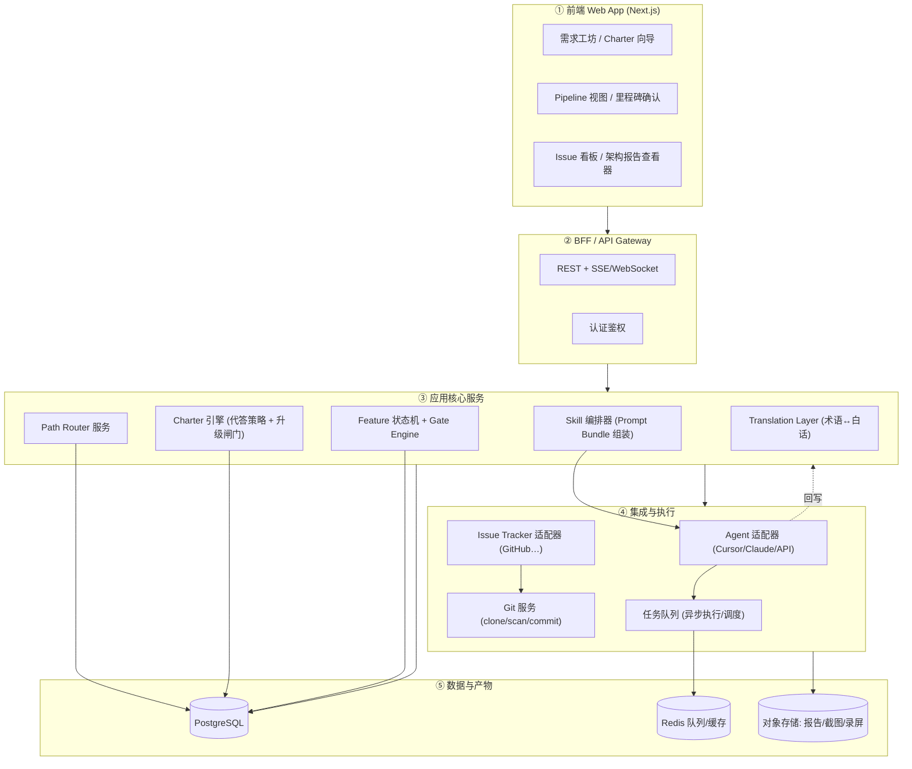
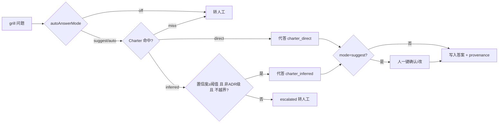

# 非专业人员友好的 AI 软件开发工作流平台 — 完整实施方案

> **定位**：让不懂代码的人，用「几句话 + 几次选择」把想法变成可交付软件。  
> **引擎来源**：[WORKFLOW.md](./WORKFLOW.md)（Skill 工作流 + Path Router + Charter）、[PLATFORM-PRD.md](./PLATFORM-PRD.md)（数据模型 + Gate + API）。  
> **本文档定位**：在上述「引擎」之上，给出**可直接落地**的系统架构、模块优先级、技术选型、UI/UX 规范与界面原型、开发路线图。  
> **版本**：v0.1-draft

---

## 0. 可行性结论（先回答「能不能」）

**能，但需补一层「非专业人员翻译层」。**

现有两份文档已经把平台的**引擎**定义完整：

| 已具备（引擎层） | 来源 |
|------------------|------|
| 路径选型规则（Path Router：需求 × 仓库状态 → workflowTemplate） | WORKFLOW §4 / PRD §6.5 |
| 决策自动化策略（Charter：四象限 + 应答模式 + 升级闸门） | WORKFLOW §5.5 / PRD §6.6 |
| 阶段状态机 + Gate 强约束 | PRD §6.2–§6.3 |
| 数据模型（Project/Feature/Slice/Charter…） | PRD §7 |
| Skill→Node 映射、Prompt Bundle、Issue Tracker 适配器 | PRD §6.1 / §8 / §9 |
| REST API 草案、里程碑、验收标准 | PRD §12 / §13 / §16 |

但面向**非专业人员**还有 4 个缺口必须补（本方案的重点）：

| # | 缺口 | 影响 | 本方案对策 |
|---|------|------|-----------|
| GAP-1 | 文档全是工程术语（grill、slice、TDD、seam、ADR） | 非专业人员看不懂、不敢点 | **术语隐藏层**：UI 用白话动词 + 悬浮解释；内部仍走 skill |
| GAP-2 | 需求输入假设用户会写「初步方案 + 技术栈」 | 非专业人员给不出 | **白话需求工坊**：引导式问卷 + 卡片选择，自动生成 grill 预填包 |
| GAP-3 | 决策点仍需懂行才能答 | 卡在 grill | **Charter 向导**：用「你最在意什么」式卡片，生成决策主旨，Agent 代答 |
| GAP-4 | 产出是 issue / 代码 / 测试，用户无法验收 | 不知道做得对不对 | **里程碑确认**：每个里程碑给「可点的演示 + 截图/录屏 + 一句话说明」，用户「是/不对/改一下」 |

> **一句话**：引擎够用，缺的是「把工程对话翻译成普通人能完成的结构化交互」——这正是本方案 §3 的 **Translation Layer** 与 §6 的 UI/UX 规范要解决的。

---

## 1. 产品定位与核心策略

### 1.1 目标用户

| 用户 | 画像 | 在平台里做什么 |
|------|------|----------------|
| **创意者（Primary）** | 有想法、不懂代码（创业者、产品经理、运营、独立创作者） | 描述想法 → 做几次选择 → 看里程碑确认 → 拿到软件 |
| **半专业者（Secondary）** | 懂一点技术（设计师、低代码玩家） | 上面 + 偶尔覆盖 Charter / 调路径 |
| **守护者（Tertiary）** | 工程顾问 / Tech Lead | 审 Charter、看架构报告、处理升级到人的决策 |

### 1.2 核心策略：把人工压缩到「前置 40 分钟 + 几次确认」

对应 WORKFLOW §5.5 的三阶段交互压缩：

```
阶段一：需求工坊（≈30 分钟，一次性）
  白话问卷 + 卡片 → 自动生成 grill 预填包（覆盖 ~70% 可预见问题）
        ↓
阶段二：快速确认（≈10 分钟）
  AI 生成 CONTEXT/Charter 草稿 → 用户「是/不对/改一下」
  剩余问题以选择题呈现
        ↓
阶段三：全自动执行（无人值守）
  Path Router 选路 → Charter 代答 grill → to-prd → to-issues → TDD 流水线
        ↓
  里程碑节点：演示 + 截图/录屏 → 用户确认
```

### 1.3 三条不可违背的设计红线（来自引擎层）

1. **不消灭 grill**：Charter 只覆盖可预见决策；未知的未知仍要问人（WORKFLOW §5.5.1）。
2. **高风险强制人工**：ADR 级 / 越界 / 低置信决策必须升级（PRD §6.3 `MustEscalateToHuman`）。
3. **里程碑兜底**：自动化越多，越要在里程碑用「可感知的演示」让用户兜住「自信地答错」。

---

## 2. 系统架构设计

### 2.1 分层架构（C4 - Container 级）



### 2.2 五层职责

| 层 | 职责 | 关键组件 |
|----|------|----------|
| ① 前端 | 非专业人员交互、术语隐藏、实时进度 | 需求工坊、Charter 向导、Pipeline Stepper、里程碑确认、看板 |
| ② BFF/Gateway | 聚合 API、鉴权、SSE/WebSocket 推送 grill 进度 | REST、实时通道 |
| ③ 应用核心 | 业务规则的「大脑」 | **Path Router**、**Charter 引擎**、**状态机/Gate**、**Skill 编排器**、**Translation Layer** |
| ④ 集成执行 | 与外部 Agent / GitHub / Git 打交道 + 异步任务 | Agent 适配器、Issue 适配器、Git 服务、队列 |
| ⑤ 数据产物 | 持久化 + 大文件产物 | PostgreSQL、Redis、对象存储 |

### 2.3 两个新增的核心服务（引擎层文档已定义规则，此处定架构）

**A. Charter 引擎**（实现 PRD §6.6）



**B. Agent 适配器（执行抽象）**——MVP 与 Post-MVP 解耦的关键：

| 模式 | 实现 | 阶段 |
|------|------|------|
| `manual_copy` | 平台生成 Prompt Bundle，用户复制到 Cursor，手动回写结果 | MVP |
| `deep_link` | 生成 Cursor deep link 一键打开 | MVP+ |
| `headless_api` | 平台直连 Claude/OpenAI API 跑无人值守 slice | Post-MVP |
| `agent_sdk` | Cursor/Agent SDK + webhook 自动回写 | Post-MVP |

> 适配器接口统一为 `runSkill(skillName, promptBundle) → AgentRun`，上层（状态机/编排器）不感知具体执行方式。

### 2.4 关键数据流（一个 Feature 的生命周期）

```
创建 Feature
  → 需求工坊收集 → Translation Layer 生成 grill 预填包 + Charter 草稿
  → Path Router(仓库扫描 + 需求) 选 workflowTemplate
  → Gate(CanGrill) → Grill(Charter 引擎代答 + 升级) → CONTEXT/ADR 回写
  → Gate(CanToPrd) → to-prd → PRD issue
  → to-issues → Slice DAG → 用户(白话)确认
  → 调度器按 DAG 拓扑 → 每个 AFK slice → Agent 适配器跑 TDD → 回写
  → 里程碑达成 → 生成演示+截图 → 用户确认
  → done
```

---

## 3. 功能模块拆解 & 优先级

采用 **MoSCoW**（Must / Should / Could / Won't-now）。每模块标注对应引擎文档来源。

### 3.1 模块总览

| 模块 | 子能力 | 优先级 | 引擎来源 |
|------|--------|:------:|----------|
| **M1 账户与项目** | 登录、连接 GitHub repo、项目列表 | Must | PRD §7 Project |
| **M2 Setup 向导** | issue tracker / triage labels / domain 配置 | Must | WORKFLOW §5、PRD §10.2 P1 |
| **M3 需求工坊**（新，GAP-2） | 白话问卷、卡片选择、生成 grill 预填包 | **Must** | 本方案 §1.2、WORKFLOW §5.5 |
| **M4 Charter 向导**（新，GAP-3） | 四象限卡片、应答模式、生成决策主旨 | **Must** | WORKFLOW §5.5、PRD §6.6 |
| **M5 Path Router** | 仓库扫描 + 推荐模板 + 白话理由 | Must | WORKFLOW §4、PRD §6.5 |
| **M6 Grill Panel** | 单问题对话、Charter 代答展示、provenance、升级问人 | Must | WORKFLOW §6、PRD §10.2 P3、§6.6 |
| **M7 Gate/状态机引擎** | 阶段闸门、强约束、模板分支 | Must | PRD §6.2–§6.3 |
| **M8 PRD 生成与查看** | to-prd、白话摘要、发布 issue | Should | WORKFLOW §8、PRD §10.2 |
| **M9 Slice DAG 编辑器** | 任务拆解可视化、依赖、无环校验 | Should | WORKFLOW §9、PRD §10.2 P4 |
| **M10 执行控制台 (TDD)** | 启动 slice、进度、zoom-out/diagnose 子操作 | Should | WORKFLOW §10、PRD §10.2 P5 |
| **M11 里程碑确认**（新，GAP-4） | 演示链接 + 截图/录屏 + 「是/不对/改」 | **Should** | 本方案 §1.2 阶段三 |
| **M12 Issue 看板 / Triage** | 状态分组、AI 分诊 disclaimer | Should | WORKFLOW §12.1、PRD §10.2 P6 |
| **M13 Agent 适配器** | manual_copy → deep_link → headless | Must(copy) | PRD §9、本方案 §2.3 |
| **M14 架构治理** | 触发 review、HTML 报告查看 | Could | WORKFLOW §11、PRD §10.2 P7 |
| **M15 Handoff / 通知** | 交接文档、里程碑通知、邮件/IM | Could | WORKFLOW §12.2 |
| **M16 Translation Layer**（新，GAP-1） | 术语↔白话词典、悬浮解释、白话模式 | **Must（贯穿）** | 本方案 §6.2 |
| **M17 团队/权限/审计** | 多用户、Charter 审批、audit log | Won't-now | PRD §3.3 Future |
| **M18 计费/SaaS** | 订阅、用量 | Won't-now | PRD §3.2 NG4 |

### 3.2 优先级分组

- **Must（MVP 闭环）**：M1, M2, M3, M4, M5, M6, M7, M13(copy), M16  
  → 形成「白话输入 → Charter 代答 → grill → 选路」最小可用闭环（即使后段手动）。
- **Should（完整流水线）**：M8, M9, M10, M11, M12  
  → 打通到 TDD 执行 + 里程碑确认。
- **Could（增强）**：M14, M15。
- **Won't-now**：M17, M18（Post-MVP）。

### 3.3 MVP「最小惊艳路径」（Demo 价值最高的纵切）

> 选一条 **Express + Charter** 的端到端纵切，最快展示「非专业人员价值」：

```
登录 → 连 repo → Setup → 需求工坊(白话) → Charter 向导(卡片)
  → Path Router 推荐 express → Grill(Charter 自动代答, 仅 1-2 个升级问人)
  → 生成 Prompt Bundle → 用户一键复制到 Cursor 执行 → 回写 → 里程碑截图确认
```

---

## 4. 技术选型建议

> 原则：**TypeScript 全栈单一语言**降低团队复杂度；优先成熟、社区大、AI 友好的库。

### 4.1 选型总表

| 领域 | 选型 | 理由 / 备选 |
|------|------|------------|
| **前端框架** | **Next.js 15 (App Router) + React 19 + TypeScript** | SSR/RSC、生态最大、与全栈一体；备选 Remix |
| **UI 组件** | **Tailwind CSS + shadcn/ui + Radix** | 可定制、无供应商锁定、a11y 好 |
| **图/DAG 可视化** | **React Flow (xyflow)** | Slice DAG / 流程图交互；Mermaid 用于静态展示 |
| **状态/数据** | **TanStack Query + Zustand** | 服务端状态缓存 + 轻量本地状态 |
| **实时通道** | **SSE（grill 进度）/ WebSocket（协作）** | grill 单向推送用 SSE 足够 |
| **后端运行时** | **Node.js 22 + TypeScript** | 与前端同语言 |
| **后端框架** | **NestJS**（模块化）或 **Fastify**（轻量） | NestJS 适合多服务、DI、清晰边界；MVP 可先 Next API Routes |
| **ORM / DB** | **Prisma + PostgreSQL** | 类型安全、迁移友好；JSON 字段存 Charter/snapshot |
| **队列/缓存** | **BullMQ + Redis** | 异步跑 slice、调度 arch-review |
| **对象存储** | **S3 兼容（MinIO 自托管 / R2）** | 架构 HTML 报告、里程碑截图/录屏 |
| **Git 操作** | **simple-git / isomorphic-git + 服务端 clone** | 仓库扫描（isGreenfield、CONTEXT 检测） |
| **Issue Tracker** | **Octokit（GitHub）** | MVP 默认；适配器接口预留 GitLab/Linear |
| **Agent 集成** | MVP: Prompt Bundle 复制 / deep link；Post-MVP: **Anthropic API / Cursor CLI** | 适配器解耦 |
| **截图/录屏** | **Playwright**（对 deploy 预览自动截图/录屏） | 里程碑确认产物 |
| **认证** | MVP 单用户本地 token；多用户用 **Auth.js / Clerk** | |
| **校验/类型** | **Zod**（输入校验 + 与 Prisma 共享类型） | |
| **测试** | **Vitest + Playwright（E2E）** | 与平台理念一致（TDD 友好） |
| **部署** | **Docker Compose（自托管）**；前端可 Vercel | PRD NG4：单用户/小团队自托管优先 |
| **可观测** | **OpenTelemetry + 结构化日志（pino）** | 追踪 Agent run / Gate 决策 |

### 4.2 仓库与代码组织（Monorepo）

```
platform/
├── apps/
│   ├── web/            # Next.js 前端
│   └── api/            # NestJS/Fastify 后端 (或合并进 web/api routes for MVP)
├── packages/
│   ├── core/           # Path Router、Charter 引擎、Gate 状态机（纯逻辑、可测）
│   ├── adapters/       # Agent / IssueTracker / Git 适配器接口与实现
│   ├── prompts/        # Prompt Bundle 模板 + Translation 词典
│   ├── db/             # Prisma schema + migrations
│   └── ui/             # 共享组件库 (shadcn 封装)
└── tooling/            # eslint, tsconfig, vitest 配置
```

> **关键**：`packages/core` 把「引擎规则」（Path Router 路由表、Charter 升级闸门、Gate 条件）做成**纯函数库 + 单元测试**，与 UI/IO 解耦——这正好用平台自己的 TDD 理念开发。

### 4.3 MVP 简化建议

MVP 阶段为降低复杂度，可：
- 前后端合并为 **Next.js 全栈**（API Routes），暂不拆 NestJS。
- 队列用 BullMQ 但只跑少量任务；Agent 用 `manual_copy`（不接 API）。
- 对象存储用本地 MinIO；认证用单用户。

---

## 5. UI/UX 设计规范

### 5.1 设计原则（非专业人员友好）

| 原则 | 落地 |
|------|------|
| **白话优先** | 所有按钮/标题用动词短语，不出现 grill/slice/TDD；术语放悬浮解释 |
| **一次一决策** | 每屏只问一件事（继承 grill「单问题」纪律），降低认知负荷 |
| **进度可见** | 顶部恒显 Pipeline Stepper + 当前在哪一步 + 还剩什么 |
| **可逆与安全** | 任何选择都能「改一下」；危险/不可逆操作二次确认 |
| **结果可感知** | 里程碑用截图/录屏/可点链接，而非 issue 号或代码 |
| **信任透明** | Agent 代答的决策标「AI 替你决定」徽章，可展开看依据（provenance） |

### 5.2 术语翻译层（M16 词典示例）

| 内部（引擎/skill） | 面向用户的白话 | 悬浮解释 |
|--------------------|----------------|----------|
| grill / 需求对齐 | 「把想法聊清楚」 | 我们会问你几个关键问题，确保做对方向 |
| Charter / 决策主旨 | 「你的偏好设定」 | 一次告诉我们你的取舍，之后 AI 替你做选择 |
| slice / vertical slice | 「可演示的小功能块」 | 每块都能单独看到效果 |
| TDD | 「边做边自检」 | AI 一边写一边验证，减少出错 |
| PRD | 「需求说明书」 | 把你的想法整理成清单 |
| ADR / 升级到人 | 「需要你拍板的大决定」 | 这个选择影响大且难改，请你确认 |
| triage | 「问题分拣」 | 给收到的问题归类、排优先级 |

### 5.3 视觉规范

| 元素 | 规范 |
|------|------|
| **主色** | 信任蓝 `#2563EB`；成功绿 `#16A34A`；警示橙 `#EA580C`（升级到人）；危险红 `#DC2626` |
| **AI 徽章** | 紫色 `#7C3AED` 小标签「AI 替你决定」，可点开看依据 |
| **字体** | 系统无衬线 + 可读性优先；正文 16px 起；中文 PingFang/Noto Sans SC |
| **圆角/间距** | 圆角 12px；卡片间距 16/24；大留白降低压迫感 |
| **状态色（Gate）** | 🔒 锁定灰 / ✅ 完成绿 / ⏳ 进行中蓝 / ⚠️ 待你确认橙 |
| **暗色模式** | 支持（shadcn 内置） |
| **无障碍** | WCAG AA 对比度；键盘可达；focus ring 明显 |

### 5.4 信息架构（导航）

```
顶层导航：我的项目 │ 新建项目 │ 设置
项目内：总览 │ 想做的功能(Features) │ 偏好设定(Charter) │ 收到的问题(看板) │ 健康检查(架构)
功能内（Pipeline）：说想法 → 聊清楚 → 看计划 → 执行 → 里程碑确认
```

---

## 6. 界面原型（Wireframes）

> 低保真线框，标注关键交互；实现时用 shadcn 组件还原。

### 6.1 需求工坊（M3，阶段一）— 引导式问卷

```
┌──────────────────────────────────────────────────────────┐
│  新建项目 · 第 2 / 6 步                       [保存草稿] [×]│
│  ●●○○○○                                                     │
├──────────────────────────────────────────────────────────┤
│                                                            │
│   这个软件主要帮谁解决什么问题？                            │
│   ┌────────────────────────────────────────────────────┐ │
│   │ 帮小店主在手机上管理每天的订单和库存…               │ │
│   └────────────────────────────────────────────────────┘ │
│                                                            │
│   用户会经常做哪些操作？（多选，可补充）                    │
│   [✓ 查看列表] [✓ 新增条目] [  搜索] [✓ 修改状态]          │
│   [  导出数据] [  权限控制]            [+ 自定义…]          │
│                                                            │
│   你最在意哪一点？（单选，影响后续取舍）                    │
│   ( ) 快速上线   (•) 稳定可靠   ( ) 以后好扩展              │
│                                                            │
│              ⓘ 不确定？先跳过，AI 之后会问你               │
│                                                            │
│                              [上一步]      [下一步 →]      │
└──────────────────────────────────────────────────────────┘
```

### 6.2 Charter 向导（M4）— 卡片式偏好设定

```
┌──────────────────────────────────────────────────────────┐
│  偏好设定 · 让 AI 知道怎么替你做选择          [稍后再说]   │
├──────────────────────────────────────────────────────────┤
│  自动决策程度                                              │
│   ( ) 每件事都问我    (•) AI 建议我确认    ( ) AI 自己决定 │
│       (off)               (suggest)         (auto+升级)    │
│                                                            │
│  遇到取舍时，请优先：       要尽量避免：                    │
│   [✓ 简单好用        ]      [✓ 引入复杂新概念  ]           │
│   [✓ 用成熟方案      ]      [✓ 破坏已有功能    ]           │
│   [+ 添加…           ]      [+ 添加…           ]           │
│                                                            │
│  绝对不能出现（硬约束）：                                   │
│   [✓ 数据离开中国大陆] [✓ 收集隐私不告知] [+ 添加…]        │
│                                                            │
│  ┌────────────────────────────────────────────────────┐ │
│  │ ⚠️ 这些「大决定」AI 永远会先问你：                   │ │
│  │   · 难以反悔且影响大的选择                           │ │
│  │   · 会突破你上面设的红线                             │ │
│  └────────────────────────────────────────────────────┘ │
│                                       [生成我的偏好设定 →] │
└──────────────────────────────────────────────────────────┘
```

### 6.3 功能 Pipeline 总览（M7/M16）— 进度可见

```
┌──────────────────────────────────────────────────────────┐
│  功能：订单管理            模板：快速通道(express) ⓘ        │
├──────────────────────────────────────────────────────────┤
│  ✅ 说想法 ── ⏳ 聊清楚 ── 🔒 看计划 ── 🔒 执行 ── 🔒 确认 │
│                  ▲ 你在这里                                 │
├──────────────────────────────────────────────────────────┤
│  当前：聊清楚（已自动回答 8/10，2 个需要你拍板）           │
│                                                            │
│   [继续回答 2 个问题 →]                                     │
│                                                            │
│  已自动决定（AI 替你决定 · 点开看依据）                     │
│   ▸ 列表默认按时间倒序        [AI·依据:你选了"简单好用"]   │
│   ▸ 暂不做多语言             [AI·依据:你的偏好设定]        │
└──────────────────────────────────────────────────────────┘
```

### 6.4 Grill Panel（M6）— 单问题 + 升级到人

```
┌──────────────────────────────────────────────────────────┐
│  聊清楚 · 还剩 2 个需要你拍板                               │
├──────────────────────────────────────────────────────────┤
│  ⚠️ 需要你拍板的大决定 (1/2)                                │
│                                                            │
│  订单删除后，数据应该：                                     │
│   (•) 真正删除（省空间，但无法恢复）  ← AI 推荐            │
│   ( ) 标记隐藏（可恢复，占空间）                           │
│                                                            │
│   为什么问你：这个选择难以反悔，影响用户数据安全           │
│                                                            │
│        [选这个]    [我要改一下]    [我不确定，解释更多]    │
├──────────────────────────────────────────────────────────┤
│  侧栏：已建立的共同语言（CONTEXT）   [实时更新 +3 词]      │
└──────────────────────────────────────────────────────────┘
```

### 6.5 里程碑确认（M11，阶段三）— 看演示点确认

```
┌──────────────────────────────────────────────────────────┐
│  🎉 里程碑达成：你现在可以新增和查看订单了                  │
├──────────────────────────────────────────────────────────┤
│   ┌──────────────┐  ┌──────────────┐                      │
│   │  [▶ 录屏演示] │  │ [截图: 列表] │   [🔗 打开试用链接] │
│   └──────────────┘  └──────────────┘                      │
│                                                            │
│   这一步完成了：                                            │
│    · 新增订单（含金额、客户）                               │
│    · 在列表里查看全部订单                                   │
│                                                            │
│   看起来对吗？                                              │
│     [✅ 对，继续下一步]   [✋ 不对/要改一下]                │
│                                                            │
│   ▸ 还没做（接下来）：修改订单状态、搜索                    │
└──────────────────────────────────────────────────────────┘
```

### 6.6 Slice DAG 编辑器（M9，半专业者可见，普通人折叠为清单）

```
┌──────────────────────────────────────────────────────────┐
│  计划：拆成 4 个可演示的小功能块   [简单清单 ▾] [关系图]   │
├──────────────────────────────────────────────────────────┤
│   ① 新增订单 ──▶ ② 查看列表 ──▶ ④ 搜索                     │
│                      └────────▶ ③ 改状态                   │
│   (○ AFK 自动)              (⚠ 需你确认权限边界 HITL)      │
│                                                            │
│   [批准这个计划并开始]                                      │
└──────────────────────────────────────────────────────────┘
```

> 普通人默认看「简单清单」模式（带依赖箭头的有序列表）；半专业者可切「关系图」（React Flow 可拖拽）。

---

## 7. 开发路线图（Roadmap）

> 以**能力里程碑**为单位（非日历周期）。每阶段给出范围、依赖、退出标准。

### 阶段 R0 — 地基（Foundation）

| 项 | 内容 |
|----|------|
| **范围** | Monorepo 搭建；`packages/core` 引擎骨架（Path Router 路由表、Gate 状态机、Charter 数据结构）+ 单元测试；Prisma schema（Project/Feature/Charter/Slice/…）；账户与项目 CRUD（M1）；GitHub 连接 + 仓库扫描（isGreenfield/CONTEXT 检测） |
| **依赖** | 无 |
| **退出标准** | 能创建项目、连 repo、扫描出仓库快照；core 逻辑单测覆盖路由与 Gate 主要分支 |

### 阶段 R1 — 非专业人员输入闭环（MVP 核心）

| 项 | 内容 |
|----|------|
| **范围** | Setup 向导（M2）；**需求工坊（M3）**；**Charter 向导（M4）**；Path Router 推荐 + 白话理由（M5）；**Translation Layer 词典（M16）**；Gate/状态机引擎（M7） |
| **依赖** | R0 |
| **退出标准** | 非专业用户能从「白话需求 + 卡片偏好」走到「系统推荐了一条路径 + 生成 grill 预填包 + Charter 草稿」；对应 AC-9、AC-11 |

### 阶段 R2 — 对话与代答（Charter 落地）

| 项 | 内容 |
|----|------|
| **范围** | Grill Panel（M6）单问题 UI + CONTEXT 实时 diff；Charter 引擎代答 + provenance + 升级闸门；Agent 适配器 `manual_copy`（M13）：生成 Prompt Bundle 供复制 |
| **依赖** | R1 |
| **退出标准** | `suggest` 模式下 Agent 按 Charter 代答、命中升级的问题转人工并标 `escalated`；对应 AC-12、PRD `MustEscalateToHuman` |

### 阶段 R3 — 计划与执行流水线

| 项 | 内容 |
|----|------|
| **范围** | PRD 生成与白话查看 + 发 issue（M8）；Slice DAG 编辑器（M9，含简单清单模式）；执行控制台（M10）；Issue 看板/Triage（M12）；BullMQ 调度按 DAG 拓扑 |
| **依赖** | R2 |
| **退出标准** | 一个 Feature 能从需求走到「拆出 slice → 逐个生成 TDD Prompt Bundle → 手动回写完成」；对应 AC-2~AC-8 |

### 阶段 R4 — 结果可感知（里程碑 + 信任）

| 项 | 内容 |
|----|------|
| **范围** | **里程碑确认（M11）**：Playwright 自动截图/录屏 + 「是/不对/改」；通知/Handoff（M15）；度量看板（Charter 覆盖率 / 升级精确率 / misalignment 率，PRD §14） |
| **依赖** | R3 |
| **退出标准** | 非专业用户全程「看演示点确认」，无需读 issue/代码；度量可采集 |

### 阶段 R5 — 自动化与增强（Post-MVP）

| 项 | 内容 |
|----|------|
| **范围** | Agent `headless_api` / `agent_sdk` 无人值守执行；`auto-with-escalation` 全自动代答 + 置信度校准；Charter 反馈环自动回写；架构治理查看器（M14）+ 定期调度 |
| **依赖** | R4 + 度量验证 Charter 覆盖率达标 |
| **退出标准** | AFK slice 端到端无人值守完成并回写；Charter 覆盖率/误判达目标 |

### 阶段 R6 — 团队与商业化（Future）

| 项 | 内容 |
|----|------|
| **范围** | 多用户/权限/Charter 审批/audit（M17）；GitLab/Linear 适配器；模板市场；计费（M18） |
| **依赖** | R5 |
| **退出标准** | 多人协作 + 多 issue tracker + 计费可用 |

### 7.1 Roadmap 与引擎文档里程碑对照

| 本方案阶段 | PRD §13 Milestone | 增量（非专业人员层） |
|------------|-------------------|----------------------|
| R0 | M1 Foundation | + Translation Layer 骨架 |
| R1 | M1/M2 | + 需求工坊、Charter 向导 |
| R2 | M2 | + Charter 引擎代答闭环 |
| R3 | M2/M3 | + 白话 PRD/清单 |
| R4 | M4 | + 里程碑演示确认 |
| R5 | Post-MVP | + 无人值守 + 自动代答 |

---

## 8. 风险与关键决策（针对本平台）

| 风险 | 缓解 |
|------|------|
| 非专业人员描述太模糊，Charter 也覆盖不了 | 需求工坊「不确定就跳过」+ grill 兜底 + 里程碑早确认（快速失败） |
| 自动代答让用户「失控感」 | provenance 透明 + 「AI 替你决定」可展开 + 默认 `suggest` 而非全自动 |
| Agent 在平台外执行，状态不同步 | MVP `manual_copy` 明确回写 UX；Post-MVP SDK + webhook（PRD §15） |
| 生成结果质量不稳定 | 保留 TDD/diagnose 引擎纪律；里程碑截图确认兜底 |
| 术语翻译造成误解 | 词典 + 悬浮原义 + 「解释更多」入口；半专业者可切专业视图 |

---

## 9. 结论

- **现有两份文档足以支撑平台的引擎**（路径、决策、状态、数据、API）。
- **要面向非专业人员**，本方案补齐了 4 个缺口：术语隐藏（M16）、白话需求工坊（M3）、卡片式 Charter 向导（M4）、里程碑演示确认（M11）。
- 架构上以 **TypeScript 全栈 + 引擎纯函数库（packages/core）+ Agent 适配器解耦** 为核心，MVP 可先用 Next.js 全栈 + `manual_copy` 跑通闭环，再逐步接入无人值守执行。
- Roadmap 按能力里程碑 R0→R6 推进，与 PRD §13 对齐，并在每阶段叠加「非专业人员层」增量。

> 下一步建议：从 **R0 + R1 的「最小惊艳路径」（§3.3）** 开始落地，最快验证「不懂代码的人能不能跑通一次」。

---

*本文档基于 [WORKFLOW.md](./WORKFLOW.md) 与 [PLATFORM-PRD.md](./PLATFORM-PRD.md) 的引擎层扩展而来；引擎规则变更时请同步本方案的模块来源引用。*
