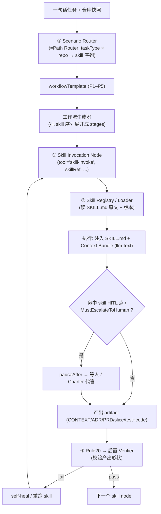

# Skills × Engine 集成方案：让自动化引擎按场景启动原版 Matt Pocock Skill

> **问题**：`stagent_vscode` 把若干 skill 的行为「编译进引擎」（Rule20 校验器 + taskType 约束），存在质量风险——judgment 重的 skill 被降维成只能验「形状」的校验器，且 `setup / to-prd / to-issues(发布) / triage / handoff` 等链路缺失。  
> **方案**：把引擎从「编译 skill 行为」升级为「**场景化调用原版 SKILL.md + 引擎做编排/校验/自愈**」的混合体——**判断交给原版 skill（保真 + 保留 HITL），形状与可靠性交给引擎**。  
> **关联**：[WORKFLOW.md](./WORKFLOW.md)（路径选型 §4、Charter §5.5）、[PLATFORM-PRD.md](./PLATFORM-PRD.md)（Node/Gate/Adapter）、[PLATFORM-SOLUTION.md](./PLATFORM-SOLUTION.md)（平台落地）。引擎现状见 [§2 与 stagent_vscode 现状对照](#2-与-stagent_vscode-现状对照)。  
> **版本**：v0.1-draft

---

## 1. 背景与质量风险定位

### 1.1 「编译进引擎」为什么有质量风险

风险**不来自「编译」这个动作本身**，而来自三件具体的事：

| # | 风险根因 | 说明 |
|---|----------|------|
| R1 | **转写保真度损失** | 把 `SKILL.md` 重编码为 Rule20 校验器 / taskType 约束，捕捉的是某一刻的理解。skill 的判断纪律（grill 的 Socratic 追问、improve-arch 的 deletion-test 取舍）难以被校验器表达；上游 skill 更新也不会传导。 |
| R2 | **丢 skill = 丢质量护栏** | 缺失的 `setup / to-prd / to-issues(发布) / triage / handoff` 本身是质量机制（合成不再问、垂直切片 DAG + 批准、状态机），少了它们外部检查点变少。 |
| R3 | **过度自动化吃掉 HITL** | skill 故意保留人工拍板点（grill 单问题、TDD planning 批准、slice 粒度 quiz）；全自动引擎容易抹平，提升「自信地答错」概率。 |

### 1.2 但不要矫枉过正（反方）

- skill 本质就是一段 prompt（`SKILL.md`）；**「运行 skill」= 注入 SKILL.md 到 agent 上下文**。若「编译」= 在正确阶段注入**原版** SKILL.md，保真损失很小。
- 引擎**强制 Gate 比人手动串联更不易漏步**（WORKFLOW §17 列的误区多是人工犯的）。

### 1.3 结论：混合，而非二选一

> **判断给原版 skill，形状给引擎校验器。**  
> judgment 重的 skill 用「原版调用」（注入真 SKILL.md，保留 HITL）；机械约束保留在引擎里，但**降级为 skill 产出的后置 verifier**，而非替代 skill。

---

## 2. 与 stagent_vscode 现状对照

### 2.1 现状（引擎已有）

| 引擎能力 | 文件 / 证据 | 在本方案中的角色 |
|----------|-------------|------------------|
| taskType 分类（software/refactor/debug/prototype/document/improve-architecture/other） | `prompts/task-type-classification.md`、`src/workflow/TaskType.ts` | **升级为 Scenario Router 输入** |
| 工作流生成（decision/impl/test-write/test-run/zoom-out/architecture stages） | `src/workflow/StageIdPatterns.ts`、`stageClassification.ts` | **展开 skill 序列的载体** |
| stage 工具仅 4 种：`llm-text`/`file-write`/`file-read`/`code-runner` | `src/workflow/StageToolKinds.ts` | **新增第 5 种 `skill-invoke`** |
| Rule20 校验器（vertical slice、to-issues 链、red-green、prototype 契约） | `src/rule20/*`、`prompts/vertical-slice-constraint.md` | **改造为后置 Verifier** |
| grill 自适应（一次一问） | `src/GrillLoopPolicy.ts`、`GrillAdaptiveFlow.ts` | grill skill native 化前的桥 |
| 词汇表 / ADR | `src/ProjectGlossaryStore.ts`（≈CONTEXT.md）、`src/AdrStore.ts` | **skill 的产出回写目标** |
| HITL / 置信度 | `src/AdaptiveHITLPolicy.ts`、`src/ConfidenceScorer.ts` | **Charter 自动应答 + 升级闸门的执行点** |
| 自愈 | `src/workflow-self-heal/*` | **Verifier 失败后的兜底** |

### 2.2 Skill 覆盖差距（本方案要补齐）

| Skill | 现状 | 目标 |
|-------|------|------|
| grill-with-docs / grill-me | 已内化（自适应 grill + glossary + ADR） | **native 化**（注入原版 SKILL.md） |
| prototype / tdd / zoom-out / diagnose / improve-arch | 已内化（taskType + 校验器） | native 化判断部分；校验器留作 verifier |
| to-issues | 部分（rule20 校验链，不发 issue） | native 化 + **接 issue tracker** |
| to-prd / setup / triage / handoff | **缺失** | **新增为 skill-invoke 节点** |
| caveman / write-a-skill / misc·personal·deprecated | 缺失 | 暂不进主流水线（按需独立入口） |

---

## 3. 目标架构

### 3.1 设计原则

| 原则 | 落地 |
|------|------|
| **保真优先** | skill 以 `SKILL.md` 原文为 single source of truth；引擎注入原文而非转写（消灭 R1） |
| **保留 HITL** | skill 定义的人工点 = 引擎真实的 `pauseAfter`（复用 `AdaptiveHITLPolicy`）（消灭 R3） |
| **引擎降级为编排 + 校验层** | Rule20 / self-heal 从「行为替代者」变「skill 产出的后置 verifier」 |
| **缺失链路补齐** | setup/to-prd/to-issues(发布)/triage/handoff 作为 skill-invoke 节点 + adapter（消灭 R2） |
| **Charter 统一代答** | 每个 skill node 配 `autoAnswerMode` + 升级闸门，减少人工不牺牲质量 |

### 3.2 四个新增组件（叠加在现有引擎上）



| 组件 | 职责 | 复用 / 新增 |
|------|------|------------|
| **① Scenario Router** | `taskType × 仓库状态 → workflowTemplate + 有序 skill 列表` | 复用 `TaskType.ts` + 新增路由表（§4） |
| **② Skill Invocation Node** | 新 stage 类型，承载一次 skill 调用 | 新增 `STAGE_TOOL_SKILL_INVOKE`（§5） |
| **③ Skill Registry / Loader** | 扫描并加载 `SKILL.md` 原文（含子文件、版本） | 扩展 `PromptSlotLoader`/`PromptVersionManager`（§6） |
| **④ Rule20 后置 Verifier** | skill 跑完后校验产出形状，不过则自愈/重跑 | 改造 `src/rule20/*` 语义（§7） |

---

## 4. 场景 → Skill 路由表

Scenario Router 把现有 `taskType` 输出从「选哪套内部约束」升级为「按序调用哪些原版 skill」。路径 ID 与 [WORKFLOW §4.2](./WORKFLOW.md#42-完整路径目录) 一致。

| 场景（taskType × repo） | `workflowTemplate` | 启动的 skill 序列（有序） |
|------|------|------|
| 新功能 + 空/极薄库 | `greenfield_full` (P1) | `setup` → `grill-with-docs` → [`prototype`] → `to-prd` → `to-issues` → `tdd`×N → [`improve-arch`] |
| 新功能 + 已有库/跨模块 | `brownfield_full` (P2) | [`setup` 核对] → `grill-with-docs` → `to-prd` → `to-issues` → **`zoom-out`(门禁)** → `tdd`×N |
| 小改 + 单切片 + 不动陌生模块 | `express` (P3) | `grill-me` → `tdd` |
| bug / 回归 | `debug` (P4) | `triage` → `diagnose` → `tdd`(回归) → [`improve-arch` 若缺 seam] |
| 纯架构治理 | `arch_review` (P5) | `improve-codebase-architecture` |
| 横切（任意模板叠加） | `cross_cutting` | `handoff` / `caveman` / `zoom-out` / `diagnose` |

**路由规则（优先级，对齐 PRD §6.5.3）：**

```
1. taskType == debug                              → debug
2. taskType == (refactor|improve-architecture)    → arch_review (含功能变更则 brownfield_full)
3. isGreenfield && multi_slice                    → greenfield_full
4. !isGreenfield && single_slice && !unknownModule→ express
5. 否则                                            → brownfield_full（保守：对齐现有代码）
运行时升级：express 发现跨模块/schema → brownfield_full；debug 无 seam → arch_review
```

> 每条路径只启动 3–8 个 skill，不会全跑（与 WORKFLOW §4.3 矩阵一致）。

---

## 5. Skill Invocation Node — 执行契约

### 5.1 新增 stage 工具类型

现有工具（`src/workflow/StageToolKinds.ts`）：`llm-text` / `file-write` / `file-read` / `code-runner`。**新增：**

```
STAGE_TOOL_SKILL_INVOKE = 'skill-invoke'
```

### 5.2 Stage 定义字段（建议）

```jsonc
{
  "id": "stage_skill_grill_with_docs",
  "tool": "skill-invoke",
  "skillRef": "grill-with-docs",          // 指向 Registry 中的 skill
  "skillVersion": "pinned@<hash>",        // 版本钉死，保真可追溯
  "autoAnswerMode": "suggest",            // off | suggest | auto-with-escalation
  "pausePoints": ["term-conflict", "adr-proposal"], // skill 的 HITL 点
  "inputs": [ /* Context Bundle 来源 */ ],
  "outputs": [ /* 回写目标，见 5.5 */ ],
  "verifier": "grill-output"              // 对应 Rule20 verifier
}
```

### 5.3 执行流程（统一契约）

```
1. Load      : Registry 读取 SKILL.md 原文（+ 子文件如 CONTEXT-FORMAT.md / ADR-FORMAT.md）
2. Assemble  : Prompt = SKILL.md 原文 + skill 参数 + Context Bundle（见 5.4）
3. Run       : 经 llm-text 执行（沿用现有 LlmTextStageRunner 管线）
4. HITL/Charter:
     - 命中 skill 的 pausePoint，或 MustEscalateToHuman（ADR 级 / 越界 / 低置信）
       → pauseAfter，等人或按 Charter 代答（标 provenance）
5. Writeback : 按 skill 类型回写 artifact（见 5.5）
6. Verify    : Rule20 后置 verifier 校验产出形状
     - pass → 下一节点
     - fail → self-heal 或重跑该 skill node（带失败上下文）
```

### 5.4 Context Bundle（注入给 skill）

```markdown
- Project / Feature 元信息
- Decision Charter（prefer/avoid/acceptable/constraints + escalation）   # 见 WORKFLOW §5.5
- Auto-answer mode
- CONTEXT.md 摘录（来自 ProjectGlossaryStore）
- 相关 ADR（来自 AdrStore）
- 上游 skill 产出（PRD / slice / grill 决策摘要）
- 仓库快照（isGreenfield / hasContextMd / touchesUnknownModule）
```

### 5.5 产出回写映射

| Skill | 回写目标（复用现有存储） |
|-------|--------------------------|
| grill-with-docs / grill-me | `ProjectGlossaryStore`（CONTEXT.md）+ `AdrStore`（ADR）+ grill 决策（带 provenance） |
| prototype | prototype verdict（结论必存，代码可删） |
| to-prd | PRD artifact + issue tracker ref（经 adapter） |
| to-issues | slice issues（DAG）+ issue tracker refs |
| tdd | `stage_test_write_*` / `stage_test_run_*` 产出（test + code） |
| zoom-out | 模块地图（lightweight，不落 repo） |
| diagnose | fix + 回归测试 + post-mortem |
| triage | issue stateRole 流转 + AI disclaimer 评论 |
| improve-arch | HTML 报告路径 + 选中 candidate |
| handoff | 临时目录交接文档（引用路径，不重复内容） |

---

## 6. Skill Registry / Loader

### 6.1 职责

- 扫描 `skills-main-lastest/skills/**/SKILL.md`，加载**原文**为 prompt（含同目录子文件如 `CONTEXT-FORMAT.md`、`ADR-FORMAT.md`、`LOGIC.md`/`UI.md`）。
- 记录 `skillVersion`（内容 hash），支持 pin；上游 skill 更新可控地传导。
- 暴露 `getSkill(skillRef) → { systemPrompt, subFiles, meta }`。

### 6.2 复用现有机制

引擎已有 `PromptSlotLoader` / `PromptVersionManager` / `generated/PromptFragments.ts` 加载带版本的 prompt 片段。**把每个 skill 当成一个带版本的 prompt fragment 接入**即可，无需另造体系。

### 6.3 保真要点

- **注入原文，不转写**：彻底消灭 R1。
- **disable-model-invocation 的 skill**（`setup`、`zoom-out`）→ 仅由 Scenario Router/门禁显式触发，不自动调用（对齐 skill 元数据）。

---

## 7. Rule20 → 后置 Verifier

### 7.1 语义改造

| 之前（生成时约束） | 之后（后置校验） |
|--------------------|------------------|
| 生成 stages 时强制形状 | skill 产出后校验形状，fail → self-heal / 重跑 |

### 7.2 Verifier 清单（保留并复用现有校验器）

| Verifier | 校验内容 | 现有来源 |
|----------|----------|----------|
| `to-issues` | 每切片有 decide+write+run 链；无 horizontal layering；HITL 比例不过高 | `src/rule20/to-issues.ts` |
| `vertical-slice` | 切片端到端、非横切 | `prompts/vertical-slice-constraint.md` |
| `red-green` | RED→GREEN 顺序，RED 不 refactor | `src/test/red-green-gate.test.ts` 相关 |
| `prototype-contract` | prototype 标 throwaway、单命令可跑 | `src/PrototypeContractLint.ts` |
| `improve-arch` | 有 zoom-out 模块地图 + 验证阶段 | `prompts/task-type/improve-architecture-constraint.md` |

> **原则**：verifier 只验「形状」，不冒充 skill 的「判断」。判断错误由 HITL/Charter + 里程碑确认兜底。

---

## 8. 混合策略矩阵

| Skill / 能力 | 处理方式 | 理由 |
|--------------|----------|------|
| grill-with-docs / grill-me | **原版调用（native-invoke）** | Socratic 判断纪律，校验器表达不了 |
| to-prd / to-issues / triage / diagnose / improve-arch / prototype | **原版调用** | 判断重，质量敏感 |
| red-green 顺序、vertical-slice 形状、to-issues 链、prototype 契约 | **保留为引擎 Verifier** | 机械可校验，适合自动兜底 |
| self-heal、tsc/import 校验、ConfidenceScorer、workflow 模板（web/uniapp） | **保留为引擎能力** | skill 没有的工程可靠性增益，纯加分 |
| caveman / write-a-skill / misc·personal·deprecated | **不进主流水线** | 独立入口按需（对齐 WORKFLOW §19） |

---

## 9. Charter / 置信度作为代答闸门

引擎现有 `AdaptiveHITLPolicy` + `ConfidenceScorer` + `grill.autoOnDecisionStages` 本质就是 [WORKFLOW §5.5](./WORKFLOW.md#55-phase-05决策主旨charter可选) 的 Charter 自动应答 + 升级闸门雏形。统一接法：

- 每个 skill node 配 `autoAnswerMode`（off/suggest/auto-with-escalation）。
- 命中 **`MustEscalateToHuman`**（ADR 判据 / 越过 Charter 约束 / 置信度 < 阈值）→ 强制 `pauseAfter`，不得代答。
- 被代答的决策标 provenance（`charter_direct`/`charter_inferred`/`escalated`），`charter_inferred` 在里程碑抽查。

> 效果：**减少人工**（可预见决策代答）与 **保质量**（高风险强制人工 + 里程碑兜底）同时成立。

---

## 10. 落地分期（灰度，不推翻现有引擎）

| 阶段 | 内容 | 退出标准 |
|------|------|----------|
| **S0 地基** | 加 `skill-invoke` 工具类型 + Skill Registry（读 SKILL.md）+ Scenario Router 复用 `taskType` | 能加载并注入一个 SKILL.md 原文跑通一个节点 |
| **S1 单点 native 化 + A/B** | 先 native 化 **grill-with-docs**，与编译版并行做 A/B（§11） | A/B 数据显示 native 版在 misalignment/返工率上不劣于编译版 |
| **S2 Verifier 改造 + 扩面** | Rule20 改为后置 verifier；native 化 to-prd / to-issues / improve-arch | 三个 skill 产出经 verifier 校验 + 自愈闭环 |
| **S3 补缺失链路** | setup / triage / handoff + issue tracker adapter（gh/octokit） | 一个 Feature 端到端：setup→grill→to-prd→to-issues(发 issue)→tdd→triage |
| **S4 Charter 统一闸门** | 每个 skill node 接 `autoAnswerMode` + `MustEscalateToHuman` + provenance | 自动代答可用，高风险强制升级，里程碑可抽查 |

---

## 11. 如何验证「原版 skill 真的更好」（A/B）

不要凭感觉。同一任务分别走 ①现有编译引擎 ②原版 skill 引擎，对比：

| 指标 | 说明 |
|------|------|
| 测试一次通过率 / 验收通过率 | 产出质量直接信号 |
| 里程碑返工率、misalignment 率 | 是否「自信地答错」 |
| HITL 升级精确率 | 该升级的有没有升级 |
| 完成耗时 / 人工介入次数 | 效率代价 |

用数据决定**哪些 skill 值得 native 化**（预计 grill / to-prd / improve-arch 收益最大，因最依赖判断）。

---

## 12. 风险与缓解

| 风险 | 缓解 |
|------|------|
| SKILL.md 原文 + Context Bundle 过长，超 token | 子文件按需加载；Context Bundle 摘要化；handoff 压缩 |
| native skill 与引擎 Verifier 冲突（skill 产出被误判） | Verifier 仅验形状；冲突先告警不阻断，灰度收敛 |
| 上游 skill 更新破坏兼容 | `skillVersion` pin + 变更评审（对齐 PRD §15 Skill pinning） |
| 全自动代答降低质量 | 默认 `suggest`；`MustEscalateToHuman` 不可绕过；里程碑确认兜底 |
| 改造影响现有引擎稳定性 | S0–S4 灰度；新旧路径并存，A/B 后再切换默认 |

---

## 13. 结论

- 「编译进引擎」的质量风险**真实但可定位**（R1 转写保真 / R2 丢护栏 / R3 过度自动化），解法不是回到全手动。
- 把引擎升级为「**场景化调用原版 SKILL.md + 引擎做编排/校验/自愈**」的混合体：**判断交原版 skill（保真 + HITL），形状交引擎 Verifier**。
- 复用引擎已有的 taskType / prompt loader / HITL / 置信度 / self-heal，叠加 4 个新组件（Scenario Router / Skill Invocation Node / Skill Registry / 后置 Verifier），按 S0–S4 灰度落地，并用 A/B 数据驱动 native 化范围。

---

*本文档基于 [WORKFLOW.md](./WORKFLOW.md)、[PLATFORM-PRD.md](./PLATFORM-PRD.md)、[PLATFORM-SOLUTION.md](./PLATFORM-SOLUTION.md) 与 `stagent_vscode` 引擎现状扩展而来。引擎或 skill 行为变更时请同步本方案。*
