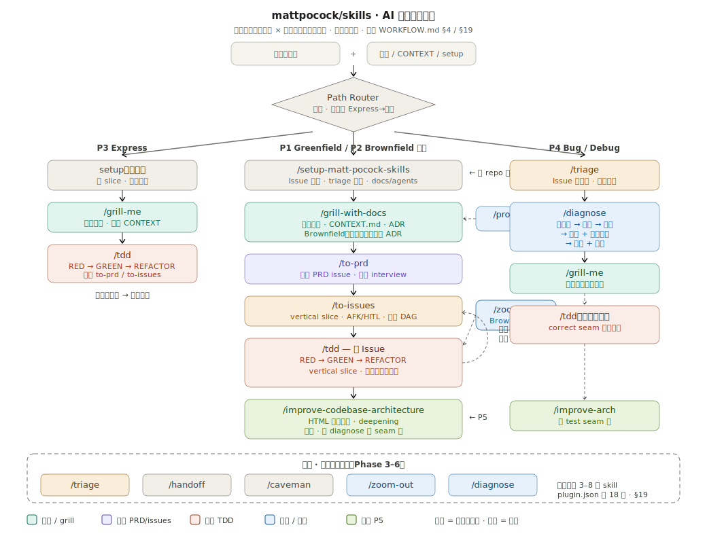
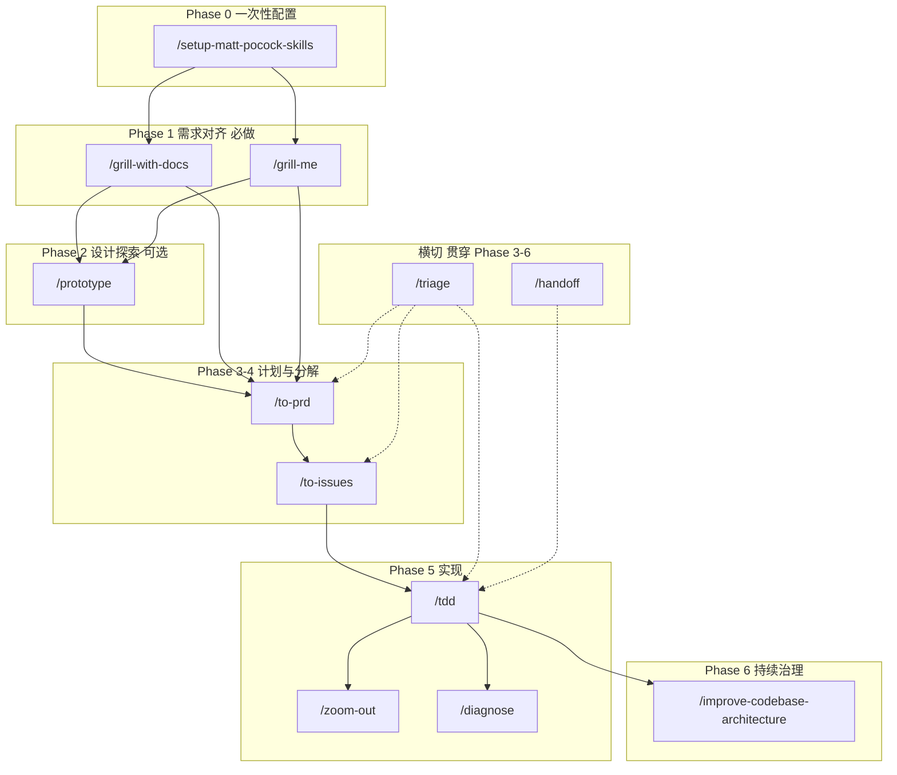
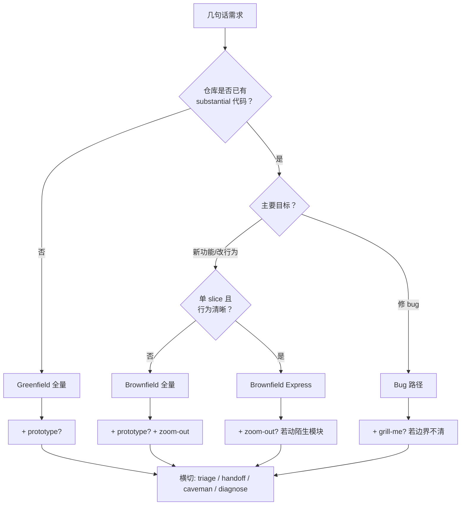
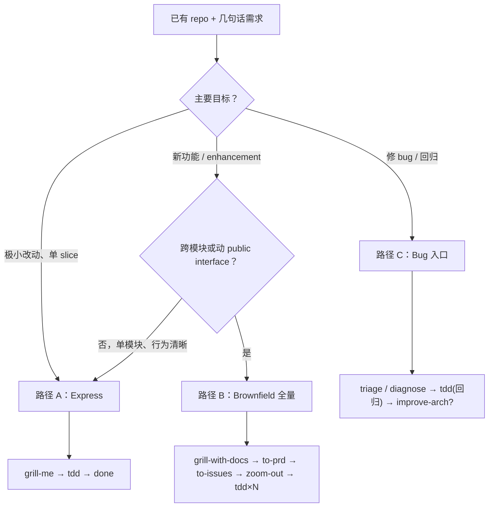
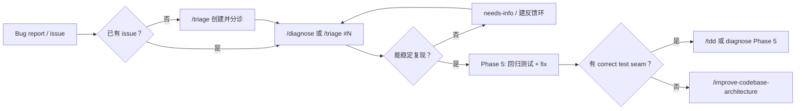

# Matt Pocock Skills 完整软件开发工作流

> 从「几句话的任务需求」到可交付软件的全流程指南。  
> 适用于：个人开发、团队 AI 辅助开发、以及**软件开发工作流平台**的产品设计参考。

---

## 1. 文档目的

本文档描述 Matt Pocock Skills 生态中，从模糊需求到可运行代码的**完整、正确、可重复**的工作流。

文档描述 **Matt Pocock Skills 主开发工作流**（从几句话需求到可交付功能），路径**不是固定两条**，而是由 **需求特征 × 当前仓库状态** 动态选路。

| 划分维度 | 含义 | 示例 |
|----------|------|------|
| **需求** | 任务类型、范围、是否 bug | 新功能 / 小改 / 修 bug / 纯重构 |
| **仓库状态** | 是否已有代码、文档、setup | Greenfield vs Brownfield；是否已有 `CONTEXT.md` |

常用路径目录见 [§4.1](#41-路径如何划定需求--仓库状态)；完整 Skill 覆盖见 [§4.3](#43-路径--skill-覆盖矩阵)（**完整版 [§19.1](#191-路径--skill-覆盖矩阵)**）。

| 路径（语境） | 适用场景 | 详见 |
|------|----------|------|
| **Greenfield 全量** | 从零或极薄代码库，扩展为完整功能 | [§13](#13-完整端到端示例-greenfield) |
| **Brownfield Express** | 已有 repo，单 slice、行为清晰 | [§14.3](#143-express-路径路径-a) |
| **Brownfield 全量** | 已有 repo，跨模块 / 动 interface | [§14](#14-brownfield--二次开发变体) |
| **Bug / Debug** | 报错、回归、性能问题 | [§14.5](#145-bug-入口路径-c) |
| **架构治理** | 定期或 diagnose 后 refactor | [§11](#11-phase-6持续架构治理) |
| **横切工具** | 任意阶段按需 | [§12](#12-横切能力) |

各路径共用 Phase 0–6 **骨架**与同一 **Skill 工具箱**；**没有任何一条路径会跑遍全部 Skill**（见 [§19](#19-路径--skill-覆盖矩阵-与-skill-全库分类)）。

如果你正在构建「软件开发工作流平台」，可以把路径选型建模为 **Path Router**（输入：需求 + 仓库快照 → 输出：`workflowTemplate`），详见 [PLATFORM-PRD.md §6.5](./PLATFORM-PRD.md#65-path-router需求--仓库状态)。

---

## 2. 核心理念

Matt Pocock Skills 解决四个经典失败模式：

| 失败模式 | 根因 | 对应 Skill |
|----------|------|------------|
| Agent 没做对你想要的 | 需求 misalignment | `/grill-me`、`/grill-with-docs` |
| Agent 太啰嗦、术语混乱 | 缺少共享语言 | `/grill-with-docs` → `CONTEXT.md` |
| 代码不工作 | 反馈环不足 | `/tdd`、`/diagnose` |
| 代码库变成泥球 | 架构 entropy 加速 | `/improve-codebase-architecture` |

设计原则：

- **小步、可组合**：每个 skill 只做一件事，可单独或串联使用
- **Vertical slice（垂直切片）**：每次交付端到端可验证的薄切片，禁止 horizontal slice（先写全部 API 再写全部 UI）
- **共享语言优先**：`CONTEXT.md` 是 glossary，不是 spec；ADR 只记录难逆转的架构决策
- **Issue tracker 是中枢**：PRD、slice issues、分诊状态都落在 issue tracker 上
- **决策主旨（Charter）优先，但不替代 grill**：可预见的决策由一份决策策略文件（Charter）预先回答，让 Agent 在 grill 中代答以减少人工；grill 仍负责挖掘「未知的未知」，高风险/难逆转决策仍强制人工确认（见 [§5.5](#55-phase-05决策主旨charter可选)）

---

## 3. 前置条件

### 3.1 安装 Skills

```bash
# 推荐：交互式安装
npx skills@latest add mattpocock/skills

# 全局安装（所有项目可用）
npx skills@latest add mattpocock/skills -g -y \
  -s diagnose grill-me grill-with-docs setup-matt-pocock-skills tdd to-issues to-prd triage prototype zoom-out improve-codebase-architecture \
  -a cursor

# 验证
npx skills@latest ls -g    # 全局
npx skills@latest ls       # 当前项目
```

安装位置：

| 范围 | 路径 | 生效条件 |
|------|------|----------|
| Global | `~/.agents/skills/<skill-name>/` | 任意工作区 |
| Project | `<repo>/.agents/skills/<skill-name>/` | 仅打开该 repo 时 |

### 3.2 核心 Engineering Skills（建议全装）

| Skill | 类型 | 说明 |
|-------|------|------|
| `setup-matt-pocock-skills` | 一次性配置 | 必须最先运行 |
| `grill-with-docs` | 需求对齐 | 正式项目首选 |
| `grill-me` | 需求对齐 | 小任务、不写文档 |
| `prototype` | 设计探索 | 可选 |
| `to-prd` | 文档化 | 合成 PRD |
| `to-issues` | 任务分解 | 拆 vertical slices |
| `triage` | Issue 管理 | 贯穿全程 |
| `tdd` | 实现 | 红-绿-重构 |
| `diagnose` | 调试 | 难 bug 按需 |
| `zoom-out` | 理解代码 | 按需，须手动触发 |
| `improve-codebase-architecture` | 架构治理 | 定期运行 |

### 3.3 Productivity / Misc（按需）

| Skill | 用途 |
|-------|------|
| `handoff` | Context 过长时，压缩成交接文档给新 session |
| `caveman` |  ultra-compressed 通信，省 token |
| `write-a-skill` | 编写新 skill |
| `git-guardrails-claude-code` | **仅 Claude Code**，阻止危险 git 命令 |

---

## 4. 工作流总览

> **Greenfield 全量路径**见 Phase 0–6 与 [§13](#13-完整端到端示例-greenfield)。**Brownfield** 见 [§14](#14-brownfield--二次开发变体)。**路径如何由需求 × 仓库状态选定**见 [§4.1–§4.4](#41-路径如何划定需求--仓库状态)。

**流程图（Path Router + Express / 全量 / Bug 三路径 + 横切）** — 与 [§4.1–§4.4](#41-路径如何划定需求--仓库状态)、[§19](#19-路径--skill-覆盖矩阵-与-skill-全库分类) 对齐：





### 阶段速查

| Phase | Skill | 必做？ | 产出 |
|-------|-------|--------|------|
| 0 | `/setup-matt-pocock-skills` | 每个 repo 一次 | `docs/agents/*.md`、`AGENTS.md`/`CLAUDE.md` 配置块 |
| 0.5 | 决策主旨（Charter） | 可选（无对应 skill，手写或半自动生成） | `docs/agents/charter.md`（优先/避免/可接受/约束）+ 应答模式设定 |
| 1 | `/grill-with-docs` 或 `/grill-me` | **必做** | 对齐的设计方向；`CONTEXT.md` + ADR（grill-with-docs） |
| 2 | `/prototype` | 可选 | 可丢弃的原型 + 决策结论 |
| 3 | `/to-prd` | 推荐 | PRD issue（`ready-for-agent`） |
| 4 | `/to-issues` | 推荐 | 多个 vertical slice issues |
| 5 | `/tdd` | 核心 | 功能代码 + 测试 |
| 5+ | `/zoom-out`、`/diagnose` | 按需 | 代码地图 / bug fix + regression test |
| 6 | `/improve-codebase-architecture` | 定期 | HTML 架构报告 + 重构方案 |
| 横切 | `/triage` | 按需 | Issue 状态流转 |
| 横切 | `/handoff` | 按需 | 临时目录中的交接文档 |

### 4.1 路径如何划定（需求 × 仓库状态）

路径由两类输入共同决定，**不是**启动时二选一、全程不变：

**A. 需求侧（用户几句话 + 任务类型）**

| 信号 | 倾向路径 |
|------|----------|
| 全新功能、范围大、多 user story | Greenfield 或 Brownfield **全量** |
| 小改、单模块、一个 session 可验证 | **Express** |
| 报错 / 崩溃 / 性能回归 / 已有 bug issue | **Bug（diagnose）** |
| 设计不确定（状态机、UI 方向） | 在选定主路径上加 **prototype** |
| 纯架构 refactor、无新功能 | **架构治理** 为主入口 |
| Context 过长、换 session | **handoff**（不改变主路径） |

**B. 仓库侧（当前文件与配置）**

| 信号 | 影响 |
|------|------|
| 无/极薄代码、`CONTEXT.md` 缺失 | **Greenfield**；grill 会**新建** glossary |
| 已有 substantial 代码 + ADR | **Brownfield**；grill **对齐**现有术语与 ADR |
| `docs/agents/` 未配置 | 必须先 **Setup**（或核对 setup） |
| 要动陌生模块 | Brownfield 下 **zoom-out 门禁**（§14.4） |
| 代码库已有可复用 seam / 测试 prior art | to-prd / tdd **优先现有 seam** |
| 无 correct test seam（diagnose 结论） | 移交 **improve-arch** |

**C. 路由决策（平台或人工）**



路径可在执行中**升级**（例如 Express 中发现要改 schema → 升级为 Brownfield 全量）。

### 4.2 完整路径目录

与 §13、§14 并列的**全部主路径**（不含 misc/personal 专项 skill）：

| ID | 路径名 | 典型 Skill 序列 | 平台 `workflowTemplate` |
|----|--------|-----------------|-------------------------|
| P0 | Setup（门禁） | `setup-matt-pocock-skills` | —（Project 级） |
| P1 | Greenfield 全量 | setup → grill-with-docs → [prototype] → to-prd → to-issues → tdd×N → [arch] | `greenfield_full` |
| P2 | Brownfield 全量 | setup → grill-with-docs → [prototype] → to-prd → to-issues → **zoom-out** → tdd×N → [arch] | `brownfield_full` |
| P3 | Express | setup → grill-me → tdd → done | `express` |
| P4 | Bug / Debug | [triage] → diagnose → [grill-me] → tdd(回归) → [improve-arch] | `debug` |
| P5 | 架构治理 | improve-codebase-architecture → [grilling 子循环] | `arch_review` |
| — | 横切 | triage / handoff / caveman / zoom-out / diagnose | `cross_cutting` |

> **不在上表的路径**：`write-a-skill`、misc/*、personal/*、deprecated/* — 见 [§4.4](#44-仓库内全部-skill-分类) 摘要；**完整 29 skill 清单见 [§19.2](#192-仓库-29-skill-分类主路径--专项--未推广)**。

### 4.3 路径 × Skill 覆盖矩阵（摘要）

> **完整矩阵（含 29 skill 全表）见 [§19.1](#191-路径--skill-覆盖矩阵)**。

图例：**●** 主路径必用　**○** 该路径下常用/按需　**—** 通常跳过　**⊘** 不属于此路径

| Skill | P1 Greenfield | P2 Brownfield 全量 | P3 Express | P4 Bug | P5 Arch | 横切 |
|-------|:---:|:---:|:---:|:---:|:---:|:---:|
| `setup-matt-pocock-skills` | ● | ○ 核对 | ○ 核对 | ○ | ○ | — |
| `grill-with-docs` | ● | ● | — | ○ | ○ | — |
| `grill-me` | ○ | — | ● | ○ | — | — |
| `prototype` | ○ | ○ | — | — | — | — |
| `to-prd` | ● | ● | — | — | — | — |
| `to-issues` | ● | ● | — | — | — | — |
| `tdd` | ● | ● | ● | ● 回归 | — | — |
| `zoom-out` | ○ | ● 门禁 | ○ | ○ | ○ | ○ |
| `diagnose` | ○ | ○ | — | ● | — | ○ |
| `triage` | ○ | ○ | — | ● | — | ● |
| `improve-codebase-architecture` | ○ 定期 | ○ | — | ○ 无 seam | ● | — |
| `handoff` | ○ | ○ | ○ | ○ | ○ | ● |
| `caveman` | ○ | ○ | ○ | ○ | ○ | ● |
| `write-a-skill` | ⊘ | ⊘ | ⊘ | ⊘ | ⊘ | ⊘ |

**结论：**

- 推广集（`plugin.json`）**18 个** skill（engineering×10 + productivity×4 + misc×4）中，**13 个**可能出现在上表主路径里；**`write-a-skill`**（meta）不在功能开发主路径中，另 4 个 misc **专项** skill 提供独立入口，不进入 Feature 流水线。
- **单条路径**通常只用 **3–8 个** skill，不会 18 个全跑。
- 仓库共 **29** 个 `SKILL.md`，主路径覆盖约 **13 个**；其余为 misc 专项 / meta / 个人 / 废弃（[§19.2](#192-仓库-29-skill-分类主路径--专项--未推广)）。

### 4.4 仓库内全部 Skill 分类（摘要）

> **完整 29 skill 分类表见 [§19.2](#192-仓库-29-skill-分类主路径--专项--未推广)**。

| 分类 | Skill | 是否纳入 §4.2 主路径 |
|------|-------|----------------------|
| **engineering（主路径）** | setup, grill-with-docs, prototype, to-prd, to-issues, tdd, triage, diagnose, zoom-out, improve-codebase-architecture | ✅ |
| **productivity（主路径/横切）** | grill-me, handoff, caveman | ✅ |
| **productivity（meta）** | write-a-skill | ❌ 扩展 skill 体系时用 |
| **misc（专项）** | setup-pre-commit, git-guardrails-claude-code, migrate-to-shoehorn, scaffold-exercises | ❌ 独立入口，不进主路径；✅ 在 plugin.json |
| **personal** | edit-article, obsidian-vault | ❌ 不推广 |
| **in-progress** | review, teach, writing-* | ❌ 草稿 |
| **deprecated** | qa, design-an-interface, request-refactor-plan, ubiquitous-language | ❌ 已废弃 |

---

## 5. Phase 0：一次性配置

### 触发

```
/setup-matt-pocock-skills
```

> `disable-model-invocation: true` — **必须手动输入**，Agent 不会自动触发。

### Agent 行为

1. **Explore**：检查 `git remote`、`AGENTS.md`/`CLAUDE.md`、`CONTEXT.md`、`docs/adr/`、`.scratch/`
2. **Ask（一次一个问题）**：
   - **A. Issue tracker**：GitHub / Linear / Local markdown / Other
   - **B. Triage labels**：五个 canonical role 的实际 label 字符串
   - **C. Domain docs**：single-context 或 multi-context（`CONTEXT-MAP.md`）
3. **Confirm**：展示 draft，让用户编辑
4. **Write**：写入配置

### 产出文件

```
AGENTS.md 或 CLAUDE.md
  └── ## Agent skills（issue tracker / triage labels / domain docs 摘要）

docs/agents/
  ├── issue-tracker.md
  ├── triage-labels.md
  └── domain.md
```

### Triage 五个 Canonical State Roles

| Role | 含义 |
|------|------|
| `needs-triage` | 维护者需要评估 |
| `needs-info` | 等待报告者补充信息 |
| `ready-for-agent` | 规格完整，AFK Agent 可独立执行 |
| `ready-for-human` | 需要人工实现（判断、设计、外部访问等） |
| `wontfix` | 不处理 |

Category roles：`bug` | `enhancement`

### 平台映射建议

- **节点类型**：`SetupGate`（每个 repo 一次）
- **阻塞关系**：未 setup 则 `to-prd`、`to-issues`、`triage`、`tdd` 等节点应提示用户先完成 setup
- **配置存储**：`docs/agents/*.md` 即平台的 per-repo 配置源

---

## 5.5 Phase 0.5：决策主旨（Charter，可选）

> **目的**：把「可提前定好的主观选择」固化成一份决策策略文件，让 Agent 在 grill 中**代替用户回答**可预见的问题，从而把人工时间压缩到「前置一次 + 几次里程碑确认」。  
> **关键纪律**：Charter **不替代 grill**；它只覆盖「已知决策空间」，grill 仍负责挖「未知的未知」。

### 5.5.1 它是什么 / 不是什么

| 是 | 不是 |
|----|------|
| 一份 Project（可 Feature override）级的**决策策略**，告诉 Agent「遇到这类选择，按什么原则答」 | 不是 PRD，不预先写功能规格 |
| 用「优先 / 避免 / 可接受 / 约束」四象限编码可预见的 trade-off | 不是 `CONTEXT.md`（glossary）的替代品 |
| 一份**活文档**：grill 浮现的新决策应回写进来 | 不是一次写死、永不更新的表单 |
| Agent 代答的**出处**，让答案可追溯（answer provenance） | 不是「跳过对齐、直接 to-prd」的借口 |

### 5.5.2 Charter 模板（建议格式）

```markdown
# 决策主旨（Charter）

## 优先（Prefer）
- 优先稳定性与可维护性高于上线速度
- 优先使用代码库已有的 seam / 库，而非引入新依赖

## 避免（Avoid）
- 避免引入新的一等公民概念，除非 grill 明确证明必要
- 避免破坏向后兼容的 public interface 变更

## 可接受（Acceptable）
- 可接受合理的性能折中以换取更简单的实现
- 可接受 happy-path 先行、edge case 后续 slice 补齐

## 约束（Constraints，硬性）
- 必须支持 X 浏览器 / Y 运行时
- 数据不得离开 Z 区域；不得引入 GPL 依赖

## 升级触发（Escalate，必须问人）
- 任何「难逆转 + 令人惊讶 + 有真实 trade-off」的决策（= ADR 判据）
- Charter 沉默或自相矛盾时
- 改动会越过约束边界时
```

### 5.5.3 三档应答模式（Auto-Answer Mode）

| 模式 | 行为 | 适用 |
|------|------|------|
| `off`（默认） | 每个 grill 问题都等人答（现状） | 高风险项目、Charter 尚不成熟 |
| `suggest` | Agent 按 Charter 给**推荐答案**，人一键确认/改 | 想保留把关又想提速 |
| `auto-with-escalation` | Agent 按 Charter **自动作答**，仅在低置信或命中升级触发时停下问人 | AFK；Charter 覆盖率已验证较高 |

**答案来源标注（provenance）**：每个被代答的 grill 决策都应标注来源 —— `human` / `charter_direct`（Charter 直接命中）/ `charter_inferred`（Agent 由 Charter 插值）/ `escalated`（升级给人）。`charter_inferred` 是最需要人工抽查的一类。

### 5.5.4 升级与风险闸门（硬纪律）

即使在 `auto-with-escalation` 下，下列决策**永远强制人工**，不得由 Charter 代答：

- 满足 **ADR 判据**（难逆转 + 无上下文会令人惊讶 + 存在真实 trade-off）的决策
- 越过 Charter「约束（Constraints）」边界的改动
- Agent 置信度低于阈值，或 Charter 沉默/自相矛盾

> **为什么**：Charter 最危险的失效模式是「自信地答错」—— Agent 从 Charter 插值出一个看似有据、实则错位的答案，从而剥夺人类发现 misalignment 的机会。**沉默地答错比不回答更糟**。风险闸门 + 里程碑演示确认 + Charter 反馈环三者缺一不可。

### 5.5.5 反馈环（Charter 是活文档）

grill / arch-review 过程中浮现、且具有普适性的决策，应在 session 结束时**回写进 Charter**（升级触发、新的优先/避免项），让下一个 Feature 的覆盖率更高。否则 Charter 会固化、过时。

### 5.5.6 平台映射建议

- **节点类型**：`CharterGate`（Project 级配置，类似 SetupGate，但**可选**）
- **与 grill 的关系**：Charter 作为 grill 节点的**自动应答策略层**，由 `autoAnswerMode` 控制；正交于 Path Router（任何 `workflowTemplate` 都可叠加）
- **度量**：Charter 覆盖率、升级精确率、**里程碑处被人发现的 misalignment 率**（详见 [PLATFORM-PRD.md §6.6](./PLATFORM-PRD.md#66-charter决策主旨--自动应答策略)）

---

## 6. Phase 1：需求对齐（必做）

### 6.1 选哪个 Skill？

| 场景 | 用 |
|------|-----|
| 正式功能、长期维护、需要共享语言 | `/grill-with-docs` |
| 小改动、一次性任务、不需要写文档 | `/grill-me` |
| 已有 `CONTEXT.md`，要对齐术语和 ADR | `/grill-with-docs` |

### 6.2 `/grill-with-docs`

**示例输入：**

```
/grill-with-docs

我想给平台加「用户登录」功能。
初步方案：邮箱+密码，JWT session，支持「记住我」30 天。
```

**Agent 行为：**

- **一次只问一个问题**，每题附带推荐答案
- 能查代码库/文档解决的问题，不问用户
- 对照 `CONTEXT.md` 挑战术语冲突
- 决策即时写入 `CONTEXT.md`（glossary only，无实现细节）
- 满足三条件时才提议 ADR：难逆转、无上下文会令人惊讶、存在真实 trade-off

**产出：**

- `CONTEXT.md`（术语表）
- `docs/adr/NNNN-*.md`（必要时）
- 口头/对话中的清晰设计方向

### 6.3 `/grill-me`

与 `grill-with-docs` 相同的 grilling 纪律，但**不写** `CONTEXT.md` 和 ADR。

**示例输入：**

```
/grill-me

我想做一个 CLI 工具，把 CSV 转成 JSON，支持自定义 delimiter。
```

### 6.4 人工决策点

- 每个问题的回答（是/否/选 A）
- 是否接受 Agent 推荐的 canonical term
- 是否创建 ADR

> **配合 Charter（[§5.5](#55-phase-05决策主旨charter可选)）**：若已设 Charter 且 `autoAnswerMode != off`，上述问题中**可预见的部分**由 Agent 按 Charter 代答（`suggest` 需人确认，`auto-with-escalation` 自动答）；命中升级触发（ADR 级、越界、低置信）的问题仍**强制人工**。无论哪种模式，里程碑 Gate 处仍需人工看演示确认，以兜住「自信地答错」。

### 6.5 平台映射建议

- **节点类型**：`HumanInTheLoopGate`（必须等人回答）
- **退出条件**：决策树所有分支已 resolve
- **输出校验**：`CONTEXT.md` diff 或 grilling 完成标记

---

## 7. Phase 2：设计原型（可选）

### 何时使用

- 状态机/业务逻辑在纸上想不清楚
- UI 方向有多个 radically different 选项
- 需要在 commit 到正式设计前「玩一下」

### 何时跳过

- Phase 1 已足够清晰
- 改动小、模式已在代码库中有先例

### 触发

```
/prototype

我想验证登录流程的状态机：未登录 → 输入中 → 验证中 → 成功/失败/锁定。
做一个可交互的终端原型。
```

或 UI 方向：

```
/prototype

做 3 种截然不同的登录页 UI，同一路由用 URL 参数切换。
```

### 两个分支

| 问题 | 分支 | 产出 |
|------|------|------|
| 逻辑/状态模型对不对？ | LOGIC | 终端交互原型 |
| 应该长什么样？ | UI | 多 variation 单路由 UI |

### 规则

- 明确标记为 throwaway
- 一条命令可运行
- 默认无持久化
- 无测试、无过度抽象
- **完成后删除或吸收决策**，结论写入 ADR/issue/NOTES

### 平台映射建议

- **节点类型**：`OptionalBranch`
- **输入**：Phase 1 的设计方向
- **输出**：prototype verdict（问题 + 答案），不是 prototype 代码本身

---

## 8. Phase 3：文档化计划

### 触发

Grill 完成后，**同一会话或引用前序上下文**：

```
/to-prd

根据我们刚才关于用户登录的讨论，生成 PRD 并发布到 issue tracker。
```

### 重要约束

- **不会再 interview 你** — 只 synthesize 已有上下文
- 因此 **Phase 1 必须做充分**，否则 PRD 会有缺口
- 依赖 Phase 0 的 issue tracker 配置

### Agent 流程

1. Explore 代码库（若尚未）
2. Sketch **测试 seams**（优先现有 seam，尽量高层）
3. 与用户确认 seams
4. 按模板写 PRD
5. 发布到 issue tracker，打 `ready-for-agent` label

### PRD 模板结构

```markdown
## Problem Statement
## Solution
## User Stories          ← 详尽编号列表
## Implementation Decisions
## Testing Decisions
## Out of Scope
## Further Notes
```

### 产出

- Issue tracker 上的一条 **PRD issue**（label: `ready-for-agent`）

### 平台映射建议

- **节点类型**：`DocumentGenerator`
- **前置**：GrillingComplete + SetupDone
- **输出 artifact**：PRD issue URL/ID

---

## 9. Phase 4：任务分解

### 触发

```
/to-issues

把 PRD issue #42 拆成 vertical slice issues。
每个 slice 端到端可验证，优先 AFK。
```

### Vertical Slice 规则

**正确（vertical）：**

```
Slice 1: 邮箱格式校验 → API → UI 错误提示 → 测试
Slice 2: 密码校验 + JWT 签发 → cookie → 测试
```

**错误（horizontal）：**

```
Issue 1: 写所有 database schema
Issue 2: 写所有 API endpoints
Issue 3: 写所有 UI components
Issue 4: 写所有 tests
```

### Slice 类型

| 类型 | 含义 |
|------|------|
| **AFK** | Agent 可独立完成，无需人工 |
| **HITL** | 需架构决策、设计评审等人工介入 |

优先 AFK；HITL 应尽量少。

### Agent 流程

1. Gather context（PRD issue 或对话）
2. Explore 代码库（可选）
3. Draft vertical slices
4. **Quiz the user**（粒度、依赖、AFK/HITL 标记）— 迭代直到批准
5. 按依赖顺序 publish issues（blockers 先），打 `ready-for-agent`

### 每个 Issue 模板

```markdown
## Parent
## What to build
## Acceptance criteria
## Blocked by
```

### 产出

- N 个 **slice issues**，每个可独立 grab

### 平台映射建议

- **节点类型**：`TaskDecomposer` + `HumanApprovalGate`
- **输出**：Issue DAG（依赖图）
- **调度**：平台应按 `Blocked by` 拓扑排序执行 `/tdd`

---

## 10. Phase 5：实现

### 10.1 主路径：`/tdd`

**每个 slice issue 单独开 session（或明确指定 issue）：**

```
/tdd

实现 issue #44：用户可以用邮箱和密码登录，成功后跳转到 dashboard。
用 red-green-refactor，一次只做一个 vertical slice。
```

### TDD 哲学

- 测试 public interface 的 **behavior**，不是 implementation
- **禁止 horizontal TDD**（先写全部测试再写全部代码）
- **正确**：`RED test1 → GREEN impl1 → RED test2 → GREEN impl2 → ... → REFACTOR`

### TDD 流程

1. **Planning**：确认 interface、优先测试的行为、deep module 机会 → 用户批准
2. **Tracer bullet**：一个测试 → 最小实现 → 通过
3. **Incremental loop**：一个测试一个实现
4. **Refactor**：全部 GREEN 后再重构；**RED 时绝不 refactor**

### 人工决策点

- 公共 interface 长什么样
- 哪些 behavior 优先测
- Planning 批准

### 10.2 按需：`/zoom-out`

```
/zoom-out
```

> `disable-model-invocation: true` — 须手动触发。

Agent 会升一层抽象，用 domain glossary 给出模块/调用者地图。

**何时用：** 不熟悉某块代码、迷失在细节里。

### 10.3 按需：`/diagnose`

```
/diagnose

登录 API 返回 500，只在密码含 @ 时复现。
```

**六阶段：**

1. **Build feedback loop**（最关键 — 没有 loop 不继续）
2. Reproduce
3. Hypothesise（3–5 个可 falsify 假设，展示给用户）
4. Instrument（一次改一个变量）
5. Fix + regression test
6. Cleanup + post-mortem（必要时 hand off 到 `/improve-codebase-architecture`）

### 平台映射建议

- **主节点**：`TDDExecutor`（per slice issue）
- **子节点**：`ZoomOut`（on-demand）、`Diagnose`（on-demand）
- **循环**：每个 slice 重复 Phase 5 直到 PRD 所有 acceptance criteria 满足
- **状态回写**：完成后更新 issue（close 或移 label）

---

## 11. Phase 6：持续架构治理

### 触发

README 建议 **每隔几天** 运行一次；或在 `/diagnose` 发现「没有 correct test seam」后。

```
/improve-codebase-architecture

扫描 auth 模块附近的架构，找 deepening opportunities。
```

### 流程

1. **Explore**：读 `CONTEXT.md`、ADR，探索代码库 friction
2. **Present**：生成 **HTML 报告** 到 OS 临时目录（`$TMPDIR/architecture-review-<timestamp>.html`），用 Tailwind + Mermaid，每 candidate 一张 card（Problem / Solution / Benefits / Before-After 图 / 推荐强度 badge）
3. **Grilling loop**：用户选一个 candidate 后深入讨论；必要时更新 `CONTEXT.md`、提议 ADR

### 产出

- 临时目录中的 **HTML 架构报告**（不写入 repo）
- 可选：`CONTEXT.md` 更新、新 ADR、实际重构

### 平台映射建议

- **节点类型**：`ScheduledReview`（cron 或 manual trigger）
- **输出**：HTML report path + selected candidate grilling session

---

## 12. 横切能力

### 12.1 `/triage` — Issue 管理（贯穿 Phase 3–6）

**不是收尾阶段**，而是全程工具：

| 时机 | 示例 |
|------|------|
| 收到新 bug/功能请求 | `/triage 看看有什么需要我处理的` |
| PRD/slice 发布前 | 确认 label 和 agent brief |
| 实现中 | 更新 issue 状态 |
| Bug report | `/triage 看看 #87` |

**State 流转：**

```
unlabeled → needs-triage → needs-info | ready-for-agent | ready-for-human | wontfix
needs-info → (reporter replies) → needs-triage
```

**Bug triage 额外步骤：** 先 reproduce，再决定是否 grill。

**所有 triage 评论必须以 disclaimer 开头：**

```markdown
> *This was generated by AI during triage.*
```

### 12.2 `/handoff` — Session 交接

Context 太长、需新 session 继续：

```
/handoff 下一个 session 继续实现 issue #45 的 TDD
```

产出：OS 临时目录中的 handoff 文档，含 suggested skills，引用 PRD/issue/ADR 路径而非重复内容。

### 12.3 `/caveman` — 省 Token

```
/caveman
```

激活 ultra-compressed 通信模式；说 `stop caveman` 或 `normal mode` 关闭。

---

## 13. 完整端到端示例（Greenfield）

> 本节为 **Greenfield（从零/新功能）** 全量路径示例。若仓库已有代码与文档，见 [§14 Brownfield / 二次开发变体](#14-brownfield--二次开发变体)。

**起点：** 几句话需求（空或极薄代码库）

> 「我想做一个任务看板，支持拖拽改状态，要有权限控制。」

### Step 0（仅一次）

```
/setup-matt-pocock-skills
```

→ 配置 GitHub Issues、triage labels、`CONTEXT.md` 布局

### Step 1

```
/grill-with-docs

我想做一个任务看板：Kanban 三列（Todo / In Progress / Done），
卡片可拖拽改状态，Admin 能看全部，Member 只能看自己的任务。
```

→ 回答 15–30 个问题  
→ 产出 `CONTEXT.md`（Board、Card、Lane、Member 等术语）+ 可能 1–2 个 ADR

### Step 2（可选）

```
/prototype

验证拖拽后 Card 状态变更 + 权限过滤的状态机。
```

→ 终端原型 → 确认「Member 拖拽他人 Card」应拒绝  
→ 删除原型，结论记入对话

### Step 3

```
/to-prd

根据 Kanban 看板的 grilling 讨论生成 PRD。
```

→ Issue #100（PRD，`ready-for-agent`）

### Step 4

```
/to-issues

把 PRD #100 拆成 vertical slices。
```

→ 批准 breakdown 后：

| Issue | Slice | Type |
|-------|-------|------|
| #101 | 创建 Board + 默认三 Lane（无拖拽） | AFK |
| #102 | 创建 Card + 列表展示 | AFK |
| #103 | 拖拽改 Lane（happy path） | AFK |
| #104 | 权限：Member 只看自己的 Card | AFK |
| #105 | Admin 视图 + 权限边界 HITL 确认 | HITL |

### Step 5（每个 issue 一轮）

```
/tdd

实现 issue #101：用户可以创建 Board，默认有三个 Lane。
```

…完成后 #102、#103、#104 …

中途若卡住：

```
/diagnose

拖拽后 Card 偶尔回到原 Lane，无法稳定复现。
```

```
/zoom-out

我不熟悉 permissions 模块，给我一张调用关系图。
```

### Step 6（定期）

```
/improve-codebase-architecture
```

→ 打开 `/tmp/architecture-review-*.html`，选 candidate，grilling 后重构

### 横切

```
/triage 有什么 ready-for-agent 的 issues？

/handoff 下一个 session 从 issue #103 继续 TDD
```

---

## 14. Brownfield / 二次开发变体

> **Brownfield** = 仓库里已有代码、`CONTEXT.md`/ADR、测试与运行方式，你只有**几句话增量需求**（新功能、改行为、修 bug）。  
> 与 Greenfield 共用 Phase 0–6 与同一套 Skill，但**更短、更贴现有系统**；Grill 要对齐代码与 ADR，动现有模块前常须 **zoom-out**。

### 14.1 与 Greenfield 的关系

| 维度 | Greenfield（§13） | Brownfield（本节） |
|------|-------------------|-------------------|
| 代码库 | 空或极薄 | 已有模块、接口、测试 |
| `CONTEXT.md` / ADR | 通常**新建** | 通常**增量更新**，须 respect 已有 ADR |
| Phase 0 Setup | 必做 | 已有 `docs/agents/` 则**核对**即可 |
| Phase 1 | 问「要什么」 | 问「怎么接现有系统」+ **对照代码挑矛盾** |
| Phase 2 Prototype | 较常用 | 多数**可跳过**（沿用现有 UI/状态模式） |
| Phase 3–4 | 大 PRD、多 slice | 短 PRD、少 slice，或小改走 **Express** |
| Phase 5 | TDD 从零建 seam | **优先现有 seam**；非绿场先 **zoom-out** |
| Phase 6 | 项目后期定期 | 改核心模块后**更常**触发 |
| 典型入口 | 新功能一句话 | enhancement / 小补丁 / **bug report** |

**骨架不变**；变的是**跳过哪些阶段、强调哪些 Skill**。

### 14.2 三条 Brownfield 路径

与 Greenfield 全量路径**并列**，按需求类型三选一：



| 路径 | 何时用 | Phase 序列 | 平台模板 |
|------|--------|------------|----------|
| **A · Express** | 单模块、一个 TDD session 可端到端验证 | `grill-me` → `tdd` | `workflowTemplate: express` |
| **B · Brownfield 全量** | 跨模块、术语/权限/架构、多个 slice | `grill-with-docs` → [`prototype`] → `to-prd` → `to-issues` → **`zoom-out`** → `tdd×N` | `full`（短 PRD/少 slice） |
| **C · Bug** | 报错、崩溃、性能回归、已有 issue | `triage` / **`diagnose`** → [`grill-me` 若 repro 不清] → `tdd`(回归) → [`improve-arch` 若缺 seam] | `taskType: debug` |

**三问快速选型：**

1. 会不会动已有 module 的 **public interface**？→ 是则几乎必 **路径 B** + zoom-out  
2. 能否**一个 TDD session** 内端到端验证？→ 能则 **路径 A**  
3. 主要是 **bug** 而非新功能？→ **路径 C**

### 14.3 Express 路径（路径 A）

**适用：** 改文案、加字段、单 API 小行为、配置开关等——行为清晰、不碰架构、不跨模块。

**Gate：**

| Gate | 条件 |
|------|------|
| `CanExpressGrill` | Setup complete（或已核对 `docs/agents/`） |
| `CanExpressTdd` | `grillingStatus == complete` 且用户确认**单 slice 范围** |

**示例：**

```
/grill-me

在现有 UserSettings 页面加一个「邮件通知开关」，默认开，写入已有 preferences API。

/tdd

用 TDD 实现：toggle 持久化到现有 preferences 接口，补一条 integration test。
```

**故意跳过：** `/to-prd`、`/to-issues`、`/prototype`。若 grill 中发现要动 schema 或多模块，**升级到路径 B**。

### 14.4 zoom-out 门禁（Brownfield 全量 / 路径 B）

`zoom-out` 带 `disable-model-invocation: true`，须**手动** `/zoom-out`。在 Brownfield 中，它是**动现有代码前的硬纪律**，不是可选装饰。

**何时必须 zoom-out（门禁）：**

| 条件 | 动作 |
|------|------|
| 首次修改**不熟悉**的现有模块（Layer 3–4 业务模块） | TDD 前运行 `/zoom-out` |
| `to-issues` 的 slice 会**穿过**多个已有 package / 服务 | 每个「新模块簇」第一次动刀前 zoom-out |
| Grill 发现术语与代码不一致，尚未读清调用链 | zoom-out 再 grill 或 tdd |

**何时可跳过：**

- 只改变量名、注释、同文件内私有函数（不动 public interface）
- 刚在同一 session 内对**同一区域**做过 zoom-out
- Express 路径且改动局限在**已完全理解**的单文件

**示例：**

```
/zoom-out

我要改 auth 模块加「记住我」。先给我 auth 相关模块和调用者的地图，用 CONTEXT.md 里的术语。
```

**然后再：**

```
/tdd

实现 issue #44：登录成功且勾选 remember-me 时延长 session。
```

> **平台实现参考：** 非绿场在首个 Layer 3–4 模块序列前插入 `stage_zoom_out`（见 [SKILLS-MAPPING.md](./SKILLS-MAPPING.md) Rule 20-G）。WORKFLOW 层面对用户即：**Brownfield + 动现有模块 ⇒ 先 zoom-out 再 tdd**。

### 14.5 Bug 入口（路径 C）

Bug 工作流**不必**从 grill-with-docs 开始；入口是 **triage** 或 **diagnose**。



**阶段要点（对齐 `diagnose` skill）：**

1. **先建反馈环** — 没有 pass/fail 信号不进入猜原因  
2. **Reproduce → Minimise** — 最短可复现路径  
3. **Hypothesise** — 3–5 条可证伪假设，展示后再测  
4. **Fix + regression test** — 仅在有 **correct seam** 时先写失败测试  
5. **Cleanup** — 清 `[DEBUG-…]` 日志；commit 写明哪条假设成立  
6. **无 seam** — 把「无法写回归测试」记为架构发现，fix 后再 `/improve-codebase-architecture`

**示例：**

```
/triage

用户报告 #87：导出 CSV 时中文乱码，仅 Windows 复现。

/diagnose

issue #87：先建可自动化反馈环，再最小化复现，不要直接改 iconv。
```

Grill 仅当 **repro 信息不足** 或 **fix 会改变产品行为边界** 时插入：

```
/grill-me

修复乱码时，CSV 编码应默认 UTF-8 BOM 还是跟随系统 locale？只问这一支。
```

### 14.6 Brownfield 全量示例（路径 B）

**起点：** 已有电商 repo + `CONTEXT.md`（Order、Cart、Checkout 等术语）+ 若干 ADR

> 「在现有结账流程里加 Apple Pay，不动信用卡路径。」

**Step 0（核对，非重做）**

- 确认 `docs/agents/issue-tracker.md` 指向 GitHub  
- 确认 triage label 映射与 repo 一致  

**Step 1**

```
/grill-with-docs

在现有 Checkout 流程增加 Apple Pay。信用卡 flow 不变。
请先对照 CONTEXT.md 和 checkout 相关 ADR，stress-test 这个方案。
```

→ 对齐 PaymentMethod seam；更新 `CONTEXT.md` 中 **WalletPayment** 术语；必要时 ADR「Apple Pay 与现有 PaymentIntent 共用 adapter」

**Step 2** — 跳过 prototype（Stripe 集成模式 repo 内已有）

**Step 3–4**

```
/to-prd

根据 Apple Pay grilling 生成 PRD，强调现有 seams 与 Testing Decisions 中的 prior art。

/to-issues

PRD #210 拆成 vertical slices，优先 AFK。
```

→ 可能仅 3 个 slice：#211 后端 intent + webhook、#212 结账 UI 按钮、#213 E2E happy path

**Step 5**

```
/zoom-out

动 checkout 和 payments 前，先给模块地图。

/tdd

实现 issue #211：…
```

**Step 6（若 diagnose 发现 payment 模块缺 test seam）**

```
/improve-codebase-architecture

聚焦 checkout/payments 的 deepening opportunities。
```

### 14.7 Phase 级 Brownfield 差异速查

| Phase | Greenfield | Brownfield |
|-------|------------|------------|
| 0 Setup | 必跑 | 核对已有配置 |
| 1 Grill | 建语言 | **对齐**语言 + **Cross-reference code** |
| 2 Prototype | 常用 | 少；UI 优先挂**现有页面** variant |
| 3 to-prd | 大而全 | 强调 **Implementation Decisions / 改哪些 module**；**prefer existing seams** |
| 4 to-issues | 多 slice | 少 slice；respect ADR |
| 5 | tdd | **zoom-out 门禁** + tdd；prior art 测试 |
| 6 | 定期 | 改核心路径后建议跑 |
| 横切 triage | 新 feature 后 | **Bug 主入口** + 全程 |

### 14.8 Brownfield 常见误区

| 误区 | 正确做法 |
|------|----------|
| 二次开发跳过 grill 直接改代码 | 至少 `grill-me`；跨模块必 `grill-with-docs` |
| 不读 ADR 就 to-prd / to-issues | 必须 respect 已有 ADR；冲突须显式 reopen |
| 动陌生模块不 zoom-out | Brownfield 全量路径：**先地图再 TDD** |
| 把 `CONTEXT.md` 写成新功能 spec | 仍只是 glossary；增量更新术语 |
| Bug 直接改代码不写回归测试 | 走 diagnose；无 seam 则记架构问题 |
| Express 路径做到一半发现要改 schema | 升级到路径 B，补 grill-with-docs + to-issues |

---

## 15. 工作流平台设计参考

> **完整平台 PRD** 见 **[PLATFORM-PRD.md](./PLATFORM-PRD.md)**（含 User Stories、数据模型、API、UI 规格、MVP 里程碑与验收标准）。  
> 本节为 WORKFLOW 文档内的摘要。Brownfield 路径对应 PRD 中的 `workflowTemplate: full` 与 `express`，Bug 路径对应 `taskType: debug`。

若你要把此流程产品化，建议的数据模型：

### 15.1 实体

```
Project
  ├── setupConfig (issueTracker, triageLabels, domainLayout)
  ├── charter? (prefer/avoid/acceptable/constraints/escalate, autoAnswerMode)
  ├── contextMd
  ├── adrs[]
  └── features[]
        ├── charterOverride?           (Feature 级覆盖 + autoAnswerMode)
        ├── grillingSession            (每个答案带 provenance: human|charter_direct|charter_inferred|escalated)
        ├── prototypeVerdict?
        ├── prdIssue
        ├── sliceIssues[] (DAG)
        └── implementationRuns[] (tdd sessions)

Issue
  ├── categoryRole: bug | enhancement
  ├── stateRole: needs-triage | needs-info | ready-for-agent | ready-for-human | wontfix
  ├── parentIssue?
  ├── blockedBy[]
  └── acceptanceCriteria[]
```

### 15.2 阶段 gates

| Gate | 条件 |
|------|------|
| CanGrill | setupComplete |
| CanAutoAnswerGrill | charterExists && autoAnswerMode != off（见 [§5.5](#55-phase-05决策主旨charter可选)、[PLATFORM-PRD §6.6](./PLATFORM-PRD.md#66-charter决策主旨--自动应答策略)） |
| MustEscalateToHuman | 命中 ADR 判据 \|\| 越过 Charter 约束 \|\| 置信度 < 阈值（反向闸门，禁止代答） |
| CanToPrd | grillingComplete |
| CanToIssues | prdPublished |
| CanTdd | sliceIssue.stateRole == ready-for-agent && blockersClosed |
| CanExpressTdd | setupComplete && grillingComplete && 用户确认单 slice（见 [§14.3](#143-express-路径路径-a)） |
| CanZoomOutBeforeTdd | Brownfield && 首次动目标模块簇 && 用户未在本 session zoom-out（见 [§14.4](#144-zoom-out-门禁brownfield-全量--路径-b)） |
| CanArchReview | anyTime（建议 periodic） |

### 15.3 Skill 触发方式

| 触发 | Skills |
|------|--------|
| 手动 only | `setup-matt-pocock-skills`, `zoom-out` |
| 手动 + 自然语言 | 其余大部分 |
| 平台按钮 | 映射为 `/skill-name` + 参数模板 |

### 15.4 推荐 UI 流程

按 Path Router 模板分支（平台见 [PLATFORM-PRD §6.5](./PLATFORM-PRD.md#65-path-router需求--仓库状态)）：

| 模板 | UI 主链 |
|------|---------|
| greenfield_full / brownfield_full | Path Router → Grill → [Prototype] → PRD → Slice DAG → TDD → [Arch] |
| express | Path Router → grill-me → TDD |
| debug | Path Router → Diagnose → TDD(回归) |
| arch_review | Path Router → Arch Report Viewer |

---

## 16. 决策树

### 16.0 路径选型（需求 × 仓库状态）

完整规则、路径目录与 Skill 矩阵见 **[§4.1–§4.4](#41-路径如何划定需求--仓库状态)**。以下为摘要：

```
输入：几句话需求 + 当前 repo（代码/CONTEXT/setup/issue）
        │
        ├─ 主要是 bug？ ──────────────────→ 路径 P4：triage / diagnose
        ├─ 纯 refactor / 架构治理？ ───────→ 路径 P5：improve-arch
        ├─ 无 substantial 代码？ ───────────→ 路径 P1：Greenfield 全量
        └─ 已有代码
              ├─ 单 slice、行为清晰？ ────→ 路径 P3：Express
              └─ 否则 ────────────────────→ 路径 P2：Brownfield 全量 + zoom-out 门禁

横切（任意路径）：triage / handoff / caveman / zoom-out / diagnose
运行时升级：Express 发现跨模块 → Brownfield 全量
```

### 16.1 Phase 1 选 skill

```
需要写 CONTEXT.md / ADR？
  ├─ 是 → /grill-with-docs
  └─ 否 → /grill-me
```

### 16.2 是否 prototype

```
设计方向是否仍不确定？
  ├─ 是 → /prototype
  └─ 否 → 跳过，直接 /to-prd
```

### 16.3 是否 to-issues

```
工作是否 > 1 个 TDD session？
  ├─ 是 → /to-issues
  └─ 否 → 直接 /tdd（小改动可跳过 PRD/issues）
```

### 16.4 实现中遇到问题

```
看不懂代码结构？ → /zoom-out
难 bug / 性能问题？ → /diagnose
Context 太长？ → /handoff
```

---

## 17. 常见误区

| 误区 | 正确做法 |
|------|----------|
| 跳过 grill 直接 `/to-prd` | PRD 会缺决策；to-prd 不会再问你 |
| 用 horizontal slice 拆 issue | 必须 vertical slice |
| 一次 `/tdd` 做整个 PRD | 每个 slice issue 单独 TDD |
| 把 triage 放在最后 | triage 贯穿 issue 生命周期 |
| 把 `CONTEXT.md` 当 spec 写实现细节 | 它只是 glossary |
| 每个决策都写 ADR | 仅难逆转 + 令人惊讶 + 有 trade-off 的决策 |
| prototype 不删除 | 验证完必须 delete 或 absorb |
| RED 时 refactor | 先 GREEN 再 refactor |
| 在 skills-main 里 setup，却在别的 repo 开发 | setup 必须在**实际开发项目**里做 |
| 用 Charter 关掉 grill（让 Agent 全自动代答所有问题） | Charter 只覆盖可预见决策；grill 仍须挖未知的未知，ADR 级/越界/低置信决策强制升级（见 [§5.5.4](#554-升级与风险闸门硬纪律)） |
| Charter 一次写死、永不更新 | Charter 是活文档；grill 浮现的普适决策应回写（[§5.5.5](#555-反馈环charter-是活文档)） |
| 信任 `charter_inferred`（插值）答案不抽查 | 插值类代答最易「自信地答错」，里程碑处必须人工确认 |

Brownfield 专属误区见 [§14.8](#148-brownfield-常见误区)。

---

## 18. 技能速查表

| Skill | 命令示例 | 输入 | 输出 |
|-------|----------|------|------|
| setup | `/setup-matt-pocock-skills` | repo 上下文 | `docs/agents/*` |
| grill-with-docs | `/grill-with-docs\n\n我想做 X…` | 几句话 + 初步方案 | CONTEXT.md, ADR, 对齐 |
| grill-me | `/grill-me\n\n我想做 X…` | 同上 | 对齐（无文档） |
| prototype | `/prototype\n\n验证状态机…` | 待验证的问题 | 可丢弃原型 + verdict |
| to-prd | `/to-prd` | 前序 grilling 上下文 | PRD issue |
| to-issues | `/to-issues\n\nPRD #42` | PRD/plan | slice issues DAG |
| triage | `/triage\n\n看看 #42` | issue ref | 状态流转 + brief |
| tdd | `/tdd\n\n实现 issue #44` | slice issue | 代码 + 测试 |
| zoom-out | `/zoom-out` | 当前代码区域 | 模块地图 |
| diagnose | `/diagnose\n\n500 when…` | bug 描述 | fix + regression test |
| improve-arch | `/improve-codebase-architecture` | 可选 scope | HTML 报告 |
| handoff | `/handoff 继续 #45` | next focus | 临时 handoff 文档 |
| caveman | `/caveman` | — | 压缩通信模式 |

**Brownfield 路径速记：** Express = `grill-me` → `tdd`；全量 = `grill-with-docs` → … → **`zoom-out`** → `tdd`；Bug = `triage`/`diagnose` → `tdd`(回归)。

---

## 19. 路径 × Skill 覆盖矩阵 与 Skill 全库分类

> 本节是 [§4.3–§4.4](#43-路径--skill-覆盖矩阵) 的**完整版**，供 Path Router UI、平台按钮过滤与实现对照。  
> 路径 ID 与 [§4.2](#42-完整路径目录) 一致：P0 Setup · P1 Greenfield · P2 Brownfield 全量 · P3 Express · P4 Bug · P5 Arch · 横切。

### 19.1 路径 × Skill 覆盖矩阵

**图例**

| 符号 | 含义 |
|------|------|
| **●** | 该路径主流程必用（或 Brownfield 下 zoom-out 门禁级） |
| **○** | 该路径下常用 / 按需 / 核对即可 |
| **—** | 该路径通常跳过 |
| **⊘** | 不属于功能开发主路径（专项 / meta / 未推广） |
| **独** | 不纳入 §4.2 主路径，仅独立入口使用 |

**A. 主路径 Skill（`plugin.json` 推广集，18 个：engineering×10 + productivity×4 + misc×4）**

| Skill | P0 | P1 | P2 | P3 | P4 | P5 | 横切 |
|-------|:--:|:--:|:--:|:--:|:--:|:--:|:--:|
| `setup-matt-pocock-skills` | ● | ○ | ○ | ○ | ○ | ○ | — |
| `grill-with-docs` | — | ● | ● | — | ○ | ○ | — |
| `grill-me` | — | ○ | — | ● | ○ | — | — |
| `prototype` | — | ○ | ○ | — | — | — | — |
| `to-prd` | — | ● | ● | — | — | — | — |
| `to-issues` | — | ● | ● | — | — | — | — |
| `tdd` | — | ● | ● | ● | ● | — | — |
| `zoom-out` | — | ○ | ● | ○ | ○ | ○ | ○ |
| `diagnose` | — | ○ | ○ | — | ● | — | ○ |
| `triage` | — | ○ | ○ | — | ● | — | ● |
| `improve-codebase-architecture` | — | ○ | ○ | — | ○ | ● | — |
| `handoff` | — | ○ | ○ | ○ | ○ | ○ | ● |
| `caveman` | — | ○ | ○ | ○ | ○ | ○ | ● |
| `write-a-skill` | ⊘ | ⊘ | ⊘ | ⊘ | ⊘ | ⊘ | ⊘ |
| `setup-pre-commit` | 独 | 独 | 独 | 独 | 独 | 独 | 独 |
| `git-guardrails-claude-code` | 独 | 独 | 独 | 独 | 独 | 独 | 独 |
| `migrate-to-shoehorn` | 独 | 独 | 独 | 独 | 独 | 独 | 独 |
| `scaffold-exercises` | 独 | 独 | 独 | 独 | 独 | 独 | 独 |

**B. 全库 29 Skill（含未推广）**

| Skill | 分类 | plugin | P0 | P1 | P2 | P3 | P4 | P5 | 横切 |
|-------|------|:------:|:--:|:--:|:--:|:--:|:--:|:--:|:--:|
| `setup-matt-pocock-skills` | 主路径 | ✅ | ● | ○ | ○ | ○ | ○ | ○ | — |
| `grill-with-docs` | 主路径 | ✅ | — | ● | ● | — | ○ | ○ | — |
| `grill-me` | 主路径 | ✅ | — | ○ | — | ● | ○ | — | — |
| `prototype` | 主路径 | ✅ | — | ○ | ○ | — | — | — | — |
| `to-prd` | 主路径 | ✅ | — | ● | ● | — | — | — | — |
| `to-issues` | 主路径 | ✅ | — | ● | ● | — | — | — | — |
| `tdd` | 主路径 | ✅ | — | ● | ● | ● | ● | — | — |
| `zoom-out` | 主路径 | ✅ | — | ○ | ● | ○ | ○ | ○ | ○ |
| `diagnose` | 主路径 | ✅ | — | ○ | ○ | — | ● | — | ○ |
| `triage` | 主路径 | ✅ | — | ○ | ○ | — | ● | — | ● |
| `improve-codebase-architecture` | 主路径 | ✅ | — | ○ | ○ | — | ○ | ● | — |
| `handoff` | 主路径 | ✅ | — | ○ | ○ | ○ | ○ | ○ | ● |
| `caveman` | 主路径 | ✅ | — | ○ | ○ | ○ | ○ | ○ | ● |
| `write-a-skill` | meta | ✅ | ⊘ | ⊘ | ⊘ | ⊘ | ⊘ | ⊘ | ⊘ |
| `setup-pre-commit` | 专项 | — | 独 | 独 | 独 | 独 | 独 | 独 | 独 |
| `git-guardrails-claude-code` | 专项 | — | 独 | 独 | 独 | 独 | 独 | 独 | 独 |
| `migrate-to-shoehorn` | 专项 | — | 独 | 独 | 独 | 独 | 独 | 独 | 独 |
| `scaffold-exercises` | 专项 | — | 独 | 独 | 独 | 独 | 独 | 独 | 独 |
| `edit-article` | 未推广 | — | 独 | 独 | 独 | 独 | 独 | 独 | 独 |
| `obsidian-vault` | 未推广 | — | 独 | 独 | 独 | 独 | 独 | 独 | 独 |
| `review` | 未推广 | — | 独 | 独 | 独 | 独 | 独 | 独 | 独 |
| `teach` | 未推广 | — | 独 | 独 | 独 | 独 | 独 | 独 | 独 |
| `writing-beats` | 未推广 | — | 独 | 独 | 独 | 独 | 独 | 独 | 独 |
| `writing-fragments` | 未推广 | — | 独 | 独 | 独 | 独 | 独 | 独 | 独 |
| `writing-shape` | 未推广 | — | 独 | 独 | 独 | 独 | 独 | 独 | 独 |
| `qa` | 未推广 | — | 独 | 独 | 独 | 独 | 独 | 独 | 独 |
| `design-an-interface` | 未推广 | — | 独 | 独 | 独 | 独 | 独 | 独 | 独 |
| `request-refactor-plan` | 未推广 | — | 独 | 独 | 独 | 独 | 独 | 独 | 独 |
| `ubiquitous-language` | 未推广 | — | 独 | 独 | 独 | 独 | 独 | 独 | 独 |

**按路径统计（主路径 Skill 计数，●+○）**

| 路径 | 典型必用 ● | 含按需 ○ 合计 |
|------|------------|---------------|
| P0 Setup | 1 | 1 |
| P1 Greenfield | 5（grill-with-docs, to-prd, to-issues, tdd + setup 核对） | ~12 |
| P2 Brownfield 全量 | 6（+ zoom-out 门禁） | ~12 |
| P3 Express | 2（grill-me, tdd） | ~5 |
| P4 Bug | 2（diagnose, tdd 回归） | ~7 |
| P5 Arch | 1（improve-arch） | ~3 |
| 横切 | — | 4（triage, handoff, caveman, + zoom-out/diagnose 挂载） |

**平台 UI 规则（摘自 [PLATFORM-PRD §6.5.5](./PLATFORM-PRD.md#655-路径--skill-覆盖)）**

- 选定 `workflowTemplate` 后，**只展示**该路径列中为 ● 或 ○ 的 skill 按钮。  
- 列为 **—** 或 **⊘** 的 skill 不在 Feature 流水线中自动编排。  
- 列为 **独** 的 skill 在「工具 / 专项」菜单单独提供。

### 19.2 仓库 29 Skill 分类（主路径 / 专项 / 未推广）

| # | Skill | 路径 | 分类 | `plugin.json` | 纳入 §4.2 主路径 | 典型使用场景 |
|---|-------|------|------|:-------------:|:----------------:|--------------|
| 1 | `setup-matt-pocock-skills` | `engineering/` | **主路径** | ✅ | ✅ P0 | 每个 repo 配置 issue tracker / triage / domain docs |
| 2 | `grill-with-docs` | `engineering/` | **主路径** | ✅ | ✅ P1/P2 | 正式功能；对齐 CONTEXT.md / ADR |
| 3 | `grill-me` | `productivity/` | **主路径** | ✅ | ✅ P3 / 按需 | 小改 Express；bug 边界澄清 |
| 4 | `prototype` | `engineering/` | **主路径** | ✅ | ○ 可选 | 状态机 / UI 方向不确定 |
| 5 | `to-prd` | `engineering/` | **主路径** | ✅ | ✅ P1/P2 | Grill 后合成 PRD issue |
| 6 | `to-issues` | `engineering/` | **主路径** | ✅ | ✅ P1/P2 | PRD → vertical slice issues |
| 7 | `tdd` | `engineering/` | **主路径** | ✅ | ✅ 所有实现 | 红-绿-重构；实现与回归 |
| 8 | `triage` | `engineering/` | **主路径** | ✅ | 横切 / P4 | Issue 状态机；bug 入口 |
| 9 | `diagnose` | `engineering/` | **主路径** | ✅ | P4 / 按需 | 难 bug；六 Phase 调试 |
| 10 | `zoom-out` | `engineering/` | **主路径** | ✅ | P2 门禁 / 按需 | 动现有模块前模块地图 |
| 11 | `improve-codebase-architecture` | `engineering/` | **主路径** | ✅ | P5 / 定期 | 架构 deepening；HTML 报告 |
| 12 | `handoff` | `productivity/` | **主路径** | ✅ | 横切 | Session 交接 |
| 13 | `caveman` | `productivity/` | **主路径** | ✅ | 横切 | 省 token 通信模式 |
| 14 | `write-a-skill` | `productivity/` | **meta** | ✅ | ❌ | 编写新 skill；非功能开发 |
| 15 | `setup-pre-commit` | `misc/` | **专项** | ✅ | ❌ 独立入口 | Husky + lint-staged 一次性 setup |
| 16 | `git-guardrails-claude-code` | `misc/` | **专项** | ✅ | ❌ 独立入口 | Claude Code git 安全 hooks（仅 Claude Code 环境） |
| 17 | `migrate-to-shoehorn` | `misc/` | **专项** | ✅ | ❌ 独立入口 | 测试断言迁移到 shoehorn |
| 18 | `scaffold-exercises` | `misc/` | **专项** | ✅ | ❌ 独立入口 | 习题目录脚手架 |
| 19 | `edit-article` | `personal/` | **未推广** | — | ❌ | 个人文章编辑 |
| 20 | `obsidian-vault` | `personal/` | **未推广** | — | ❌ | 个人 Obsidian 工作流 |
| 21 | `review` | `in-progress/` | **未推广** | — | ❌ | 草稿 |
| 22 | `teach` | `in-progress/` | **未推广** | — | ❌ | 草稿 |
| 23 | `writing-beats` | `in-progress/` | **未推广** | — | ❌ | 草稿 |
| 24 | `writing-fragments` | `in-progress/` | **未推广** | — | ❌ | 草稿 |
| 25 | `writing-shape` | `in-progress/` | **未推广** | — | ❌ | 草稿 |
| 26 | `qa` | `deprecated/` | **未推广** | — | ❌ | 已废弃 |
| 27 | `design-an-interface` | `deprecated/` | **未推广** | — | ❌ | 已废弃 |
| 28 | `request-refactor-plan` | `deprecated/` | **未推广** | — | ❌ | 已废弃 |
| 29 | `ubiquitous-language` | `deprecated/` | **未推广** | — | ❌ | 已废弃；由 grill-with-docs 取代 |

**分类汇总**

| 分类 | 数量 | `plugin.json` | Skill |
|------|------|:-------------:|-------|
| **主路径** | 13 | ✅ | engineering×10 + productivity×3（grill-me, handoff, caveman） |
| **meta** | 1 | ✅ | write-a-skill（在 plugin.json 中，但不进 Feature 流水线） |
| **专项** | 4 | ✅ | misc/*（在 plugin.json 中，但提供独立入口，不进主路径） |
| **未推广** | 11 | — | personal×2 + in-progress×5 + deprecated×4 |
| **合计** | **29** | | **18 个**在 plugin.json（engineering+productivity+misc）|

> **注**：misc/ 专项 skill 之所以在 plugin.json 中，是因为 `CLAUDE.md` 规则：「engineering/, productivity/, or misc/ 中的每个 skill 都必须在 plugin.json 和 README 中有条目」。它们通过独立入口提供，不进 Feature 主流水线。

**与 Path Router 的关系**

| 分类 | Path Router 行为 |
|------|------------------|
| 主路径 | 按 [§4.1](#41-路径如何划定需求--仓库状态) 选 P1–P5，编排 ●/○ skill |
| meta | 独立「编写 Skill」入口，不进入 Feature 流水线 |
| 专项 | 独立「工程工具」入口（pre-commit、git guardrails 等） |
| 未推广 | 文档/catalog 可见，平台默认不暴露 |

---

## 20. 附录：与 README Quickstart 的对齐

官方 Quickstart 四步：

1. `npx skills@latest add mattpocock/skills`
2. 选择 skills 和 agents（含 `setup-matt-pocock-skills`）
3. 在 agent 中运行 `/setup-matt-pocock-skills`
4. 开始用 `/grill-me` 或 `/grill-with-docs`

本文档在此基础上扩展为**完整软件项目工作流**（路径选型 §4 + Greenfield §13 + Brownfield §14），并补充 prototype → PRD → issues → TDD → 架构治理 → triage 横切的完整链路。平台 Path Router 见 [PLATFORM-PRD §6.5](./PLATFORM-PRD.md#65-path-router需求--仓库状态)。

---

*文档版本：基于 [mattpocock/skills](https://github.com/mattpocock/skills) 仓库当前 skill 定义。Skill 行为以各 `SKILL.md` 为准。*
