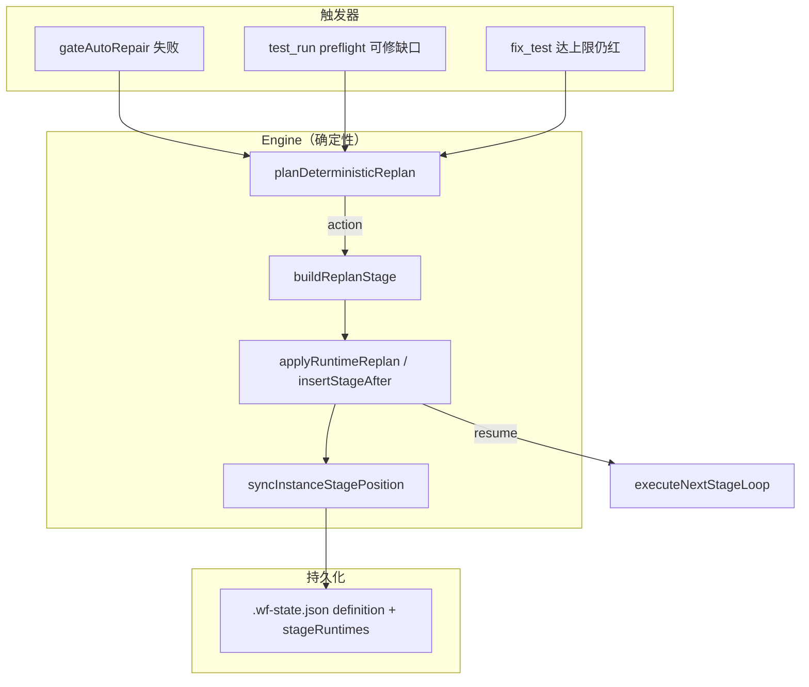

# Runtime Replan 设计规格（P3 · 三层闭环）

> **状态**：P3a POC + **P3b/P3c/P3d 已接入**（pre-gate replan + test_run fix-exhausted 链 + AFK `runtimeReplanCount`）。  
> **前置**：`gate-repair/`（E2 block → L3 单次 LLM 修）已落地；本模块在其失败或不足时 **改 DAG 继续跑**，而非整单 regenerate。  
> **关联**：`structural-repair/`（生成期）、`workflow-self-heal/injectSelfHealStages.ts`（confirm 期）、`PreGateRegistry.ts`（执行期 gate-repair）。

---

## 1. 问题陈述

| 现状 | 缺口 |
|------|------|
| 生成期 `applyPlanCompletenessStructuralRepairs` 可插 stage | 执行中 plan 与磁盘/环境偏离时无法改 DAG |
| `gateAutoRepair` 在 pre-gate 内 LLM 修一次并重试 gate | 修失败仍 `failWorkflowStageFromGate`，等人 Retry |
| `stage_fix_if_failed_*` 仅在 test_run **失败后** 运行 | pre-gate block、缺 pytest-asyncio 等进不了 fix 链 |
| Resume 时 `normalizeWorkflow` / `applyPythonWorkflowRepairs` | 不改**已持久化实例**的 `stages[]` 顺序 mid-flight |

**目标**：在**单 workflow 实例**执行过程中，对 **单 slice** 做 **有界、确定性优先** 的 DAG 修补，使 AFK 信封内任务无需人手改 Confirm Plan。

---

## 2. 非目标（v1）

- 整单 `WorkflowGeneration` 重生成
- 删除已有 stage / 改 `meta.taskType`
- 任意改 `dependsOn` 图（v1 仅 **insertAfter(anchor)**）
- DAG 并行模式下的多锚点同时 replan（v1 仅 **linear 调度**）
- LLM 输出完整新 `stages[]` JSON（v2）

---

## 3. 架构位置



与既有三层关系：

| 层 | 组件 | replan 角色 |
|----|------|-------------|
| Engine | `planDeterministicReplan` | 决定插什么 stage |
| LLM | replan 插入的 `llm-text` stage 正文 | 与 gate-repair 共用 prompt 族 |
| Human | HITL 仅当 replan 预算耗尽或 LLM replan 升级 | AFK 信封外 |

---

## 4. 触发条件（v1 白名单）

| `RuntimeReplanTrigger.kind` | 条件 | 典型动作 |
|-----------------------------|------|----------|
| `gate-repair-exhausted` | `gateAutoRepair` 已尝试且 gate 仍 block | 在 `test_run` 前插 `stage_runtime_replan_gate_*`（llm-text，带 gate issue） |
| `preflight-pytest-asyncio` | preflight 报缺 `pytest-asyncio` | 在首个 `stage_venv_pip_install` 后插 pip install 或扩展现有 pip stage |
| `preflight-conftest` | preflight 可自动写 conftest 已失败 | 插 `stage_runtime_replan_conftest_*`（llm-text） |
| `fix-exhausted` | 同 slice `stage_fix_if_failed_*` retry ≥ N 仍失败 | 插 `stage_runtime_replan_fix_*` 或升级 HITL |

**不触发**：`sdk-path-contract`（宜人工改 DecisionRecord）、`red-green-pre-impl`（TDD 语义）、任意 `severity: warn`。

---

## 5. 可改 / 不可改契约

### 5.1 允许（v1）

- `definition.stages`：**在 anchor 之后 splice 插入** 1..N 个 stage
- `stageRuntimes`：按 `stages[]` 顺序 **重建对齐**（见 §6）
- `currentStageIndex`：插入点 ≤ 当前游标时 **+1**；replan 后 **跳转到新 stage**（`pending`）
- `stageRuntimes[].outputs._runtimeReplan`：记录 `{ attempts, lastTrigger, insertedIds[] }`

### 5.2 禁止（v1）

- 修改已有 stage 的 `id` / `tool` / `toolConfig`（除系统插入的 replan stage）
- 删除 stage 或清空 `stageRuntimes`
- 插入无 `dependsOn` 约束的 stage 到 DAG 并行波次（v1 仅 linear）

### 5.3 Stage 标记

- id 前缀：`stage_runtime_replan_`（常量 `RUNTIME_REPLAN_STAGE_ID_PREFIX`）
- `description` 含：`[系统插入 · runtime-replan]`（`RUNTIME_REPLAN_MARKER`）
- 与 `stagent_` / `[系统插入 · M40]` 区分，便于 UI / lint 过滤

---

## 6. `stageRuntimes` 对齐算法

插入 `newStage` 于 `afterStageId` 之后：

1. `afterIdx = stages.findIndex(id === afterStageId)`；不存在 → abort
2. 幂等：`stages.some(id === newStage.id)` → abort `already-inserted`
3. `stages.splice(afterIdx + 1, 0, newStage)`
4. `runtimeById = Map(stageRuntimes by stageId)`
5. `newRuntimes = stages.map(s => runtimeById.get(s.id) ?? createPendingRuntime(s))`  
   - 除 `newStage` 外缺失 runtime → abort `runtime-misaligned`
6. `currentStageIndex`：若 `>= afterIdx + 1` 则 `+1`；replan 成功后将游标设为 `afterIdx + 1`（先跑新 stage）
7. `syncInstanceStagePosition(instance)`（DAG 模式兼容）

POC 实现：`src/runtime-replan/applyRuntimeReplan.ts`

---

## 7. 预算与升级

| 限制 | 默认 | 配置键（拟） |
|------|------|----------------|
| 每 slice replan 插入次数 | 2 | `stagent.execution.runtimeReplanMaxPerSlice` |
| 每实例 replan 总次数 | 6 | `stagent.execution.runtimeReplanMaxPerInstance` |
| gate-repair + replan 合计 LLM 调用 | 3/slice | 与 `gateAutoRepair` 共享计数 |

超预算 → `failWorkflowStageFromGate` + playbook 建议人手 Resume；AFK 验收记 `humanInterventions` 或失败。

---

## 8. 执行器接入点（待实现）

### 8.1 Pre-gate 路径（优先）

```
PreGateRegistry.runQualityGateHostPreGate
  → gate block
  → tryGateAutoRepair (已有)
  → 仍 block && shouldOfferRuntimeReplan(trigger)
  → applyRuntimeReplan(instance, action)
  → scheduleSave()
  → return 'continue'  // 不 fail；下一轮 loop 跑新 stage
```

### 8.2 test_run 失败路径

```
executeStageStep → test_run failed
  → fix stage skipIf / retry 计数
  → fix-exhausted trigger
  → applyRuntimeReplan
  → currentStageIndex → 新 replan stage
```

### 8.3 与 HITL Retry 交互

- 人手 **Retry** 同一 `test_run`：不清 replan 插入的 stage（已 done 的保留）
- **Regenerate workflow**：新实例，不继承 replan 插入
- `handleRetry` I9 cascade：replan 插入的 stage 视为普通 stage 参与 cascade reset

---

## 9. 确定性 replan 规则表（v1）

| Trigger | anchor | 插入 stage id 模式 | tool |
|---------|--------|-------------------|------|
| `preflight-pytest-asyncio` | 最近 `stage_venv_pip_install` 或 `stage_venv_create` | `stage_runtime_replan_pip_pytest_asyncio_{semantic}` | code-runner: `pip install pytest-asyncio` |
| `gate-repair-exhausted` + export-contract | `lastImplBefore(test_run)` | `stage_runtime_replan_gate_{semantic}` | llm-text → `implFile` |
| `gate-repair-exhausted` + pypi-symbol | 同上 | 同上 | llm-text |
| `preflight-conftest` | `test_write` 或 `lastImpl` | `stage_runtime_replan_conftest_{semantic}` | llm-text → `conftest.py` |

`semantic` = `semanticNameFromTestRunStageId(testRunId)`。

LLM replan（v2）：`planLlmRuntimeReplan` 读 gate playbook + 磁盘树，输出 **单 stage** JSON，经 schema 校验后 `applyRuntimeReplan`。

---

## 10. 持久化与恢复

- 变更写入现有 `persistInstanceSnapshot` 路径；`definition.stages` 与 `stageRuntimes` 一并版本化
- `persistRevision` 自增；恢复时 `syncInstanceStagePosition`
- 旧实例无 `_runtimeReplan` 字段：视为 0 次 replan

---

## 11. 可观测性

| 事件 | `debugLog` event |
|------|------------------|
| 计划 replan | `runtime_replan_planned` |
| 应用成功 | `runtime_replan_applied` |
| 幂等跳过 | `runtime_replan_skipped` |
| 预算拒绝 | `runtime_replan_budget_denied` |

`logUserAction('runtime_replan', { trigger, insertedStageId, slice })`

---

## 12. 测试策略

| 层级 | 文件 | 内容 |
|------|------|------|
| POC 单测 | `src/test/runtime-replan-poc.test.ts` | 纯函数：insert、plan、budget、幂等 |
| 集成（待接 executor） | `runtime-replan-executor.integration.test.ts` | pre-gate block → 插 stage → 游标跳转 |
| 回归 | 扩展现有 `pre-gate-registry.test.ts` | mock `applyRuntimeReplan` |

---

## 13. 退出标准（P3 Done）

1. Nanhua `market_connector`：gate-repair 失败后自动插 replan stage → impl 补齐 → test_run GREEN，**零人手 Retry**
2. 缺 `pytest-asyncio`：自动插 pip stage，无需改 requirements 人手
3. AFK 实例 `humanInterventions` 不因 replan 插入而增加（自动跳转执行）
4. 单测覆盖 §6 对齐 + §7 预算 + §9 规则表前两行

---

## 14. 实现顺序（建议 PR 切分）

| PR | 范围 |
|----|------|
| **P3a**（本文 POC） | `runtime-replan/*` 纯函数 + spec + poc test ✅ |
| **P3b** | `PreGateRegistry` 接入 + `readRuntimeReplanEnabled` + `StageStepOutcome.replan` ✅ |
| **P3c** | preflight 触发 `preflight-pytest-asyncio` ✅ |
| **P3d** | fix-exhausted 触发 + AFK 指标 ✅ |
| **P3e** | LLM replan v2（可选） |

---

## 15. 模块索引

| 路径 | 职责 |
|------|------|
| `src/runtime-replan/types.ts` | 触发器 / 动作 / 结果类型 |
| `src/runtime-replan/constants.ts` | 前缀、marker、默认预算 |
| `src/runtime-replan/createPendingRuntime.ts` | 新 stage 初始 runtime |
| `src/runtime-replan/applyRuntimeReplan.ts` | 实例突变 + 游标 |
| `src/runtime-replan/planDeterministicReplan.ts` | 触发器 → 动作 |
| `src/runtime-replan/replanBudget.ts` | 预算读写 |
| `src/runtime-replan/buildReplanStage.ts` | 确定性 stage 工厂 |
| `src/test/runtime-replan-poc.test.ts` | POC 测试骨架 |
